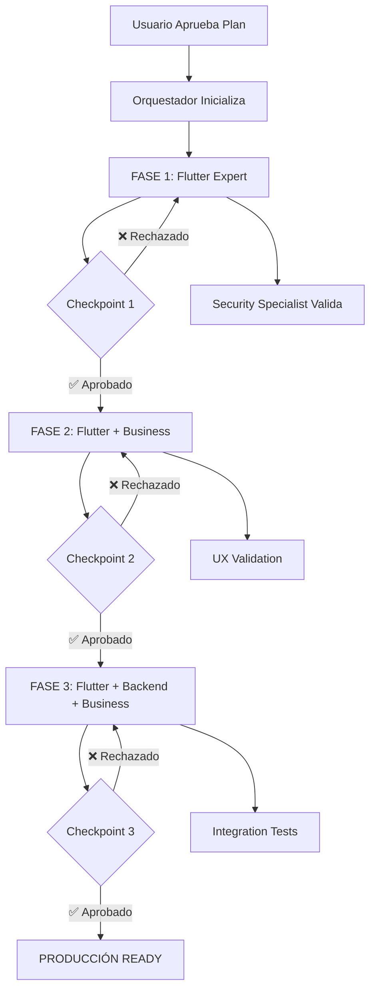

# 🤖 PROTOCOLO DE ACTIVACIÓN MULTI-AGENTE
## **Sistema de Usuario No Invasivo - Zodiac Life Coach**

**Plan:** USER_IDENTITY_SYSTEM_MASTER_PLAN  
**Status:** ⏸️ LISTO PARA ACTIVACIÓN  
**Coordinador:** @orchestrator_master  

---

## 🎯 COMANDO DE ACTIVACIÓN RÁPIDA

```bash
@orchestrator_master

EJECUTAR: USER_IDENTITY_SYSTEM_MASTER_PLAN
MODO: Secuencial por fases
VALIDACIÓN: Checkpoint después de cada fase

INICIAR FASE 1
```

---

## 📋 ESTRUCTURA DE EJECUCIÓN

### **FASE 1: Fundación Crítica** (4.5h)
```yaml
Agentes:
  - zodiac_flutter_expert (Opus)
  - security_specialist (Sonnet)

Archivos de Contexto:
  - 11_IMPLEMENTATION_PLANS/FASE_1_FLUTTER_EXPERT_CONTEXT.md
  - 11_IMPLEMENTATION_PLANS/USER_IDENTITY_SYSTEM_MASTER_PLAN.md

Entregables:
  ✓ UserIdentityService.dart (NUEVO)
  ✓ user_identity.dart model (NUEVO)
  ✓ revenuecat_service.dart (MODIFICADO - fix crítico)
  ✓ preferences_service.dart (AGREGADO métodos)
  ✓ Tests unitarios (coverage >85%)

Checkpoint 1:
  Orquestador valida:
  - UserIdentityService funcional
  - RevenueCat userID persistente
  - Tests pasando
  - Sin regresiones

  → SI APROBADO: Continuar a FASE 2
  → SI RECHAZADO: Iterar en correcciones
```

### **FASE 2: UI No Invasivo** (5h)
```yaml
Agentes:
  - zodiac_flutter_expert (Opus)
  - zodiac_business_expert (Sonnet)

Archivos de Contexto:
  - 11_IMPLEMENTATION_PLANS/FASE_2_UI_CONTEXT.md (crear)
  - 02_DESIGN_UX/mobile_ui_specialist.md

Entregables:
  ✓ settings_screen.dart (MODIFICADO - account section)
  ✓ account_benefits_sheet.dart (NUEVO widget)
  ✓ sign_in_with_apple_button.dart (NUEVO widget)
  ✓ Localización en 6 idiomas
  ✓ UX validation con beta testers

Checkpoint 2:
  Orquestador valida:
  - UI no invasivo implementado
  - Sign in with Apple funcional
  - Copywriting persuasivo pero sutil
  - Localización completa

  → SI APROBADO: Continuar a FASE 3
  → SI RECHAZADO: Iterar en mejoras UX
```

### **FASE 3: Migración y Prompts** (4h)
```yaml
Agentes:
  - zodiac_flutter_expert (Opus)
  - zodiac_backend_expert (Opus - opcional)
  - zodiac_business_expert (Sonnet)

Archivos de Contexto:
  - 11_IMPLEMENTATION_PLANS/FASE_3_MIGRATION_CONTEXT.md (crear)

Entregables:
  ✓ data_migration_service.dart (NUEVO)
  ✓ account_prompt_service.dart (NUEVO - opcional)
  ✓ Analytics tracking completo
  ✓ Integration tests pasando
  ✓ Documentación completa

Checkpoint 3:
  Orquestador valida:
  - Migración de datos automática
  - Analytics tracking activo
  - Tests de integración OK
  - Sin memory leaks

  → SI APROBADO: LISTO PARA PRODUCCIÓN
  → SI RECHAZADO: Iterar en fixes
```

---

## 🔄 FLUJO DE TRABAJO MULTI-AGENTE

### **Secuencia de Activación:**



---

## 📚 CONTEXTO COMPARTIDO PARA TODOS LOS AGENTES

### **Datos de la App:**
```yaml
Nombre: Zodiac Life Coach
Tipo: Astrological guidance + neural compatibility
Estado: 95% production ready, bloqueado por bug RevenueCat
Stack: Flutter + Riverpod + Firebase + RevenueCat + Railway
Idiomas: 6 (ES, EN, DE, FR, IT, PT)
Tiers Premium:
  - Cosmic: $6.99/mes
  - Stellar: $19.99/mes
  - Universe: $49.99 lifetime
```

### **Bug Crítico Actual:**
```dart
// revenuecat_service.dart línea 77
return 'user_${DateTime.now().millisecondsSinceEpoch}';
// ❌ Genera nuevo userID cada reinicio
// 💥 Usuario pierde compras premium
// 🚨 Bloqueante para launch
```

### **Objetivo del Sistema:**
```
Permitir:
✅ Usar app SIN login (modo anónimo)
✅ Compras premium funcionando sin cuenta
✅ Opción OPCIONAL de crear cuenta
✅ Migración suave anónimo → autenticado
✅ Sincronización multi-device (con cuenta)

Sin:
❌ Login obligatorio en onboarding
❌ Pérdida de compras al reiniciar
❌ UX invasivo o pushy
❌ Bloqueo de features sin cuenta
```

---

## 🎯 INSTRUCCIONES PARA CADA AGENTE

### **@zodiac_flutter_expert**
```markdown
CONTEXTO PRINCIPAL:
- Lee: FASE_1_FLUTTER_EXPERT_CONTEXT.md
- Lee: USER_IDENTITY_SYSTEM_MASTER_PLAN.md
- Lee: 01_AGENTS_CORE/ZODIAC_FLUTTER_EXPERT_2025.md

TAREAS CRÍTICAS:
1. Implementar UserIdentityService (200 líneas)
2. Fix RevenueCat userID (5 líneas cambio)
3. Agregar métodos a PreferencesService
4. Crear tests unitarios completos
5. Validar sin regresiones

PATRONES A SEGUIR:
- BaseSingletonService para servicios
- AppLogger para logging
- SecureStorage para datos sensibles
- Riverpod para state management
- Tests con flutter_test

NO HACER:
- Cambiar imports a absolutos (usar relativos)
- Agregar 'const' a widgets dinámicos
- Modificar servicios no relacionados
- Crear features no especificadas
```

### **@security_specialist**
```markdown
CONTEXTO PRINCIPAL:
- Lee: USER_IDENTITY_SYSTEM_MASTER_PLAN.md
- Foco: Seguridad de device ID y migración

VALIDACIONES REQUERIDAS:
1. ✅ UUID guardado en SecureStorage (AES-256)
2. ✅ No exponer UUID en logs públicos
3. ✅ Migración de datos segura
4. ✅ GDPR compliance para datos anónimos
5. ✅ Privacy policy updates necesarios

REVISAR:
- UserIdentityService.dart (cuando esté listo)
- data_migration_service.dart (Fase 3)
- Flujo de Sign in with Apple

ENTREGAR:
- Security audit report
- Privacy policy updates necesarios
- Best practices checklist
```

### **@zodiac_business_expert**
```markdown
CONTEXTO PRINCIPAL:
- Lee: USER_IDENTITY_SYSTEM_MASTER_PLAN.md
- Foco: UX no invasivo y copywriting

TAREAS FASE 2:
1. Copywriting account benefits sheet
2. Diseño de prompts sutiles (no invasivos)
3. Estrategia de conversión anónimo → cuenta
4. Analytics events tracking

OBJETIVOS MÉTRICAS:
- Conversión anónimo → cuenta: >20% mes 1
- User satisfaction: >4.5/5
- Refunds por login: <1%
- Support tickets: <5%

PRINCIPIOS UX:
- NUNCA login obligatorio
- NUNCA bloquear features
- SIEMPRE mostrar valor antes de pedir
- SIEMPRE opción "Maybe Later"
```

### **@quality_assurance**
```markdown
CONTEXTO PRINCIPAL:
- Lee: USER_IDENTITY_SYSTEM_MASTER_PLAN.md
- Foco: Testing exhaustivo

TEST SUITE COMPLETO:
1. Unit tests (UserIdentityService)
2. Integration tests (purchase flow)
3. E2E tests (anonymous → authenticated)
4. Regression tests (features existentes)
5. Performance tests (no memory leaks)

ESCENARIOS CRÍTICOS:
✅ Compra → cierra app → reabre → premium activo
✅ Restore purchases funciona
✅ Sign in → migración → datos intactos
✅ Cambio de dispositivo → sincronización
✅ Reinstalar app → recovery con Apple ID

COVERAGE OBJETIVO:
- Unit tests: >85%
- Integration tests: >90%
- Critical paths: 100%
```

---

## 📊 MÉTRICAS DE PROGRESO

### **Dashboard de Estado:**
```
FASE 1: ⏸️ PENDIENTE
├─ UserIdentityService: □ No iniciado
├─ RevenueCat Fix: □ No iniciado
├─ Tests Unitarios: □ No iniciado
└─ Checkpoint 1: □ No validado

FASE 2: ⏸️ EN ESPERA
├─ Account Section UI: □ No iniciado
├─ Benefits Sheet: □ No iniciado
├─ Sign in with Apple: □ No iniciado
└─ Checkpoint 2: □ No validado

FASE 3: ⏸️ EN ESPERA
├─ Data Migration: □ No iniciado
├─ Account Prompts: □ No iniciado
├─ Analytics Tracking: □ No iniciado
└─ Checkpoint 3: □ No validado

PRODUCCIÓN: ⏸️ BLOQUEADO
```

---

## 🚀 COMANDOS DE ACTIVACIÓN

### **Iniciar Sistema Completo:**
```bash
@orchestrator_master EJECUTAR USER_IDENTITY_SYSTEM_MASTER_PLAN
```

### **Iniciar Solo Fase 1 (Crítico):**
```bash
@zodiac_flutter_expert 
CONTEXTO: FASE_1_FLUTTER_EXPERT_CONTEXT.md
TAREA: Implementar UserIdentityService
PRIORIDAD: CRÍTICA
```

### **Validar Checkpoint:**
```bash
@orchestrator_master
VALIDAR: CHECKPOINT_1
CRITERIOS: USER_IDENTITY_SYSTEM_MASTER_PLAN
```

### **Testing Exhaustivo:**
```bash
@quality_assurance
EJECUTAR: TEST_SUITE_USER_IDENTITY
COBERTURA: >85%
```

---

## ⚡ OPTIMIZACIONES MULTI-AGENTE

### **Paralelización Posible:**
```yaml
FASE 1:
  Paralelo:
    - zodiac_flutter_expert: Implementa código
    - security_specialist: Revisa specs de seguridad
  Secuencial:
    - zodiac_flutter_expert termina
    - security_specialist valida código real

FASE 2:
  Paralelo:
    - zodiac_flutter_expert: Implementa UI
    - zodiac_business_expert: Escribe copy
  Sincronización:
    - Integrar copy en UI

FASE 3:
  Paralelo:
    - zodiac_flutter_expert: Migración service
    - zodiac_business_expert: Analytics tracking
    - quality_assurance: Crear test suite
  Sincronización:
    - Ejecutar tests en código final
```

---

## 📁 ESTRUCTURA DE ARCHIVOS GENERADOS

```
.claude/
├── 11_IMPLEMENTATION_PLANS/
│   ├── USER_IDENTITY_SYSTEM_MASTER_PLAN.md ✅
│   ├── FASE_1_FLUTTER_EXPERT_CONTEXT.md ✅
│   ├── FASE_2_UI_CONTEXT.md (crear después Fase 1)
│   ├── FASE_3_MIGRATION_CONTEXT.md (crear después Fase 2)
│   └── MULTIAGENT_ACTIVATION_PROTOCOL.md ✅ (este archivo)
│
├── 12_COMPLETED_IMPLEMENTATIONS/
│   ├── PHASE_1_COMPLETION_REPORT.md (después Checkpoint 1)
│   ├── PHASE_2_COMPLETION_REPORT.md (después Checkpoint 2)
│   └── PHASE_3_COMPLETION_REPORT.md (después Checkpoint 3)
│
└── README.md (actualizar con nuevo plan)
```

---

## ✅ CHECKLIST PRE-ACTIVACIÓN

Antes de activar el sistema multi-agente:
```
□ Plan maestro revisado y aprobado
□ Contextos de fase creados
□ Agentes identificados correctamente
□ Checkpoints definidos claramente
□ Métricas de éxito establecidas
□ Tests requirements especificados
□ Rollback plan preparado
□ Usuario confirma inicio
```

---

## 🎯 PRÓXIMA ACCIÓN

```
USUARIO DEBE:
1. Revisar este plan completo
2. Aprobar inicio de implementación
3. Ejecutar comando de activación

COMANDO SUGERIDO:
@orchestrator_master INICIAR FASE_1 USER_IDENTITY_SYSTEM_MASTER_PLAN
```

---

**🚀 SISTEMA MULTI-AGENTE CONFIGURADO Y LISTO**

**Status:** ⏸️ ESPERANDO CONFIRMACIÓN DE USUARIO  
**Tiempo Estimado Total:** 13.5 horas (3 fases)  
**Prioridad:** 🔴 CRÍTICA (Bloqueante para launch)
