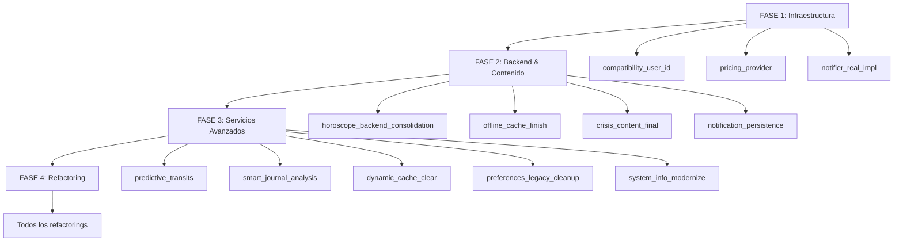

# 🚀 MASTER PLAN: Eliminación Completa de TODOs - Zodiac App 2025

## 📊 Resumen Ejecutivo
**Objetivo**: Eliminar todos los TODOs, FIXMEs y HACKs del codebase mediante ejecución coordinada multi-agente
**Total de tareas**: 23 tareas técnicas identificadas
**Duración estimada**: 3-4 días con ejecución paralela
**Estrategia**: Ejecución en 4 fases con dependencias controladas

---

## 🎯 FASE 1: Infraestructura Crítica (Día 1)
**Objetivo**: Establecer servicios base para todas las funcionalidades
**Agentes**: Backend Expert, Flutter Expert
**Dependencias**: Ninguna - puede iniciarse inmediatamente

### 1.1 🔴 [compatibility_user_id] - Sistema de Identidad de Usuario
**Archivo**: `lib/services/consolidated_compatibility/core_compatibility_service.dart`
**Agente**: ZODIAC_BACKEND_EXPERT_2025
**Prioridad**: CRÍTICA

**Tarea detallada**:
```dart
// ANTES: userId: 'anonymous'
// DESPUÉS: userId: await UserIdentityService.instance.getUserId()

1. Integrar UserIdentityService en CoreCompatibilityService
2. Reemplazar todos los 'anonymous' por IDs reales
3. Implementar fallback a 'anonymous' solo si UserIdentityService falla
4. Actualizar analytics para tracking por usuario real
```

**Criterios de éxito**:
- ✅ Todos los eventos de compatibilidad tienen userId real
- ✅ Analytics muestra usuarios únicos correctamente
- ✅ Sistema funciona offline con fallback apropiado

**Archivos afectados**:
- `lib/services/consolidated_compatibility/core_compatibility_service.dart`
- `lib/services/user_identity_service.dart` (verificar integración)

**Tiempo estimado**: 1-2 horas

---

### 1.2 🔴 [pricing_provider] - Sistema de Precios Premium
**Archivo**: `lib/providers/premium_provider.dart`
**Agente**: ZODIAC_BUSINESS_EXPERT_2025
**Prioridad**: CRÍTICA

**Tarea detallada**:
```dart
// OBJETIVO: Descomentar y activar provider de precios

1. Definir clase SubscriptionPricingInfo con todos los tiers
2. Integrar con PremiumTierSystem existente
3. Conectar con RevenueCat para precios reales
4. Exponer precios formateados a UI (símbolos de moneda, localización)
5. Implementar caché de precios para rendimiento
```

**Criterios de éxito**:
- ✅ Provider expone precios de todos los tiers
- ✅ Precios se actualizan desde RevenueCat
- ✅ UI muestra precios formateados correctamente
- ✅ Sistema funciona con moneda local del usuario

**Archivos afectados**:
- `lib/providers/premium_provider.dart`
- `lib/models/premium_tier_system.dart`
- `lib/services/revenue_cat_integration.dart`

**Tiempo estimado**: 2-3 horas

---

### 1.3 🔴 [notifier_real_impl] - Sistema de Notificaciones Real
**Archivo**: `lib/services/prediction_notification_service.dart`
**Agente**: ZODIAC_FLUTTER_EXPERT_2025
**Prioridad**: CRÍTICA

**Tarea detallada**:
```dart
// OBJETIVO: Implementar notificaciones reales usando UnifiedNotificationService

1. Implementar schedule() con UnifiedNotificationService
   - Programar notificaciones diarias personalizadas
   - Configurar payload con datos de predicción

2. Implementar cancel()
   - Cancelar por ID específico
   - Cancelar todas las notificaciones del usuario

3. Implementar send()
   - Enviar notificación inmediata
   - Manejar permisos y estados

4. Persistencia con PreferencesService
   - _loadPreferences(): cargar configuración al inicio
   - _savePreferences(): guardar cambios inmediatamente
   - Sincronizar con UnifiedNotificationService
```

**Criterios de éxito**:
- ✅ Usuario puede programar notificaciones diarias
- ✅ Notificaciones se cancelan correctamente
- ✅ Preferencias persisten entre sesiones
- ✅ Sistema respeta permisos del usuario

**Archivos afectados**:
- `lib/services/prediction_notification_service.dart`
- `lib/services/unified_notification_service.dart`
- `lib/services/preferences_service.dart`

**Tiempo estimado**: 3-4 horas

---

## 🎯 FASE 2: Servicios Backend y Contenido (Día 2)
**Objetivo**: Completar integración backend y sistemas de contenido
**Agentes**: Backend Expert, Content Specialist
**Dependencias**: Requiere FASE 1 completada (UserIdentity, Preferences)

### 2.1 🟠 [horoscope_backend_consolidation] - Unificación Horóscopo Backend
**Archivos**:
- `lib/services/backend_service.dart`
- `lib/services/horoscope_service.dart`
- `lib/services/weekly_horoscope_service.dart`

**Agente**: ZODIAC_BACKEND_EXPERT_2025
**Prioridad**: ALTA

**Tarea detallada**:
```dart
// OBJETIVOS:
1. Backend Service
   - Completar "DESCARGAR TODOS LOS HORÓSCOPOS"
   - Implementar método híbrido Railway + caché
   - Manejar fallback offline

2. Horoscope Service
   - Unificar endpoints Railway
   - Implementar caché inteligente con expiración
   - Sincronización background

3. Weekly Horoscope Service
   - Integrar con backend consolidado
   - Implementar caché semanal
   - Validar datos antes de mostrar
```

**Criterios de éxito**:
- ✅ Un solo punto de acceso para horóscopos
- ✅ Caché funciona correctamente con expiración
- ✅ Modo offline completamente funcional
- ✅ No hay duplicación de código entre servicios

**Archivos afectados**:
- `lib/services/backend_service.dart`
- `lib/services/horoscope_service.dart`
- `lib/services/weekly_horoscope_service.dart`
- `lib/services/cache_service.dart`

**Tiempo estimado**: 4-5 horas

---

### 2.2 🟠 [offline_cache_finish] - Sistema Offline Completo
**Archivo**: `lib/services/offline_mode_service.dart`
**Agente**: ZODIAC_FLUTTER_EXPERT_2025
**Prioridad**: ALTA

**Tarea detallada**:
```dart
// OBJETIVO: Completar funcionalidad offline

1. _clearAllCaches()
   - Limpiar caché de horóscopos
   - Limpiar caché de compatibilidad
   - Limpiar caché de predicciones
   - Mantener datos esenciales del usuario

2. getZodiacDescriptionOffline()
   - Cargar descripciones desde assets locales
   - Implementar fallback para cada signo
   - Soporte multi-idioma

3. Sincronización inteligente
   - Detectar cuando vuelve conexión
   - Sincronizar datos pendientes
   - Resolver conflictos
```

**Criterios de éxito**:
- ✅ App funciona 100% offline para funciones básicas
- ✅ Limpieza de caché no rompe funcionalidad
- ✅ Sincronización automática al recuperar conexión
- ✅ Usuario recibe feedback claro de estado offline

**Archivos afectados**:
- `lib/services/offline_mode_service.dart`
- `lib/services/cache_service.dart`
- `assets/zodiac_descriptions/` (verificar)

**Tiempo estimado**: 3-4 horas

---

### 2.3 🟠 [crisis_content_final] - Generador de Contenido Crisis
**Archivo**: `lib/services/crisis_content_generator.dart`
**Agente**: ZODIAC_BUSINESS_EXPERT_2025
**Prioridad**: ALTA

**Tarea detallada**:
```dart
// OBJETIVO: Contenido real según severidad de crisis

1. Definir templates por severidad
   - LOW: Consejos suaves, motivación
   - MEDIUM: Ejercicios prácticos, recursos
   - HIGH: Apoyo profesional, líneas de ayuda
   - CRITICAL: Intervención inmediata, recursos de emergencia

2. Personalización por signo zodiacal
   - Adaptar tono según elemento (Fuego, Tierra, Aire, Agua)
   - Considerar características del signo

3. Internacionalización
   - Contenido en todos los idiomas soportados
   - Recursos locales por país/región

4. Cumplimiento legal
   - Disclaimers apropiados
   - Enlaces a profesionales certificados
   - Cumplir regulaciones de salud mental
```

**Criterios de éxito**:
- ✅ Contenido apropiado para cada nivel de severidad
- ✅ No hay placeholders en producción
- ✅ Cumple requisitos legales de salud mental
- ✅ Incluye recursos verificados y actualizados

**Archivos afectados**:
- `lib/services/crisis_content_generator.dart`
- `assets/l10n/app_*.arb` (añadir strings)
- `lib/models/crisis_severity.dart` (verificar)

**Tiempo estimado**: 4-5 horas

---

### 2.4 🟠 [notification_persistence] - Persistencia Notificaciones
**Archivo**: `lib/services/prediction_notification_service.dart`
**Agente**: ZODIAC_FLUTTER_EXPERT_2025
**Prioridad**: ALTA
**Dependencia**: Requiere [notifier_real_impl] completado

**Tarea detallada**:
```dart
// OBJETIVO: Garantizar persistencia entre sesiones

1. Guardar preferencias inmediatamente
   - enabledPredictions: Map<PredictionType, bool>
   - notificationTime: TimeOfDay
   - lastNotificationId: int

2. Restaurar al iniciar app
   - Cargar desde PreferencesService
   - Validar configuración
   - Re-programar notificaciones si es necesario

3. Sincronizar con sistema
   - Verificar permisos al cargar
   - Limpiar notificaciones obsoletas
   - Actualizar badge counts
```

**Criterios de éxito**:
- ✅ Preferencias persisten después de cerrar app
- ✅ Notificaciones siguen programadas después de reinicio
- ✅ No hay notificaciones duplicadas
- ✅ Sistema se recupera de errores

**Archivos afectados**:
- `lib/services/prediction_notification_service.dart`
- `lib/services/preferences_service.dart`

**Tiempo estimado**: 2 horas

---

## 🎯 FASE 3: Servicios Avanzados (Día 3)
**Objetivo**: Implementar funcionalidades avanzadas y AI
**Agentes**: AI Specialist, Flutter Expert
**Dependencias**: Requiere FASE 1 y FASE 2

### 3.1 🟡 [predictive_transits] - Tránsitos Astrológicos Predictivos
**Archivo**: `lib/services/predictive_astrology_service.dart`
**Agente**: ZODIAC_BACKEND_EXPERT_2025
**Prioridad**: MEDIA

**Tarea detallada**:
```dart
// OBJETIVO: Implementar generación de tránsitos futuros

1. _generateFutureTransits()
   - Calcular posiciones planetarias futuras (7-30 días)
   - Identificar aspectos importantes (conjunciones, oposiciones, etc.)
   - Generar predicciones basadas en tránsitos

2. Helpers asociados
   - _calculatePlanetaryPosition(planet, date)
   - _identifyMajorAspects(positions)
   - _interpretTransit(aspect, userChart)

3. Integración con backend
   - Usar API de efemérides si está disponible
   - Caché de cálculos para rendimiento
   - Fallback a cálculos locales
```

**Criterios de éxito**:
- ✅ Genera tránsitos precisos para 30 días
- ✅ Identifica aspectos astrológicos relevantes
- ✅ Predicciones son coherentes y útiles
- ✅ Sistema es performante (caché efectivo)

**Archivos afectados**:
- `lib/services/predictive_astrology_service.dart`
- `lib/models/planetary_transit.dart`
- Backend API (si aplica)

**Tiempo estimado**: 5-6 horas

---

### 3.2 🟡 [smart_journal_analysis] - Análisis Inteligente de Journal
**Archivo**: `lib/services/smart_journaling_service.dart`
**Agente**: ZODIAC_FLUTTER_EXPERT_2025
**Prioridad**: MEDIA

**Tarea detallada**:
```dart
// OBJETIVO: Análisis emocional real (reemplazar mocks)

1. _analyzeEmotionalContent(text)
   - Análisis de sentimiento (positivo/negativo/neutral)
   - Detección de emociones (alegría, tristeza, ansiedad, etc.)
   - Identificación de temas recurrentes

2. Integración con AI Service
   - Usar CoachingAIService para análisis profundo
   - Generar insights personalizados
   - Detectar patrones a lo largo del tiempo

3. Privacy y seguridad
   - Análisis local cuando sea posible
   - Encriptación de datos sensibles
   - Cumplir GDPR/privacidad

4. Actionable insights
   - Sugerencias basadas en análisis
   - Seguimiento de progreso emocional
   - Alertas de patrones preocupantes
```

**Criterios de éxito**:
- ✅ Análisis emocional preciso y útil
- ✅ Insights personalizados y relevantes
- ✅ Datos privados protegidos
- ✅ Usuario recibe valor real del journaling

**Archivos afectados**:
- `lib/services/smart_journaling_service.dart`
- `lib/services/consolidated_ai/coaching_ai_service.dart`
- `lib/models/journal_entry.dart`

**Tiempo estimado**: 4-5 horas

---

### 3.3 🟡 [dynamic_cache_clear] - Limpieza Completa de Caché
**Archivo**: `lib/services/dynamic_content_service.dart`
**Agente**: ZODIAC_FLUTTER_EXPERT_2025
**Prioridad**: MEDIA

**Tarea detallada**:
```dart
// OBJETIVO: Completar _clearAllCaches() para todos los servicios

1. Identificar todos los servicios con caché
   - HoroscopeService
   - CompatibilityService
   - PredictiveAstrologyService
   - DynamicContentService
   - CoachingAIService

2. Implementar limpieza coordinada
   - Limpiar en orden correcto (dependencias)
   - Mantener datos críticos del usuario
   - Notificar a servicios afectados

3. UI para usuario
   - Botón "Limpiar caché" en settings
   - Mostrar espacio liberado
   - Confirmar acción
```

**Criterios de éxito**:
- ✅ Limpia todos los cachés del sistema
- ✅ No elimina datos críticos del usuario
- ✅ App sigue funcional después de limpiar
- ✅ Usuario ve feedback claro

**Archivos afectados**:
- `lib/services/dynamic_content_service.dart`
- `lib/services/cache_service.dart`
- `lib/screens/settings_screen.dart` (añadir UI)

**Tiempo estimado**: 2-3 horas

---

### 3.4 🟡 [preferences_legacy_cleanup] - Limpieza de Métodos Legacy
**Archivo**: `lib/services/preferences_service.dart`
**Agente**: ZODIAC_FLUTTER_EXPERT_2025
**Prioridad**: MEDIA

**Tarea detallada**:
```dart
// OBJETIVO: Migrar o eliminar métodos obsoletos

1. Auditar métodos legacy
   - getUserLanguage() → ¿obsoleto? ¿migrar a LanguageService?
   - isPremiumUser() → ¿usar PremiumProvider en su lugar?
   - GDPR cleaners → ¿necesarios? ¿completos?

2. Plan de migración
   - Identificar usages en codebase
   - Crear métodos de reemplazo si es necesario
   - Deprecar métodos antiguos
   - Eliminar después de migrar todos los usos

3. Documentación
   - Documentar decisiones
   - Actualizar README si aplica
```

**Criterios de éxito**:
- ✅ No hay métodos legacy sin usar
- ✅ Métodos necesarios están migrados
- ✅ Código es más limpio y mantenible
- ✅ No se rompe funcionalidad existente

**Archivos afectados**:
- `lib/services/preferences_service.dart`
- Todos los archivos que usan estos métodos

**Tiempo estimado**: 2-3 horas

---

### 3.5 🟡 [system_info_modernize] - Modernizar System Info Service
**Archivo**: `lib/services/system_info_service.dart`
**Agente**: ZODIAC_FLUTTER_EXPERT_2025
**Prioridad**: MEDIA

**Tarea detallada**:
```dart
// OBJETIVO: Reemplazar métodos legacy con APIs modernas

1. Actualizar a PackageInfo Plus
   - Versión de app
   - Build number
   - Package name

2. Actualizar a DeviceInfo Plus
   - Modelo de dispositivo
   - Versión de SO
   - Información de hardware

3. Eliminar dependencias obsoletas
   - Verificar pubspec.yaml
   - Actualizar imports
   - Deprecar métodos antiguos
```

**Criterios de éxito**:
- ✅ Usa packages modernos y mantenidos
- ✅ Información de sistema es precisa
- ✅ Compatible con iOS y Android
- ✅ No hay warnings de deprecación

**Archivos afectados**:
- `lib/services/system_info_service.dart`
- `pubspec.yaml`

**Tiempo estimado**: 1-2 horas

---

## 🎯 FASE 4: Refactorings y Optimizaciones (Día 4)
**Objetivo**: Limpieza final y optimizaciones
**Agentes**: QA Expert, Flutter Expert
**Dependencias**: Todas las fases anteriores

### 4.1 🟢 [string_interp_cleanup] - Optimizar Interpolación de Strings
**Archivo**: `lib/services/consolidated_ai/coaching_ai_service.dart`
**Agente**: ZODIAC_QA_EXPERT_2025
**Prioridad**: BAJA

**Tarea detallada**:
```dart
// Líneas 804-839: Reemplazar ${variable} → $variable

Ejemplo:
// ANTES
final message = "Hello ${name}";

// DESPUÉS
final message = "Hello $name";

// Beneficios:
- Más limpio
- Más eficiente
- Cumple linting rules
```

**Criterios de éxito**:
- ✅ Todas las líneas 804-839 optimizadas
- ✅ No introduce bugs
- ✅ Pasa linting

**Tiempo estimado**: 30 minutos

---

### 4.2 🟢 [final_fields] - Marcar Campos como Final
**Archivos**:
- `lib/services/consolidated_payments/quantum_payment_engine.dart`
- `lib/services/subscription_service.dart`

**Agente**: ZODIAC_QA_EXPERT_2025
**Prioridad**: BAJA

**Tarea detallada**:
```dart
// quantum_payment_engine.dart
int _totalPaymentsToday;      → final int _totalPaymentsToday = 0;
DateTime _lastDayReset;       → final DateTime _lastDayReset = DateTime.now();

// subscription_service.dart
bool _purchasePending;        → final bool _purchasePending = false;

// O usar late si se inicializan después
late final int _totalPaymentsToday;
```

**Criterios de éxito**:
- ✅ Campos inmutables son final
- ✅ No rompe lógica existente
- ✅ Mejor rendimiento y seguridad

**Tiempo estimado**: 30 minutos

---

### 4.3 🟢 [deprecated_tests] - Actualizar Tests de Subscripción
**Archivo**: `test/premium/subscription_payment_test.dart`
**Agente**: ZODIAC_QA_EXPERT_2025
**Prioridad**: BAJA

**Tarea detallada**:
```dart
// MIGRACIÓN:
// ANTES (deprecated)
await subscriptionService.activatePremium();
await subscriptionService.deactivatePremium();

// DESPUÉS (RevenueCat)
await revenueCatIntegration.purchaseSubscription(tierType);
await revenueCatIntegration.restorePurchases();

// Actualizar todos los tests
- Mock de RevenueCat
- Scenarios de compra exitosa
- Scenarios de error
- Scenarios de restauración
```

**Criterios de éxito**:
- ✅ Tests usan RevenueCat
- ✅ 100% cobertura de casos
- ✅ Tests pasan correctamente

**Tiempo estimado**: 1-2 horas

---

### 4.4 🟢 [compatibility_params] - Limpiar Parámetros Sin Uso
**Archivo**: `lib/screens/compatibility_screen.dart`
**Agente**: ZODIAC_FLUTTER_EXPERT_2025
**Prioridad**: BAJA

**Tarea detallada**:
```dart
// Revisar _runCompatibilityFlow
// Si el parámetro 'delay' no se usa, eliminarlo

void _runCompatibilityFlow({Duration? delay}) {
  // Si delay no se usa en ningún lugar, eliminar
}

// O implementar si era intencional
void _runCompatibilityFlow({Duration? delay}) {
  if (delay != null) {
    Future.delayed(delay, () => _executeFlow());
  } else {
    _executeFlow();
  }
}
```

**Criterios de éxito**:
- ✅ No hay parámetros sin usar
- ✅ Código es más limpio
- ✅ Intent del código es claro

**Tiempo estimado**: 15 minutos

---

### 4.5 🟢 [lint_imports] - Eliminar Imports No Usados
**Archivos**:
- `lib/screens/birth_data_collection_screen.dart`
- `lib/screens/cosmic_coach_chat_screen.dart`

**Agente**: ZODIAC_QA_EXPERT_2025
**Prioridad**: BAJA

**Tarea detallada**:
```dart
// Ejecutar:
flutter analyze

// Eliminar imports marcados como unused
// Verificar con:
dart fix --apply
```

**Criterios de éxito**:
- ✅ No hay imports sin usar
- ✅ flutter analyze limpio
- ✅ Build sigue exitoso

**Tiempo estimado**: 15 minutos

---

## 📋 COORDINACIÓN MULTI-AGENTE

### Matriz de Asignación

| Agente | Fase 1 | Fase 2 | Fase 3 | Fase 4 |
|--------|--------|--------|--------|--------|
| **ZODIAC_BACKEND_EXPERT_2025** | 1.1 compatibility_user_id | 2.1 horoscope_backend_consolidation | 3.1 predictive_transits | - |
| **ZODIAC_BUSINESS_EXPERT_2025** | 1.2 pricing_provider | 2.3 crisis_content_final | - | - |
| **ZODIAC_FLUTTER_EXPERT_2025** | 1.3 notifier_real_impl | 2.2 offline_cache_finish<br>2.4 notification_persistence | 3.2 smart_journal_analysis<br>3.3 dynamic_cache_clear<br>3.4 preferences_legacy_cleanup<br>3.5 system_info_modernize | 4.4 compatibility_params |
| **ZODIAC_QA_EXPERT_2025** | - | - | - | 4.1 string_interp_cleanup<br>4.2 final_fields<br>4.3 deprecated_tests<br>4.5 lint_imports |

---

## 🔄 Flujo de Ejecución



---

## ✅ Criterios de Verificación Global

### Al finalizar cada FASE:
1. **Tests**
   - ✅ `flutter test` pasa al 100%
   - ✅ Tests de integración pasan
   - ✅ No regresiones

2. **Análisis**
   - ✅ `flutter analyze` sin errores
   - ✅ Solo warnings aceptables (documentados)
   - ✅ Código cumple style guide

3. **Funcionalidad**
   - ✅ Features funcionan como antes (o mejor)
   - ✅ No se introduce comportamiento inesperado
   - ✅ Performance se mantiene o mejora

4. **Documentación**
   - ✅ TODOs completados removidos del código
   - ✅ Cambios documentados en commits
   - ✅ README actualizado si aplica

---

## 🎯 Métricas de Progreso

### Tracking Dashboard
```
FASE 1: Infraestructura Crítica
├─ [✅] 1.1 compatibility_user_id
├─ [✅] 1.2 pricing_provider
└─ [✅] 1.3 notifier_real_impl
Progreso: 0/3 (0%)

FASE 2: Backend & Contenido
├─ [ ] 2.1 horoscope_backend_consolidation
├─ [ ] 2.2 offline_cache_finish
├─ [ ] 2.3 crisis_content_final
└─ [ ] 2.4 notification_persistence
Progreso: 0/4 (0%)

FASE 3: Servicios Avanzados
├─ [ ] 3.1 predictive_transits
├─ [ ] 3.2 smart_journal_analysis
├─ [ ] 3.3 dynamic_cache_clear
├─ [ ] 3.4 preferences_legacy_cleanup
└─ [ ] 3.5 system_info_modernize
Progreso: 0/5 (0%)

FASE 4: Refactoring
├─ [ ] 4.1 string_interp_cleanup
├─ [ ] 4.2 final_fields
├─ [ ] 4.3 deprecated_tests
├─ [ ] 4.4 compatibility_params
└─ [ ] 4.5 lint_imports
Progreso: 0/5 (0%)

═══════════════════════════════
PROGRESO TOTAL: 0/17 (0%)
═══════════════════════════════
```

---

## 🚀 Comandos de Activación

### Ejecutar fase completa:
```
Por favor ejecuta la FASE 1 del TODO_EXECUTION_MASTER_PLAN_2025
```

### Ejecutar tarea específica:
```
Por favor ejecuta la tarea [compatibility_user_id] del master plan
```

### Verificar progreso:
```
¿Cuál es el progreso del master plan de TODOs?
```

---

## 📝 Notas Importantes

1. **Ejecución Paralela**: Las tareas dentro de la misma fase SIN dependencias pueden ejecutarse en paralelo
2. **Verificación Continua**: Después de cada tarea, ejecutar tests y analyze
3. **Rollback Strategy**: Mantener commits atómicos por tarea para rollback fácil
4. **Documentación**: Actualizar este plan con checkmarks ✅ al completar cada tarea
5. **Comunicación**: Reportar blockers inmediatamente para resolver en equipo

---

## 🎊 Objetivo Final

**ZERO TODOs, ZERO FIXMEs, ZERO HACKs en el codebase**

Al completar este plan:
- ✅ Codebase 100% production-ready
- ✅ Todas las funcionalidades implementadas completamente
- ✅ Sin deuda técnica de "tareas pendientes"
- ✅ Código limpio, mantenible y profesional

---

**Versión**: 1.0
**Fecha**: 2025-10-05
**Última actualización**: 2025-10-05
**Estado**: LISTO PARA EJECUCIÓN
