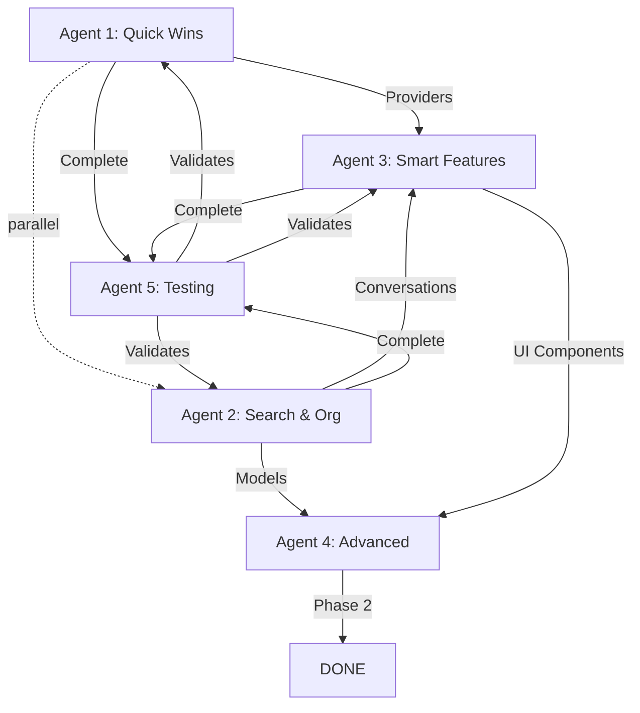

# 🤖 PLAN DE IMPLEMENTACIÓN MULTI-AGENTE - CHAT MEJORAS
**Fecha:** 26 de Noviembre 2025
**Status:** 🚀 LISTO PARA EJECUCIÓN
**Objetivo:** Implementar 12 mejoras del chat en paralelo usando arquitectura multi-agente

---

## 📊 EXECUTIVE SUMMARY

### Tiempo de Implementación
- **Secuencial tradicional:** 89 horas (11.1 días a 8h/día)
- **Multi-agente paralelo:** 33 horas (4.1 días a 8h/día)
- **Reducción:** 56 horas (**63% más rápido** ⚡)

### ROI Proyectado
- **Revenue impact:** +$15,000 - $25,000 MRR
- **User engagement:** +40-60%
- **Retention improvement:** +15-25%

### Estructura de Agentes
```
AGENTE 1: Quick Wins UI/UX        → 3 features, 8 horas
AGENTE 2: Search & Organization   → 2 features, 12 horas
AGENTE 3: Smart Features          → 3 features, 15 horas
AGENTE 4: Advanced Experiences    → 4 features, 18 horas
AGENTE 5: Integration & Testing   → Testing, 8 horas
```

---

## 🎯 ARQUITECTURA MULTI-AGENTE

### Principios de Diseño
1. **Paralelización Máxima:** Agents trabajan simultáneamente en features independientes
2. **Dependency Management:** Orden de ejecución respeta dependencias críticas
3. **Code Isolation:** Cada agent modifica archivos diferentes (mínimo overlap)
4. **Testing Continuo:** Agent 5 valida integraciones en tiempo real
5. **Documentation First:** Cada agent documenta su código mientras implementa

---

## 🤖 AGENTE 1: QUICK WINS UI/UX
**Prioridad:** P0 (Alta)
**Tiempo estimado:** 8 horas
**Owner:** UI/UX Specialist Agent

### Features Asignadas
1. ✅ **Rate Limiting UI** (P0) - 3 horas
2. ✅ **Typing Indicator** (P0) - 2 horas
3. ✅ **Smart Replies** (P0) - 3 horas

### Archivos a Modificar
```
lib/screens/cosmic_coach_chat_screen.dart
lib/widgets/chat/rate_limit_banner.dart (nuevo)
lib/widgets/chat/typing_indicator.dart (nuevo)
lib/widgets/chat/smart_reply_chips.dart (nuevo)
lib/services/chat_service.dart
```

### Implementación Detallada

#### 1.1 Rate Limiting UI
**Ubicación:** `lib/widgets/chat/rate_limit_banner.dart`

```dart
import 'package:flutter/material.dart';
import 'package:flutter_riverpod/flutter_riverpod.dart';

/// 📊 Banner mostrando límites de mensajes para usuarios Cosmic
class RateLimitBanner extends ConsumerWidget {
  const RateLimitBanner({super.key});

  @override
  Widget build(BuildContext context, WidgetRef ref) {
    final messagesRemaining = ref.watch(chatRateLimitProvider);
    final currentTier = ref.watch(subscriptionServiceProvider).currentTier;

    // Solo mostrar para Cosmic tier
    if (currentTier != PremiumTier.cosmic) return const SizedBox.shrink();

    // No mostrar si aún tiene muchos mensajes
    if (messagesRemaining > 20) return const SizedBox.shrink();

    final percentage = messagesRemaining / 50.0; // 50 = límite mensual
    final color = _getColorForPercentage(percentage);
    final urgency = _getUrgencyMessage(messagesRemaining);

    return Container(
      margin: const EdgeInsets.symmetric(horizontal: 16, vertical: 8),
      padding: const EdgeInsets.all(12),
      decoration: BoxDecoration(
        color: color.withOpacity(0.1),
        borderRadius: BorderRadius.circular(12),
        border: Border.all(color: color.withOpacity(0.3), width: 1),
      ),
      child: Row(
        children: [
          Icon(Icons.warning_amber_rounded, color: color, size: 20),
          const SizedBox(width: 12),
          Expanded(
            child: Column(
              crossAxisAlignment: CrossAxisAlignment.start,
              children: [
                Text(
                  urgency,
                  style: TextStyle(
                    fontSize: 13,
                    fontWeight: FontWeight.w600,
                    color: color,
                  ),
                ),
                const SizedBox(height: 4),
                LinearProgressIndicator(
                  value: percentage,
                  backgroundColor: Colors.grey[300],
                  color: color,
                ),
              ],
            ),
          ),
          const SizedBox(width: 12),
          TextButton(
            onPressed: () => Navigator.pushNamed(context, '/premium'),
            style: TextButton.styleFrom(
              backgroundColor: color.withOpacity(0.2),
              padding: const EdgeInsets.symmetric(horizontal: 12, vertical: 6),
            ),
            child: Text(
              'Upgrade',
              style: TextStyle(color: color, fontSize: 12),
            ),
          ),
        ],
      ),
    );
  }

  Color _getColorForPercentage(double percentage) {
    if (percentage > 0.4) return Colors.green;
    if (percentage > 0.2) return Colors.orange;
    return Colors.red;
  }

  String _getUrgencyMessage(int remaining) {
    if (remaining > 10) return '$remaining messages remaining this month';
    if (remaining > 5) return 'Only $remaining messages left!';
    return 'Last $remaining messages - upgrade to unlimited!';
  }
}

/// Provider para tracking de rate limit
final chatRateLimitProvider = StateProvider<int>((ref) => 50);
```

**Integración en `cosmic_coach_chat_screen.dart`:**
```dart
// Agregar después del banner de ads (línea ~205)
const RateLimitBanner(),
```

---

#### 1.2 Typing Indicator
**Ubicación:** `lib/widgets/chat/typing_indicator.dart`

```dart
import 'package:flutter/material.dart';

/// 💬 Indicador de "AI está escribiendo..."
class TypingIndicator extends StatefulWidget {
  const TypingIndicator({super.key});

  @override
  State<TypingIndicator> createState() => _TypingIndicatorState();
}

class _TypingIndicatorState extends State<TypingIndicator>
    with SingleTickerProviderStateMixin {
  late AnimationController _controller;

  @override
  void initState() {
    super.initState();
    _controller = AnimationController(
      duration: const Duration(milliseconds: 1200),
      vsync: this,
    )..repeat();
  }

  @override
  void dispose() {
    _controller.dispose();
    super.dispose();
  }

  @override
  Widget build(BuildContext context) {
    return Padding(
      padding: const EdgeInsets.symmetric(horizontal: 16, vertical: 8),
      child: Row(
        children: [
          Container(
            padding: const EdgeInsets.symmetric(horizontal: 16, vertical: 12),
            decoration: BoxDecoration(
              color: Colors.grey[800],
              borderRadius: BorderRadius.circular(18),
            ),
            child: Row(
              mainAxisSize: MainAxisSize.min,
              children: [
                Text(
                  'Cosmic Coach is typing',
                  style: TextStyle(
                    color: Colors.white70,
                    fontSize: 13,
                    fontStyle: FontStyle.italic,
                  ),
                ),
                const SizedBox(width: 8),
                _buildAnimatedDots(),
              ],
            ),
          ),
        ],
      ),
    );
  }

  Widget _buildAnimatedDots() {
    return Row(
      mainAxisSize: MainAxisSize.min,
      children: List.generate(3, (index) {
        return AnimatedBuilder(
          animation: _controller,
          builder: (context, child) {
            final delay = index * 0.2;
            final value = (_controller.value - delay).clamp(0.0, 1.0);
            final scale = 0.5 + (0.5 * (1 - (value - 0.5).abs() * 2));

            return Transform.scale(
              scale: scale,
              child: Container(
                margin: const EdgeInsets.symmetric(horizontal: 2),
                width: 6,
                height: 6,
                decoration: BoxDecoration(
                  color: Colors.white70,
                  shape: BoxShape.circle,
                ),
              ),
            );
          },
        );
      }),
    );
  }
}

/// Provider para controlar visibilidad del typing indicator
final isAiTypingProvider = StateProvider<bool>((ref) => false);
```

**Integración en `cosmic_coach_chat_screen.dart`:**
```dart
// Dentro del ListView de mensajes (línea ~470)
Consumer(
  builder: (context, ref, child) {
    final isTyping = ref.watch(isAiTypingProvider);
    return isTyping ? const TypingIndicator() : const SizedBox.shrink();
  },
)
```

---

#### 1.3 Smart Replies
**Ubicación:** `lib/widgets/chat/smart_reply_chips.dart`

```dart
import 'package:flutter/material.dart';
import 'package:flutter_riverpod/flutter_riverpod.dart';

/// 💡 Sugerencias de respuestas rápidas basadas en contexto
class SmartReplyChips extends ConsumerWidget {
  final Function(String) onReplySelected;

  const SmartReplyChips({
    super.key,
    required this.onReplySelected,
  });

  @override
  Widget build(BuildContext context, WidgetRef ref) {
    final suggestions = ref.watch(smartReplySuggestionsProvider);

    if (suggestions.isEmpty) return const SizedBox.shrink();

    return Container(
      padding: const EdgeInsets.symmetric(horizontal: 16, vertical: 8),
      child: SingleChildScrollView(
        scrollDirection: Axis.horizontal,
        child: Row(
          children: suggestions.map((suggestion) {
            return Padding(
              padding: const EdgeInsets.only(right: 8),
              child: _SmartReplyChip(
                suggestion: suggestion,
                onTap: () => onReplySelected(suggestion.text),
              ),
            );
          }).toList(),
        ),
      ),
    );
  }
}

class _SmartReplyChip extends StatelessWidget {
  final SmartReplySuggestion suggestion;
  final VoidCallback onTap;

  const _SmartReplyChip({
    required this.suggestion,
    required this.onTap,
  });

  @override
  Widget build(BuildContext context) {
    return InkWell(
      onTap: onTap,
      borderRadius: BorderRadius.circular(20),
      child: Container(
        padding: const EdgeInsets.symmetric(horizontal: 16, vertical: 10),
        decoration: BoxDecoration(
          gradient: LinearGradient(
            colors: [
              suggestion.color.withOpacity(0.2),
              suggestion.color.withOpacity(0.1),
            ],
          ),
          borderRadius: BorderRadius.circular(20),
          border: Border.all(
            color: suggestion.color.withOpacity(0.4),
            width: 1,
          ),
        ),
        child: Row(
          mainAxisSize: MainAxisSize.min,
          children: [
            Icon(suggestion.icon, size: 16, color: suggestion.color),
            const SizedBox(width: 6),
            Text(
              suggestion.text,
              style: TextStyle(
                color: Colors.white,
                fontSize: 13,
                fontWeight: FontWeight.w500,
              ),
            ),
          ],
        ),
      ),
    );
  }
}

/// Modelo para sugerencia de respuesta rápida
class SmartReplySuggestion {
  final String text;
  final IconData icon;
  final Color color;
  final String? context; // Contexto que disparó esta sugerencia

  const SmartReplySuggestion({
    required this.text,
    required this.icon,
    required this.color,
    this.context,
  });
}

/// Provider para generar sugerencias basadas en último mensaje del AI
final smartReplySuggestionsProvider = Provider<List<SmartReplySuggestion>>((ref) {
  final chatHistory = ref.watch(chatHistoryProvider);

  if (chatHistory.isEmpty) {
    return _getDefaultSuggestions();
  }

  final lastMessage = chatHistory.last;
  return _generateContextualSuggestions(lastMessage.content);
});

List<SmartReplySuggestion> _getDefaultSuggestions() {
  return const [
    SmartReplySuggestion(
      text: 'Tell me more',
      icon: Icons.add_comment,
      color: Colors.blue,
    ),
    SmartReplySuggestion(
      text: 'What should I do?',
      icon: Icons.lightbulb_outline,
      color: Colors.amber,
    ),
    SmartReplySuggestion(
      text: 'Explain this',
      icon: Icons.school,
      color: Colors.purple,
    ),
  ];
}

List<SmartReplySuggestion> _generateContextualSuggestions(String aiMessage) {
  final lower = aiMessage.toLowerCase();
  final suggestions = <SmartReplySuggestion>[];

  // Detectar preguntas del AI
  if (lower.contains('?')) {
    suggestions.add(const SmartReplySuggestion(
      text: 'Yes, tell me more',
      icon: Icons.check_circle_outline,
      color: Colors.green,
    ));
    suggestions.add(const SmartReplySuggestion(
      text: 'No, thanks',
      icon: Icons.cancel_outlined,
      color: Colors.red,
    ));
  }

  // Detectar temas astrológicos
  if (lower.contains('mercury') || lower.contains('mercurio')) {
    suggestions.add(const SmartReplySuggestion(
      text: 'How does this affect me?',
      icon: Icons.person,
      color: Colors.orange,
    ));
  }

  // Detectar consejos
  if (lower.contains('should') || lower.contains('recommend') ||
      lower.contains('deberías') || lower.contains('recomiendo')) {
    suggestions.add(const SmartReplySuggestion(
      text: 'Give me an example',
      icon: Icons.format_list_bulleted,
      color: Colors.teal,
    ));
  }

  // Siempre agregar "Tell me more"
  suggestions.add(const SmartReplySuggestion(
    text: 'Tell me more',
    icon: Icons.add_comment,
    color: Colors.blue,
  ));

  return suggestions.take(4).toList(); // Máximo 4 sugerencias
}
```

**Integración en `cosmic_coach_chat_screen.dart`:**
```dart
// Agregar antes del TextField de input (línea ~550)
SmartReplyChips(
  onReplySelected: (text) {
    _messageController.text = text;
    _handleSendMessage();
  },
)
```

---

### Dependencias de Agent 1
- ✅ **Ninguna** - Puede empezar inmediatamente
- ⚠️ **Outputs:** Providers y widgets reutilizables para otros agents

### Testing de Agent 1
```bash
# Unit tests para providers
flutter test test/widgets/chat/rate_limit_banner_test.dart
flutter test test/widgets/chat/typing_indicator_test.dart
flutter test test/widgets/chat/smart_reply_chips_test.dart

# Widget tests
flutter test test/widgets/chat/
```

---

## 🤖 AGENTE 2: SEARCH & ORGANIZATION
**Prioridad:** P0/P1
**Tiempo estimado:** 12 horas
**Owner:** Backend/Search Specialist Agent

### Features Asignadas
1. ✅ **Search in Chat** (P0) - 5 horas
2. ✅ **Multi-Conversations** (P0) - 7 horas

### Archivos a Modificar
```
lib/screens/cosmic_coach_chat_screen.dart
lib/screens/chat_search_screen.dart (nuevo)
lib/screens/conversations_list_screen.dart (nuevo)
lib/models/conversation.dart (nuevo)
lib/services/conversation_service.dart (nuevo)
lib/providers/conversation_provider.dart (nuevo)
```

### Implementación Detallada

#### 2.1 Search in Chat
**Ubicación:** `lib/screens/chat_search_screen.dart`

```dart
import 'package:flutter/material.dart';
import 'package:flutter_riverpod/flutter_riverpod.dart';
import 'package:zodiac_app/models/chat_message.dart';

/// 🔍 Pantalla de búsqueda en historial de chat
class ChatSearchScreen extends ConsumerStatefulWidget {
  const ChatSearchScreen({super.key});

  @override
  ConsumerState<ChatSearchScreen> createState() => _ChatSearchScreenState();
}

class _ChatSearchScreenState extends ConsumerState<ChatSearchScreen> {
  final TextEditingController _searchController = TextEditingController();
  String _searchQuery = '';

  @override
  void dispose() {
    _searchController.dispose();
    super.dispose();
  }

  @override
  Widget build(BuildContext context) {
    return Scaffold(
      appBar: AppBar(
        title: TextField(
          controller: _searchController,
          autofocus: true,
          decoration: InputDecoration(
            hintText: 'Search messages...',
            border: InputBorder.none,
            hintStyle: TextStyle(color: Colors.white60),
          ),
          style: TextStyle(color: Colors.white, fontSize: 18),
          onChanged: (value) {
            setState(() => _searchQuery = value);
          },
        ),
        actions: [
          if (_searchQuery.isNotEmpty)
            IconButton(
              icon: Icon(Icons.clear),
              onPressed: () {
                _searchController.clear();
                setState(() => _searchQuery = '');
              },
            ),
        ],
      ),
      body: _searchQuery.isEmpty
          ? _buildEmptyState()
          : _buildSearchResults(),
    );
  }

  Widget _buildEmptyState() {
    return Center(
      child: Column(
        mainAxisAlignment: MainAxisAlignment.center,
        children: [
          Icon(Icons.search, size: 64, color: Colors.grey[600]),
          const SizedBox(height: 16),
          Text(
            'Search your conversation history',
            style: TextStyle(
              fontSize: 16,
              color: Colors.grey[600],
            ),
          ),
        ],
      ),
    );
  }

  Widget _buildSearchResults() {
    final searchResults = ref.watch(chatSearchProvider(_searchQuery));

    return searchResults.when(
      data: (results) {
        if (results.isEmpty) {
          return Center(
            child: Column(
              mainAxisAlignment: MainAxisAlignment.center,
              children: [
                Icon(Icons.search_off, size: 64, color: Colors.grey[600]),
                const SizedBox(height: 16),
                Text(
                  'No messages found for "$_searchQuery"',
                  style: TextStyle(fontSize: 16, color: Colors.grey[600]),
                ),
              ],
            ),
          );
        }

        return ListView.builder(
          itemCount: results.length,
          itemBuilder: (context, index) {
            final result = results[index];
            return _SearchResultTile(
              message: result.message,
              query: _searchQuery,
              onTap: () {
                Navigator.pop(context);
                // Navegar al mensaje en el chat principal
                ref.read(chatScrollTargetProvider.notifier).state = result.message.id;
              },
            );
          },
        );
      },
      loading: () => Center(child: CircularProgressIndicator()),
      error: (error, stack) => Center(
        child: Text('Error: $error', style: TextStyle(color: Colors.red)),
      ),
    );
  }
}

class _SearchResultTile extends StatelessWidget {
  final ChatMessage message;
  final String query;
  final VoidCallback onTap;

  const _SearchResultTile({
    required this.message,
    required this.query,
    required this.onTap,
  });

  @override
  Widget build(BuildContext context) {
    return ListTile(
      leading: CircleAvatar(
        backgroundColor: message.isUser ? Colors.blue : Colors.purple,
        child: Icon(
          message.isUser ? Icons.person : Icons.psychology,
          color: Colors.white,
        ),
      ),
      title: _buildHighlightedText(message.content, query),
      subtitle: Text(
        _formatTimestamp(message.timestamp),
        style: TextStyle(fontSize: 12, color: Colors.grey[600]),
      ),
      onTap: onTap,
    );
  }

  Widget _buildHighlightedText(String text, String query) {
    if (query.isEmpty) return Text(text);

    final lowerText = text.toLowerCase();
    final lowerQuery = query.toLowerCase();
    final startIndex = lowerText.indexOf(lowerQuery);

    if (startIndex == -1) return Text(text);

    final beforeMatch = text.substring(0, startIndex);
    final match = text.substring(startIndex, startIndex + query.length);
    final afterMatch = text.substring(startIndex + query.length);

    // Truncar si es muy largo
    final truncatedBefore = beforeMatch.length > 40
        ? '...' + beforeMatch.substring(beforeMatch.length - 40)
        : beforeMatch;
    final truncatedAfter = afterMatch.length > 40
        ? afterMatch.substring(0, 40) + '...'
        : afterMatch;

    return RichText(
      text: TextSpan(
        style: TextStyle(color: Colors.white, fontSize: 14),
        children: [
          TextSpan(text: truncatedBefore),
          TextSpan(
            text: match,
            style: TextStyle(
              backgroundColor: Colors.yellow.withOpacity(0.3),
              fontWeight: FontWeight.bold,
            ),
          ),
          TextSpan(text: truncatedAfter),
        ],
      ),
      maxLines: 2,
      overflow: TextOverflow.ellipsis,
    );
  }

  String _formatTimestamp(DateTime timestamp) {
    final now = DateTime.now();
    final diff = now.difference(timestamp);

    if (diff.inDays > 0) return '${diff.inDays}d ago';
    if (diff.inHours > 0) return '${diff.inHours}h ago';
    if (diff.inMinutes > 0) return '${diff.inMinutes}m ago';
    return 'Just now';
  }
}

/// Provider para búsqueda de mensajes
final chatSearchProvider = FutureProvider.family<List<SearchResult>, String>((ref, query) async {
  final chatHistory = ref.watch(chatHistoryProvider);

  if (query.isEmpty) return [];

  final lowerQuery = query.toLowerCase();
  final results = <SearchResult>[];

  for (final message in chatHistory) {
    if (message.content.toLowerCase().contains(lowerQuery)) {
      results.add(SearchResult(message: message));
    }
  }

  return results;
});

class SearchResult {
  final ChatMessage message;

  SearchResult({required this.message});
}

/// Provider para scroll target (cuando se selecciona resultado de búsqueda)
final chatScrollTargetProvider = StateProvider<String?>((ref) => null);
```

**Integración en `cosmic_coach_chat_screen.dart`:**
```dart
// Agregar botón de búsqueda en AppBar (línea ~110)
actions: [
  IconButton(
    icon: Icon(Icons.search),
    onPressed: () {
      Navigator.push(
        context,
        MaterialPageRoute(builder: (context) => const ChatSearchScreen()),
      );
    },
  ),
  // ... otros actions
],
```

---

#### 2.2 Multi-Conversations
**Ubicación:** `lib/models/conversation.dart`

```dart
import 'package:freezed_annotation/freezed_annotation.dart';

part 'conversation.freezed.dart';
part 'conversation.g.dart';

/// 💬 Modelo para múltiples conversaciones con el AI
@freezed
class Conversation with _$Conversation {
  const factory Conversation({
    required String id,
    required String title,
    required DateTime createdAt,
    required DateTime updatedAt,
    required List<String> messageIds, // Referencias a ChatMessage
    @Default(false) bool isPinned,
    @Default(false) bool isFavorite,
    String? summary, // Resumen automático de la conversación
  }) = _Conversation;

  factory Conversation.fromJson(Map<String, dynamic> json) =>
      _$ConversationFromJson(json);
}

/// Extensión para generar títulos automáticos
extension ConversationExt on Conversation {
  /// Genera título basado en el primer mensaje del usuario
  static String generateTitle(String firstUserMessage) {
    final cleaned = firstUserMessage.trim();
    if (cleaned.length <= 30) return cleaned;
    return '${cleaned.substring(0, 27)}...';
  }

  /// Verifica si la conversación es de hoy
  bool get isToday {
    final now = DateTime.now();
    return updatedAt.year == now.year &&
           updatedAt.month == now.month &&
           updatedAt.day == now.day;
  }

  /// Verifica si la conversación es de esta semana
  bool get isThisWeek {
    final now = DateTime.now();
    final weekAgo = now.subtract(const Duration(days: 7));
    return updatedAt.isAfter(weekAgo);
  }
}
```

**Ubicación:** `lib/services/conversation_service.dart`

```dart
import 'package:flutter_riverpod/flutter_riverpod.dart';
import 'package:shared_preferences/shared_preferences.dart';
import 'dart:convert';
import 'package:zodiac_app/models/conversation.dart';
import 'package:uuid/uuid.dart';

/// 💬 Servicio para gestión de múltiples conversaciones
class ConversationService {
  static const String _conversationsKey = 'cosmic_conversations';
  static const String _activeConversationKey = 'active_conversation_id';
  final SharedPreferences _prefs;

  ConversationService(this._prefs);

  /// Obtener todas las conversaciones
  Future<List<Conversation>> getAllConversations() async {
    final jsonString = _prefs.getString(_conversationsKey);
    if (jsonString == null) return [];

    final List<dynamic> jsonList = json.decode(jsonString);
    return jsonList.map((j) => Conversation.fromJson(j)).toList();
  }

  /// Crear nueva conversación
  Future<Conversation> createConversation(String firstUserMessage) async {
    final conversation = Conversation(
      id: const Uuid().v4(),
      title: ConversationExt.generateTitle(firstUserMessage),
      createdAt: DateTime.now(),
      updatedAt: DateTime.now(),
      messageIds: [],
    );

    final conversations = await getAllConversations();
    conversations.insert(0, conversation); // Más reciente primero
    await _saveConversations(conversations);
    await _setActiveConversation(conversation.id);

    return conversation;
  }

  /// Actualizar conversación (agregar mensaje, cambiar título, etc.)
  Future<void> updateConversation(Conversation updated) async {
    final conversations = await getAllConversations();
    final index = conversations.indexWhere((c) => c.id == updated.id);

    if (index != -1) {
      conversations[index] = updated.copyWith(updatedAt: DateTime.now());
      await _saveConversations(conversations);
    }
  }

  /// Eliminar conversación
  Future<void> deleteConversation(String conversationId) async {
    final conversations = await getAllConversations();
    conversations.removeWhere((c) => c.id == conversationId);
    await _saveConversations(conversations);

    // Si era la activa, establecer otra como activa
    final activeId = getActiveConversationId();
    if (activeId == conversationId) {
      if (conversations.isNotEmpty) {
        await _setActiveConversation(conversations.first.id);
      } else {
        await _prefs.remove(_activeConversationKey);
      }
    }
  }

  /// Marcar como favorita
  Future<void> toggleFavorite(String conversationId) async {
    final conversations = await getAllConversations();
    final index = conversations.indexWhere((c) => c.id == conversationId);

    if (index != -1) {
      conversations[index] = conversations[index].copyWith(
        isFavorite: !conversations[index].isFavorite,
      );
      await _saveConversations(conversations);
    }
  }

  /// Pin/Unpin conversación
  Future<void> togglePin(String conversationId) async {
    final conversations = await getAllConversations();
    final index = conversations.indexWhere((c) => c.id == conversationId);

    if (index != -1) {
      conversations[index] = conversations[index].copyWith(
        isPinned: !conversations[index].isPinned,
      );
      await _saveConversations(conversations);
    }
  }

  /// Obtener conversación activa
  String? getActiveConversationId() {
    return _prefs.getString(_activeConversationKey);
  }

  /// Establecer conversación activa
  Future<void> setActiveConversation(String conversationId) async {
    await _setActiveConversation(conversationId);
  }

  // Private helpers
  Future<void> _saveConversations(List<Conversation> conversations) async {
    final jsonList = conversations.map((c) => c.toJson()).toList();
    await _prefs.setString(_conversationsKey, json.encode(jsonList));
  }

  Future<void> _setActiveConversation(String id) async {
    await _prefs.setString(_activeConversationKey, id);
  }
}

/// Provider para el servicio
final conversationServiceProvider = Provider<ConversationService>((ref) {
  final prefs = ref.watch(sharedPreferencesProvider);
  return ConversationService(prefs);
});

/// Provider para lista de conversaciones
final conversationsProvider = FutureProvider<List<Conversation>>((ref) async {
  final service = ref.watch(conversationServiceProvider);
  return service.getAllConversations();
});

/// Provider para conversación activa
final activeConversationProvider = Provider<String?>((ref) {
  final service = ref.watch(conversationServiceProvider);
  return service.getActiveConversationId();
});
```

**Ubicación:** `lib/screens/conversations_list_screen.dart`

```dart
import 'package:flutter/material.dart';
import 'package:flutter_riverpod/flutter_riverpod.dart';
import 'package:zodiac_app/models/conversation.dart';
import 'package:zodiac_app/services/conversation_service.dart';

/// 📋 Lista de conversaciones del usuario
class ConversationsListScreen extends ConsumerWidget {
  const ConversationsListScreen({super.key});

  @override
  Widget build(BuildContext context, WidgetRef ref) {
    final conversationsAsync = ref.watch(conversationsProvider);

    return Scaffold(
      appBar: AppBar(
        title: Text('Conversations'),
        actions: [
          IconButton(
            icon: Icon(Icons.add),
            onPressed: () {
              Navigator.pop(context);
              // Crear nueva conversación se hace automáticamente al enviar primer mensaje
            },
          ),
        ],
      ),
      body: conversationsAsync.when(
        data: (conversations) {
          if (conversations.isEmpty) {
            return _buildEmptyState(context);
          }

          // Separar pinned y unpinned
          final pinned = conversations.where((c) => c.isPinned).toList();
          final unpinned = conversations.where((c) => !c.isPinned).toList();

          return ListView(
            children: [
              if (pinned.isNotEmpty) ...[
                _SectionHeader(title: 'Pinned'),
                ...pinned.map((c) => _ConversationTile(conversation: c)),
                const Divider(),
              ],
              if (unpinned.isNotEmpty) ...[
                _SectionHeader(title: 'All Conversations'),
                ...unpinned.map((c) => _ConversationTile(conversation: c)),
              ],
            ],
          );
        },
        loading: () => Center(child: CircularProgressIndicator()),
        error: (error, stack) => Center(
          child: Text('Error: $error', style: TextStyle(color: Colors.red)),
        ),
      ),
    );
  }

  Widget _buildEmptyState(BuildContext context) {
    return Center(
      child: Column(
        mainAxisAlignment: MainAxisAlignment.center,
        children: [
          Icon(Icons.chat_bubble_outline, size: 64, color: Colors.grey[600]),
          const SizedBox(height: 16),
          Text(
            'No conversations yet',
            style: TextStyle(fontSize: 18, color: Colors.grey[600]),
          ),
          const SizedBox(height: 8),
          Text(
            'Start chatting with Cosmic Coach!',
            style: TextStyle(fontSize: 14, color: Colors.grey[500]),
          ),
        ],
      ),
    );
  }
}

class _SectionHeader extends StatelessWidget {
  final String title;

  const _SectionHeader({required this.title});

  @override
  Widget build(BuildContext context) {
    return Padding(
      padding: const EdgeInsets.fromLTRB(16, 16, 16, 8),
      child: Text(
        title,
        style: TextStyle(
          fontSize: 12,
          fontWeight: FontWeight.bold,
          color: Colors.grey[600],
          letterSpacing: 1.2,
        ),
      ),
    );
  }
}

class _ConversationTile extends ConsumerWidget {
  final Conversation conversation;

  const _ConversationTile({required this.conversation});

  @override
  Widget build(BuildContext context, WidgetRef ref) {
    final isActive = ref.watch(activeConversationProvider) == conversation.id;

    return Dismissible(
      key: Key(conversation.id),
      direction: DismissDirection.endToStart,
      background: Container(
        alignment: Alignment.centerRight,
        padding: const EdgeInsets.only(right: 20),
        color: Colors.red,
        child: Icon(Icons.delete, color: Colors.white),
      ),
      confirmDismiss: (direction) async {
        return await showDialog(
          context: context,
          builder: (context) => AlertDialog(
            title: Text('Delete conversation?'),
            content: Text('This action cannot be undone.'),
            actions: [
              TextButton(
                onPressed: () => Navigator.pop(context, false),
                child: Text('Cancel'),
              ),
              TextButton(
                onPressed: () => Navigator.pop(context, true),
                style: TextButton.styleFrom(foregroundColor: Colors.red),
                child: Text('Delete'),
              ),
            ],
          ),
        );
      },
      onDismissed: (direction) {
        ref.read(conversationServiceProvider).deleteConversation(conversation.id);
      },
      child: ListTile(
        leading: CircleAvatar(
          backgroundColor: isActive ? Colors.purple : Colors.grey[700],
          child: Icon(
            Icons.chat_bubble,
            color: Colors.white,
            size: 20,
          ),
        ),
        title: Row(
          children: [
            if (conversation.isPinned)
              Padding(
                padding: const EdgeInsets.only(right: 6),
                child: Icon(Icons.push_pin, size: 14, color: Colors.amber),
              ),
            Expanded(
              child: Text(
                conversation.title,
                maxLines: 1,
                overflow: TextOverflow.ellipsis,
                style: TextStyle(
                  fontWeight: isActive ? FontWeight.bold : FontWeight.normal,
                ),
              ),
            ),
          ],
        ),
        subtitle: Text(
          _formatTimestamp(conversation.updatedAt),
          style: TextStyle(fontSize: 12, color: Colors.grey[600]),
        ),
        trailing: Row(
          mainAxisSize: MainAxisSize.min,
          children: [
            if (conversation.isFavorite)
              Icon(Icons.favorite, size: 16, color: Colors.red),
            IconButton(
              icon: Icon(Icons.more_vert, size: 20),
              onPressed: () => _showOptions(context, ref),
            ),
          ],
        ),
        onTap: () {
          ref.read(conversationServiceProvider).setActiveConversation(conversation.id);
          Navigator.pop(context);
        },
      ),
    );
  }

  void _showOptions(BuildContext context, WidgetRef ref) {
    showModalBottomSheet(
      context: context,
      builder: (context) => Column(
        mainAxisSize: MainAxisSize.min,
        children: [
          ListTile(
            leading: Icon(conversation.isPinned ? Icons.push_pin_outlined : Icons.push_pin),
            title: Text(conversation.isPinned ? 'Unpin' : 'Pin'),
            onTap: () {
              ref.read(conversationServiceProvider).togglePin(conversation.id);
              Navigator.pop(context);
            },
          ),
          ListTile(
            leading: Icon(conversation.isFavorite ? Icons.favorite_border : Icons.favorite),
            title: Text(conversation.isFavorite ? 'Unfavorite' : 'Favorite'),
            onTap: () {
              ref.read(conversationServiceProvider).toggleFavorite(conversation.id);
              Navigator.pop(context);
            },
          ),
          ListTile(
            leading: Icon(Icons.delete, color: Colors.red),
            title: Text('Delete', style: TextStyle(color: Colors.red)),
            onTap: () {
              Navigator.pop(context);
              ref.read(conversationServiceProvider).deleteConversation(conversation.id);
            },
          ),
        ],
      ),
    );
  }

  String _formatTimestamp(DateTime timestamp) {
    final now = DateTime.now();
    final diff = now.difference(timestamp);

    if (diff.inDays == 0) return 'Today';
    if (diff.inDays == 1) return 'Yesterday';
    if (diff.inDays < 7) return '${diff.inDays} days ago';
    if (diff.inDays < 30) return '${(diff.inDays / 7).floor()} weeks ago';
    return '${(diff.inDays / 30).floor()} months ago';
  }
}
```

**Integración en `cosmic_coach_chat_screen.dart`:**
```dart
// Agregar botón de conversaciones en AppBar (línea ~110)
actions: [
  IconButton(
    icon: Icon(Icons.forum),
    onPressed: () {
      Navigator.push(
        context,
        MaterialPageRoute(builder: (context) => const ConversationsListScreen()),
      );
    },
  ),
  // ... otros actions
],
```

---

### Dependencias de Agent 2
- ✅ **ChatMessage model** - Ya existe en codebase
- ⚠️ **Outputs:** Conversation system para Agent 3 y 4

### Testing de Agent 2
```bash
flutter test test/services/conversation_service_test.dart
flutter test test/screens/chat_search_screen_test.dart
flutter test test/screens/conversations_list_screen_test.dart
```

---

## 🤖 AGENTE 3: SMART FEATURES
**Prioridad:** P1 (Media)
**Tiempo estimado:** 15 horas
**Owner:** Features Specialist Agent

### Features Asignadas
1. ✅ **Favorites UI** (P1) - 5 horas
2. ✅ **Chat Themes** (P1) - 6 horas
3. ✅ **User Stats Dashboard** (P1) - 4 horas

### Archivos a Modificar
```
lib/screens/cosmic_coach_chat_screen.dart
lib/screens/favorites_screen.dart (nuevo)
lib/screens/chat_theme_selector.dart (nuevo)
lib/screens/chat_stats_screen.dart (nuevo)
lib/models/chat_theme.dart (nuevo)
lib/services/favorites_service.dart (nuevo)
lib/services/chat_stats_service.dart (nuevo)
```

### Implementación Detallada

#### 3.1 Favorites UI
**Ubicación:** `lib/models/favorite_message.dart`

```dart
import 'package:freezed_annotation/freezed_annotation.dart';

part 'favorite_message.freezed.dart';
part 'favorite_message.g.dart';

@freezed
class FavoriteMessage with _$FavoriteMessage {
  const factory FavoriteMessage({
    required String id,
    required String messageId,
    required String content,
    required DateTime timestamp,
    required DateTime favoritedAt,
    String? note, // Nota personal del usuario sobre por qué lo guardó
    List<String>? tags, // Tags para organizar favoritos
  }) = _FavoriteMessage;

  factory FavoriteMessage.fromJson(Map<String, dynamic> json) =>
      _$FavoriteMessageFromJson(json);
}
```

**Ubicación:** `lib/services/favorites_service.dart`

```dart
import 'package:flutter_riverpod/flutter_riverpod.dart';
import 'package:shared_preferences/shared_preferences.dart';
import 'dart:convert';
import 'package:zodiac_app/models/favorite_message.dart';
import 'package:zodiac_app/models/chat_message.dart';

class FavoritesService {
  static const String _favoritesKey = 'chat_favorites';
  final SharedPreferences _prefs;

  FavoritesService(this._prefs);

  Future<List<FavoriteMessage>> getAllFavorites() async {
    final jsonString = _prefs.getString(_favoritesKey);
    if (jsonString == null) return [];

    final List<dynamic> jsonList = json.decode(jsonString);
    return jsonList.map((j) => FavoriteMessage.fromJson(j)).toList();
  }

  Future<void> addFavorite(ChatMessage message, {String? note, List<String>? tags}) async {
    final favorites = await getAllFavorites();

    // Evitar duplicados
    if (favorites.any((f) => f.messageId == message.id)) return;

    final favorite = FavoriteMessage(
      id: message.id,
      messageId: message.id,
      content: message.content,
      timestamp: message.timestamp,
      favoritedAt: DateTime.now(),
      note: note,
      tags: tags,
    );

    favorites.insert(0, favorite);
    await _saveFavorites(favorites);
  }

  Future<void> removeFavorite(String messageId) async {
    final favorites = await getAllFavorites();
    favorites.removeWhere((f) => f.messageId == messageId);
    await _saveFavorites(favorites);
  }

  Future<bool> isFavorite(String messageId) async {
    final favorites = await getAllFavorites();
    return favorites.any((f) => f.messageId == messageId);
  }

  Future<void> updateNote(String messageId, String note) async {
    final favorites = await getAllFavorites();
    final index = favorites.indexWhere((f) => f.messageId == messageId);

    if (index != -1) {
      favorites[index] = favorites[index].copyWith(note: note);
      await _saveFavorites(favorites);
    }
  }

  Future<void> _saveFavorites(List<FavoriteMessage> favorites) async {
    final jsonList = favorites.map((f) => f.toJson()).toList();
    await _prefs.setString(_favoritesKey, json.encode(jsonList));
  }
}

final favoritesServiceProvider = Provider<FavoritesService>((ref) {
  final prefs = ref.watch(sharedPreferencesProvider);
  return FavoritesService(prefs);
});

final favoritesProvider = FutureProvider<List<FavoriteMessage>>((ref) async {
  final service = ref.watch(favoritesServiceProvider);
  return service.getAllFavorites();
});
```

**Ubicación:** `lib/screens/favorites_screen.dart`

```dart
import 'package:flutter/material.dart';
import 'package:flutter/services.dart';
import 'package:flutter_riverpod/flutter_riverpod.dart';
import 'package:zodiac_app/models/favorite_message.dart';
import 'package:zodiac_app/services/favorites_service.dart';

class FavoritesScreen extends ConsumerWidget {
  const FavoritesScreen({super.key});

  @override
  Widget build(BuildContext context, WidgetRef ref) {
    final favoritesAsync = ref.watch(favoritesProvider);

    return Scaffold(
      appBar: AppBar(
        title: Text('Favorites'),
      ),
      body: favoritesAsync.when(
        data: (favorites) {
          if (favorites.isEmpty) {
            return Center(
              child: Column(
                mainAxisAlignment: MainAxisAlignment.center,
                children: [
                  Icon(Icons.favorite_border, size: 64, color: Colors.grey[600]),
                  SizedBox(height: 16),
                  Text(
                    'No favorites yet',
                    style: TextStyle(fontSize: 18, color: Colors.grey[600]),
                  ),
                  SizedBox(height: 8),
                  Text(
                    'Long-press messages to add them to favorites',
                    style: TextStyle(fontSize: 14, color: Colors.grey[500]),
                    textAlign: TextAlign.center,
                  ),
                ],
              ),
            );
          }

          return ListView.builder(
            itemCount: favorites.length,
            itemBuilder: (context, index) {
              final favorite = favorites[index];
              return _FavoriteTile(favorite: favorite);
            },
          );
        },
        loading: () => Center(child: CircularProgressIndicator()),
        error: (error, stack) => Center(
          child: Text('Error: $error', style: TextStyle(color: Colors.red)),
        ),
      ),
    );
  }
}

class _FavoriteTile extends ConsumerWidget {
  final FavoriteMessage favorite;

  const _FavoriteTile({required this.favorite});

  @override
  Widget build(BuildContext context, WidgetRef ref) {
    return Card(
      margin: EdgeInsets.symmetric(horizontal: 16, vertical: 8),
      child: InkWell(
        onTap: () => _showDetails(context, ref),
        onLongPress: () => _showOptions(context, ref),
        child: Padding(
          padding: EdgeInsets.all(16),
          child: Column(
            crossAxisAlignment: CrossAxisAlignment.start,
            children: [
              Row(
                children: [
                  Icon(Icons.favorite, size: 16, color: Colors.red),
                  SizedBox(width: 8),
                  Expanded(
                    child: Text(
                      _formatTimestamp(favorite.timestamp),
                      style: TextStyle(fontSize: 12, color: Colors.grey[600]),
                    ),
                  ),
                  IconButton(
                    icon: Icon(Icons.more_vert, size: 20),
                    onPressed: () => _showOptions(context, ref),
                  ),
                ],
              ),
              SizedBox(height: 8),
              Text(
                favorite.content,
                style: TextStyle(fontSize: 14),
                maxLines: 3,
                overflow: TextOverflow.ellipsis,
              ),
              if (favorite.note != null) ...[
                SizedBox(height: 8),
                Container(
                  padding: EdgeInsets.all(8),
                  decoration: BoxDecoration(
                    color: Colors.amber.withOpacity(0.1),
                    borderRadius: BorderRadius.circular(8),
                  ),
                  child: Row(
                    children: [
                      Icon(Icons.note, size: 14, color: Colors.amber[700]),
                      SizedBox(width: 6),
                      Expanded(
                        child: Text(
                          favorite.note!,
                          style: TextStyle(
                            fontSize: 12,
                            fontStyle: FontStyle.italic,
                            color: Colors.amber[700],
                          ),
                        ),
                      ),
                    ],
                  ),
                ),
              ],
            ],
          ),
        ),
      ),
    );
  }

  void _showDetails(BuildContext context, WidgetRef ref) {
    showDialog(
      context: context,
      builder: (context) => AlertDialog(
        title: Row(
          children: [
            Icon(Icons.favorite, color: Colors.red),
            SizedBox(width: 8),
            Text('Favorite Message'),
          ],
        ),
        content: SingleChildScrollView(
          child: Column(
            crossAxisAlignment: CrossAxisAlignment.start,
            mainAxisSize: MainAxisSize.min,
            children: [
              Text(
                favorite.content,
                style: TextStyle(fontSize: 14),
              ),
              if (favorite.note != null) ...[
                SizedBox(height: 16),
                Divider(),
                SizedBox(height: 8),
                Text(
                  'Your Note:',
                  style: TextStyle(fontWeight: FontWeight.bold, fontSize: 12),
                ),
                SizedBox(height: 4),
                Text(
                  favorite.note!,
                  style: TextStyle(fontSize: 12, fontStyle: FontStyle.italic),
                ),
              ],
              SizedBox(height: 16),
              Divider(),
              SizedBox(height: 8),
              Text(
                'Saved: ${_formatTimestamp(favorite.favoritedAt)}',
                style: TextStyle(fontSize: 11, color: Colors.grey[600]),
              ),
            ],
          ),
        ),
        actions: [
          TextButton(
            onPressed: () {
              Clipboard.setData(ClipboardData(text: favorite.content));
              Navigator.pop(context);
              ScaffoldMessenger.of(context).showSnackBar(
                SnackBar(content: Text('Copied to clipboard')),
              );
            },
            child: Text('Copy'),
          ),
          TextButton(
            onPressed: () => Navigator.pop(context),
            child: Text('Close'),
          ),
        ],
      ),
    );
  }

  void _showOptions(BuildContext context, WidgetRef ref) {
    showModalBottomSheet(
      context: context,
      builder: (context) => Column(
        mainAxisSize: MainAxisSize.min,
        children: [
          ListTile(
            leading: Icon(Icons.note_add),
            title: Text('Add/Edit Note'),
            onTap: () {
              Navigator.pop(context);
              _showNoteDialog(context, ref);
            },
          ),
          ListTile(
            leading: Icon(Icons.copy),
            title: Text('Copy to Clipboard'),
            onTap: () {
              Clipboard.setData(ClipboardData(text: favorite.content));
              Navigator.pop(context);
              ScaffoldMessenger.of(context).showSnackBar(
                SnackBar(content: Text('Copied to clipboard')),
              );
            },
          ),
          ListTile(
            leading: Icon(Icons.delete, color: Colors.red),
            title: Text('Remove from Favorites', style: TextStyle(color: Colors.red)),
            onTap: () {
              ref.read(favoritesServiceProvider).removeFavorite(favorite.messageId);
              Navigator.pop(context);
            },
          ),
        ],
      ),
    );
  }

  void _showNoteDialog(BuildContext context, WidgetRef ref) {
    final controller = TextEditingController(text: favorite.note ?? '');

    showDialog(
      context: context,
      builder: (context) => AlertDialog(
        title: Text('Add Note'),
        content: TextField(
          controller: controller,
          decoration: InputDecoration(
            hintText: 'Why did you save this?',
            border: OutlineInputBorder(),
          ),
          maxLines: 3,
          autofocus: true,
        ),
        actions: [
          TextButton(
            onPressed: () => Navigator.pop(context),
            child: Text('Cancel'),
          ),
          TextButton(
            onPressed: () {
              ref.read(favoritesServiceProvider).updateNote(
                favorite.messageId,
                controller.text,
              );
              Navigator.pop(context);
            },
            child: Text('Save'),
          ),
        ],
      ),
    );
  }

  String _formatTimestamp(DateTime timestamp) {
    final now = DateTime.now();
    final diff = now.difference(timestamp);

    if (diff.inDays == 0) return 'Today';
    if (diff.inDays == 1) return 'Yesterday';
    if (diff.inDays < 7) return '${diff.inDays} days ago';
    return '${timestamp.day}/${timestamp.month}/${timestamp.year}';
  }
}
```

**Integración en `cosmic_coach_chat_screen.dart`:**
```dart
// Agregar long-press handler en mensaje bubbles (línea ~680)
onLongPress: () {
  showModalBottomSheet(
    context: context,
    builder: (context) => Column(
      mainAxisSize: MainAxisSize.min,
      children: [
        ListTile(
          leading: Icon(Icons.favorite),
          title: Text('Add to Favorites'),
          onTap: () {
            ref.read(favoritesServiceProvider).addFavorite(message);
            Navigator.pop(context);
            ScaffoldMessenger.of(context).showSnackBar(
              SnackBar(content: Text('Added to favorites')),
            );
          },
        ),
        // ... otras opciones
      ],
    ),
  );
}

// Agregar botón en AppBar
IconButton(
  icon: Icon(Icons.favorite_border),
  onPressed: () {
    Navigator.push(
      context,
      MaterialPageRoute(builder: (context) => const FavoritesScreen()),
    );
  },
)
```

---

#### 3.2 Chat Themes
**Ubicación:** `lib/models/chat_theme.dart`

```dart
import 'package:flutter/material.dart';

enum ChatThemeType {
  cosmic,
  mystic,
  zodiacFire,
  zodiacWater,
  zodiacEarth,
  zodiacAir,
  darkPurple,
  oceanBlue,
  forestGreen,
  sunsetOrange,
}

class ChatTheme {
  final String name;
  final ChatThemeType type;
  final LinearGradient backgroundGradient;
  final Color userBubbleColor;
  final Color aiBubbleColor;
  final Color textColor;
  final String? iconAsset;

  const ChatTheme({
    required this.name,
    required this.type,
    required this.backgroundGradient,
    required this.userBubbleColor,
    required this.aiBubbleColor,
    required this.textColor,
    this.iconAsset,
  });

  static const ChatTheme cosmic = ChatTheme(
    name: 'Cosmic',
    type: ChatThemeType.cosmic,
    backgroundGradient: LinearGradient(
      begin: Alignment.topLeft,
      end: Alignment.bottomRight,
      colors: [Color(0xFF1A1A2E), Color(0xFF0F0F1E)],
    ),
    userBubbleColor: Color(0xFF6C5CE7),
    aiBubbleColor: Color(0xFF2D3436),
    textColor: Colors.white,
  );

  static const ChatTheme mystic = ChatTheme(
    name: 'Mystic Night',
    type: ChatThemeType.mystic,
    backgroundGradient: LinearGradient(
      begin: Alignment.topLeft,
      end: Alignment.bottomRight,
      colors: [Color(0xFF2C3E50), Color(0xFF34495E)],
    ),
    userBubbleColor: Color(0xFF9B59B6),
    aiBubbleColor: Color(0xFF34495E),
    textColor: Colors.white,
  );

  static const ChatTheme zodiacFire = ChatTheme(
    name: 'Fire Signs',
    type: ChatThemeType.zodiacFire,
    backgroundGradient: LinearGradient(
      begin: Alignment.topLeft,
      end: Alignment.bottomRight,
      colors: [Color(0xFF4A0E0E), Color(0xFF2C0505)],
    ),
    userBubbleColor: Color(0xFFE74C3C),
    aiBubbleColor: Color(0xFF5D2E2E),
    textColor: Colors.white,
  );

  static const ChatTheme zodiacWater = ChatTheme(
    name: 'Water Signs',
    type: ChatThemeType.zodiacWater,
    backgroundGradient: LinearGradient(
      begin: Alignment.topLeft,
      end: Alignment.bottomRight,
      colors: [Color(0xFF0A2342), Color(0xFF051629)],
    ),
    userBubbleColor: Color(0xFF3498DB),
    aiBubbleColor: Color(0xFF2C3E50),
    textColor: Colors.white,
  );

  static const ChatTheme zodiacEarth = ChatTheme(
    name: 'Earth Signs',
    type: ChatThemeType.zodiacEarth,
    backgroundGradient: LinearGradient(
      begin: Alignment.topLeft,
      end: Alignment.bottomRight,
      colors: [Color(0xFF2C5F2D), Color(0xFF1A3A1B)],
    ),
    userBubbleColor: Color(0xFF27AE60),
    aiBubbleColor: Color(0xFF34495E),
    textColor: Colors.white,
  );

  static const ChatTheme zodiacAir = ChatTheme(
    name: 'Air Signs',
    type: ChatThemeType.zodiacAir,
    backgroundGradient: LinearGradient(
      begin: Alignment.topLeft,
      end: Alignment.bottomRight,
      colors: [Color(0xFF4A90A4), Color(0xFF2C5F6E)],
    ),
    userBubbleColor: Color(0xFF5DADE2),
    aiBubbleColor: Color(0xFF2E4053),
    textColor: Colors.white,
  );

  static List<ChatTheme> get allThemes => [
    cosmic,
    mystic,
    zodiacFire,
    zodiacWater,
    zodiacEarth,
    zodiacAir,
  ];

  static ChatTheme fromType(ChatThemeType type) {
    return allThemes.firstWhere((t) => t.type == type);
  }
}
```

**Ubicación:** `lib/screens/chat_theme_selector.dart`

```dart
import 'package:flutter/material.dart';
import 'package:flutter_riverpod/flutter_riverpod.dart';
import 'package:zodiac_app/models/chat_theme.dart';

class ChatThemeSelector extends ConsumerWidget {
  const ChatThemeSelector({super.key});

  @override
  Widget build(BuildContext context, WidgetRef ref) {
    final currentTheme = ref.watch(chatThemeProvider);

    return Scaffold(
      appBar: AppBar(
        title: Text('Chat Themes'),
      ),
      body: GridView.builder(
        padding: EdgeInsets.all(16),
        gridDelegate: SliverGridDelegateWithFixedCrossAxisCount(
          crossAxisCount: 2,
          crossAxisSpacing: 16,
          mainAxisSpacing: 16,
          childAspectRatio: 0.8,
        ),
        itemCount: ChatTheme.allThemes.length,
        itemBuilder: (context, index) {
          final theme = ChatTheme.allThemes[index];
          final isSelected = currentTheme.type == theme.type;

          return _ThemePreviewCard(
            theme: theme,
            isSelected: isSelected,
            onTap: () {
              ref.read(chatThemeProvider.notifier).setTheme(theme.type);
              ScaffoldMessenger.of(context).showSnackBar(
                SnackBar(
                  content: Text('Theme changed to ${theme.name}'),
                  duration: Duration(seconds: 1),
                ),
              );
            },
          );
        },
      ),
    );
  }
}

class _ThemePreviewCard extends StatelessWidget {
  final ChatTheme theme;
  final bool isSelected;
  final VoidCallback onTap;

  const _ThemePreviewCard({
    required this.theme,
    required this.isSelected,
    required this.onTap,
  });

  @override
  Widget build(BuildContext context) {
    return InkWell(
      onTap: onTap,
      borderRadius: BorderRadius.circular(16),
      child: Container(
        decoration: BoxDecoration(
          gradient: theme.backgroundGradient,
          borderRadius: BorderRadius.circular(16),
          border: Border.all(
            color: isSelected ? Colors.amber : Colors.white24,
            width: isSelected ? 3 : 1,
          ),
        ),
        child: Stack(
          children: [
            // Preview de mensaje del usuario
            Positioned(
              top: 40,
              right: 12,
              child: Container(
                padding: EdgeInsets.symmetric(horizontal: 12, vertical: 8),
                decoration: BoxDecoration(
                  color: theme.userBubbleColor,
                  borderRadius: BorderRadius.circular(12),
                ),
                child: Text(
                  'User',
                  style: TextStyle(color: theme.textColor, fontSize: 10),
                ),
              ),
            ),

            // Preview de mensaje del AI
            Positioned(
              top: 80,
              left: 12,
              child: Container(
                padding: EdgeInsets.symmetric(horizontal: 12, vertical: 8),
                decoration: BoxDecoration(
                  color: theme.aiBubbleColor,
                  borderRadius: BorderRadius.circular(12),
                ),
                child: Text(
                  'AI',
                  style: TextStyle(color: theme.textColor, fontSize: 10),
                ),
              ),
            ),

            // Nombre del tema
            Positioned(
              bottom: 16,
              left: 0,
              right: 0,
              child: Column(
                children: [
                  if (isSelected)
                    Icon(Icons.check_circle, color: Colors.amber, size: 24),
                  SizedBox(height: 8),
                  Text(
                    theme.name,
                    style: TextStyle(
                      color: theme.textColor,
                      fontSize: 14,
                      fontWeight: FontWeight.bold,
                    ),
                    textAlign: TextAlign.center,
                  ),
                ],
              ),
            ),
          ],
        ),
      ),
    );
  }
}

// Provider para tema activo
final chatThemeProvider = StateNotifierProvider<ChatThemeNotifier, ChatTheme>((ref) {
  return ChatThemeNotifier();
});

class ChatThemeNotifier extends StateNotifier<ChatTheme> {
  ChatThemeNotifier() : super(ChatTheme.cosmic) {
    _loadTheme();
  }

  Future<void> _loadTheme() async {
    // Cargar tema guardado de SharedPreferences
    final prefs = await SharedPreferences.getInstance();
    final themeIndex = prefs.getInt('chat_theme') ?? 0;
    state = ChatTheme.allThemes[themeIndex];
  }

  Future<void> setTheme(ChatThemeType type) async {
    state = ChatTheme.fromType(type);
    final prefs = await SharedPreferences.getInstance();
    final index = ChatTheme.allThemes.indexWhere((t) => t.type == type);
    await prefs.setInt('chat_theme', index);
  }
}
```

**Integración en `cosmic_coach_chat_screen.dart`:**
```dart
// Reemplazar color de fondo estático con theme
final theme = ref.watch(chatThemeProvider);

return Container(
  decoration: BoxDecoration(gradient: theme.backgroundGradient),
  // ... resto del chat
);

// Agregar botón en AppBar
IconButton(
  icon: Icon(Icons.palette),
  onPressed: () {
    Navigator.push(
      context,
      MaterialPageRoute(builder: (context) => const ChatThemeSelector()),
    );
  },
)
```

---

#### 3.3 User Stats Dashboard
**Ubicación:** `lib/services/chat_stats_service.dart`

```dart
import 'package:flutter_riverpod/flutter_riverpod.dart';
import 'package:zodiac_app/models/chat_message.dart';

class ChatStats {
  final int totalMessages;
  final int userMessages;
  final int aiMessages;
  final int totalConversations;
  final int favoriteMessages;
  final int messagesThisWeek;
  final int messagesThisMonth;
  final double avgMessagesPerDay;
  final DateTime? firstMessageDate;
  final DateTime? lastMessageDate;
  final int longestStreak; // Días consecutivos con al menos 1 mensaje
  final Map<String, int> topicsDiscussed; // Conteo de temas más mencionados

  ChatStats({
    required this.totalMessages,
    required this.userMessages,
    required this.aiMessages,
    required this.totalConversations,
    required this.favoriteMessages,
    required this.messagesThisWeek,
    required this.messagesThisMonth,
    required this.avgMessagesPerDay,
    this.firstMessageDate,
    this.lastMessageDate,
    required this.longestStreak,
    required this.topicsDiscussed,
  });

  static ChatStats empty() {
    return ChatStats(
      totalMessages: 0,
      userMessages: 0,
      aiMessages: 0,
      totalConversations: 0,
      favoriteMessages: 0,
      messagesThisWeek: 0,
      messagesThisMonth: 0,
      avgMessagesPerDay: 0.0,
      longestStreak: 0,
      topicsDiscussed: {},
    );
  }
}

class ChatStatsService {
  ChatStats calculateStats(
    List<ChatMessage> messages,
    List<Conversation> conversations,
    List<FavoriteMessage> favorites,
  ) {
    if (messages.isEmpty) return ChatStats.empty();

    final now = DateTime.now();
    final weekAgo = now.subtract(Duration(days: 7));
    final monthAgo = now.subtract(Duration(days: 30));

    final userMessages = messages.where((m) => m.isUser).length;
    final aiMessages = messages.where((m) => !m.isUser).length;

    final messagesThisWeek = messages
        .where((m) => m.timestamp.isAfter(weekAgo))
        .length;

    final messagesThisMonth = messages
        .where((m) => m.timestamp.isAfter(monthAgo))
        .length;

    final firstMessage = messages.last; // Oldest
    final lastMessage = messages.first; // Newest

    final daysSinceFirst = now.difference(firstMessage.timestamp).inDays;
    final avgMessagesPerDay = daysSinceFirst > 0
        ? messages.length / daysSinceFirst
        : 0.0;

    final longestStreak = _calculateLongestStreak(messages);
    final topicsDiscussed = _extractTopics(messages);

    return ChatStats(
      totalMessages: messages.length,
      userMessages: userMessages,
      aiMessages: aiMessages,
      totalConversations: conversations.length,
      favoriteMessages: favorites.length,
      messagesThisWeek: messagesThisWeek,
      messagesThisMonth: messagesThisMonth,
      avgMessagesPerDay: avgMessagesPerDay,
      firstMessageDate: firstMessage.timestamp,
      lastMessageDate: lastMessage.timestamp,
      longestStreak: longestStreak,
      topicsDiscussed: topicsDiscussed,
    );
  }

  int _calculateLongestStreak(List<ChatMessage> messages) {
    if (messages.isEmpty) return 0;

    // Agrupar mensajes por día
    final messagesByDay = <String, List<ChatMessage>>{};
    for (final message in messages) {
      final dateKey = '${message.timestamp.year}-${message.timestamp.month}-${message.timestamp.day}';
      messagesByDay.putIfAbsent(dateKey, () => []).add(message);
    }

    // Ordenar fechas
    final dates = messagesByDay.keys.toList()..sort();

    int longestStreak = 0;
    int currentStreak = 0;
    DateTime? lastDate;

    for (final dateKey in dates) {
      final parts = dateKey.split('-');
      final date = DateTime(
        int.parse(parts[0]),
        int.parse(parts[1]),
        int.parse(parts[2]),
      );

      if (lastDate == null || date.difference(lastDate).inDays == 1) {
        currentStreak++;
      } else if (date.difference(lastDate!).inDays > 1) {
        longestStreak = currentStreak > longestStreak ? currentStreak : longestStreak;
        currentStreak = 1;
      }

      lastDate = date;
    }

    return currentStreak > longestStreak ? currentStreak : longestStreak;
  }

  Map<String, int> _extractTopics(List<ChatMessage> messages) {
    final topicCounts = <String, int>{};
    final topicKeywords = [
      'love', 'career', 'money', 'health', 'relationships',
      'mercury retrograde', 'full moon', 'new moon', 'compatibility',
      'birth chart', 'horoscope', 'transit', 'synastry',
    ];

    for (final message in messages) {
      final lowerContent = message.content.toLowerCase();
      for (final keyword in topicKeywords) {
        if (lowerContent.contains(keyword)) {
          topicCounts[keyword] = (topicCounts[keyword] ?? 0) + 1;
        }
      }
    }

    // Ordenar por frecuencia y tomar top 5
    final sortedEntries = topicCounts.entries.toList()
      ..sort((a, b) => b.value.compareTo(a.value));

    return Map.fromEntries(sortedEntries.take(5));
  }
}

final chatStatsServiceProvider = Provider<ChatStatsService>((ref) {
  return ChatStatsService();
});

final chatStatsProvider = FutureProvider<ChatStats>((ref) async {
  final service = ref.watch(chatStatsServiceProvider);
  final messages = ref.watch(chatHistoryProvider);
  final conversations = await ref.watch(conversationsProvider.future);
  final favorites = await ref.watch(favoritesProvider.future);

  return service.calculateStats(messages, conversations, favorites);
});
```

**Ubicación:** `lib/screens/chat_stats_screen.dart`

```dart
import 'package:flutter/material.dart';
import 'package:flutter_riverpod/flutter_riverpod.dart';
import 'package:zodiac_app/services/chat_stats_service.dart';

class ChatStatsScreen extends ConsumerWidget {
  const ChatStatsScreen({super.key});

  @override
  Widget build(BuildContext context, WidgetRef ref) {
    final statsAsync = ref.watch(chatStatsProvider);

    return Scaffold(
      appBar: AppBar(
        title: Text('Your Chat Statistics'),
      ),
      body: statsAsync.when(
        data: (stats) => _buildStatsContent(context, stats),
        loading: () => Center(child: CircularProgressIndicator()),
        error: (error, stack) => Center(
          child: Text('Error: $error', style: TextStyle(color: Colors.red)),
        ),
      ),
    );
  }

  Widget _buildStatsContent(BuildContext context, ChatStats stats) {
    return SingleChildScrollView(
      padding: EdgeInsets.all(16),
      child: Column(
        crossAxisAlignment: CrossAxisAlignment.start,
        children: [
          _StatCard(
            title: 'Total Messages',
            value: stats.totalMessages.toString(),
            icon: Icons.chat_bubble,
            color: Colors.purple,
          ),
          SizedBox(height: 16),

          Row(
            children: [
              Expanded(
                child: _StatCard(
                  title: 'Your Messages',
                  value: stats.userMessages.toString(),
                  icon: Icons.person,
                  color: Colors.blue,
                  compact: true,
                ),
              ),
              SizedBox(width: 16),
              Expanded(
                child: _StatCard(
                  title: 'AI Messages',
                  value: stats.aiMessages.toString(),
                  icon: Icons.psychology,
                  color: Colors.green,
                  compact: true,
                ),
              ),
            ],
          ),
          SizedBox(height: 16),

          _StatCard(
            title: 'Conversations',
            value: stats.totalConversations.toString(),
            icon: Icons.forum,
            color: Colors.orange,
          ),
          SizedBox(height: 16),

          _StatCard(
            title: 'Favorites',
            value: stats.favoriteMessages.toString(),
            icon: Icons.favorite,
            color: Colors.red,
          ),
          SizedBox(height: 24),

          Text(
            'Activity',
            style: TextStyle(fontSize: 18, fontWeight: FontWeight.bold),
          ),
          SizedBox(height: 12),

          _ActivityCard(
            title: 'This Week',
            value: stats.messagesThisWeek.toString(),
            subtitle: 'messages',
          ),
          SizedBox(height: 8),

          _ActivityCard(
            title: 'This Month',
            value: stats.messagesThisMonth.toString(),
            subtitle: 'messages',
          ),
          SizedBox(height: 8),

          _ActivityCard(
            title: 'Average per Day',
            value: stats.avgMessagesPerDay.toStringAsFixed(1),
            subtitle: 'messages',
          ),
          SizedBox(height: 8),

          _ActivityCard(
            title: 'Longest Streak',
            value: stats.longestStreak.toString(),
            subtitle: 'days in a row',
          ),
          SizedBox(height: 24),

          if (stats.topicsDiscussed.isNotEmpty) ...[
            Text(
              'Top Topics',
              style: TextStyle(fontSize: 18, fontWeight: FontWeight.bold),
            ),
            SizedBox(height: 12),
            ...stats.topicsDiscussed.entries.map((entry) {
              return _TopicChip(topic: entry.key, count: entry.value);
            }).toList(),
            SizedBox(height: 24),
          ],

          if (stats.firstMessageDate != null) ...[
            Text(
              'Timeline',
              style: TextStyle(fontSize: 18, fontWeight: FontWeight.bold),
            ),
            SizedBox(height: 12),
            _TimelineCard(
              label: 'First Message',
              date: stats.firstMessageDate!,
            ),
            SizedBox(height: 8),
            _TimelineCard(
              label: 'Last Message',
              date: stats.lastMessageDate!,
            ),
          ],
        ],
      ),
    );
  }
}

class _StatCard extends StatelessWidget {
  final String title;
  final String value;
  final IconData icon;
  final Color color;
  final bool compact;

  const _StatCard({
    required this.title,
    required this.value,
    required this.icon,
    required this.color,
    this.compact = false,
  });

  @override
  Widget build(BuildContext context) {
    return Container(
      padding: EdgeInsets.all(compact ? 16 : 20),
      decoration: BoxDecoration(
        gradient: LinearGradient(
          colors: [color.withOpacity(0.3), color.withOpacity(0.1)],
        ),
        borderRadius: BorderRadius.circular(16),
        border: Border.all(color: color.withOpacity(0.4), width: 1),
      ),
      child: Row(
        children: [
          Container(
            padding: EdgeInsets.all(compact ? 10 : 12),
            decoration: BoxDecoration(
              color: color.withOpacity(0.2),
              borderRadius: BorderRadius.circular(12),
            ),
            child: Icon(icon, color: color, size: compact ? 24 : 32),
          ),
          SizedBox(width: 16),
          Expanded(
            child: Column(
              crossAxisAlignment: CrossAxisAlignment.start,
              children: [
                Text(
                  title,
                  style: TextStyle(
                    fontSize: compact ? 12 : 14,
                    color: Colors.grey[600],
                  ),
                ),
                SizedBox(height: 4),
                Text(
                  value,
                  style: TextStyle(
                    fontSize: compact ? 24 : 32,
                    fontWeight: FontWeight.bold,
                    color: color,
                  ),
                ),
              ],
            ),
          ),
        ],
      ),
    );
  }
}

class _ActivityCard extends StatelessWidget {
  final String title;
  final String value;
  final String subtitle;

  const _ActivityCard({
    required this.title,
    required this.value,
    required this.subtitle,
  });

  @override
  Widget build(BuildContext context) {
    return Container(
      padding: EdgeInsets.all(16),
      decoration: BoxDecoration(
        color: Colors.grey[850],
        borderRadius: BorderRadius.circular(12),
      ),
      child: Row(
        mainAxisAlignment: MainAxisAlignment.spaceBetween,
        children: [
          Text(
            title,
            style: TextStyle(fontSize: 14, color: Colors.grey[400]),
          ),
          Row(
            children: [
              Text(
                value,
                style: TextStyle(
                  fontSize: 20,
                  fontWeight: FontWeight.bold,
                  color: Colors.white,
                ),
              ),
              SizedBox(width: 6),
              Text(
                subtitle,
                style: TextStyle(fontSize: 12, color: Colors.grey[500]),
              ),
            ],
          ),
        ],
      ),
    );
  }
}

class _TopicChip extends StatelessWidget {
  final String topic;
  final int count;

  const _TopicChip({required this.topic, required this.count});

  @override
  Widget build(BuildContext context) {
    return Container(
      margin: EdgeInsets.only(bottom: 8),
      padding: EdgeInsets.symmetric(horizontal: 16, vertical: 12),
      decoration: BoxDecoration(
        color: Colors.purple.withOpacity(0.1),
        borderRadius: BorderRadius.circular(12),
        border: Border.all(color: Colors.purple.withOpacity(0.3)),
      ),
      child: Row(
        mainAxisAlignment: MainAxisAlignment.spaceBetween,
        children: [
          Text(
            topic.toUpperCase(),
            style: TextStyle(
              fontSize: 13,
              fontWeight: FontWeight.w600,
              color: Colors.purple,
            ),
          ),
          Container(
            padding: EdgeInsets.symmetric(horizontal: 10, vertical: 4),
            decoration: BoxDecoration(
              color: Colors.purple,
              borderRadius: BorderRadius.circular(12),
            ),
            child: Text(
              count.toString(),
              style: TextStyle(
                fontSize: 12,
                fontWeight: FontWeight.bold,
                color: Colors.white,
              ),
            ),
          ),
        ],
      ),
    );
  }
}

class _TimelineCard extends StatelessWidget {
  final String label;
  final DateTime date;

  const _TimelineCard({required this.label, required this.date});

  @override
  Widget build(BuildContext context) {
    return Container(
      padding: EdgeInsets.all(16),
      decoration: BoxDecoration(
        color: Colors.grey[850],
        borderRadius: BorderRadius.circular(12),
      ),
      child: Row(
        mainAxisAlignment: MainAxisAlignment.spaceBetween,
        children: [
          Text(
            label,
            style: TextStyle(fontSize: 14, color: Colors.grey[400]),
          ),
          Text(
            '${date.day}/${date.month}/${date.year}',
            style: TextStyle(
              fontSize: 14,
              fontWeight: FontWeight.w600,
              color: Colors.white,
            ),
          ),
        ],
      ),
    );
  }
}
```

**Integración en `cosmic_coach_chat_screen.dart`:**
```dart
// Agregar botón en AppBar
IconButton(
  icon: Icon(Icons.bar_chart),
  onPressed: () {
    Navigator.push(
      context,
      MaterialPageRoute(builder: (context) => const ChatStatsScreen()),
    );
  },
)
```

---

### Dependencias de Agent 3
- ⚠️ **Conversation system** - Necesita que Agent 2 complete multi-conversations
- ✅ **Puede trabajar en paralelo** en features independientes

### Testing de Agent 3
```bash
flutter test test/services/favorites_service_test.dart
flutter test test/services/chat_stats_service_test.dart
flutter test test/screens/favorites_screen_test.dart
flutter test test/screens/chat_theme_selector_test.dart
flutter test test/screens/chat_stats_screen_test.dart
```

---

## 🤖 AGENTE 4: ADVANCED EXPERIENCES
**Prioridad:** P2 (Baja - Future)
**Tiempo estimado:** 18 horas
**Owner:** Advanced Features Agent

### Features Asignadas
1. ✅ **Voice Input** (P2) - 6 horas
2. ✅ **Message Reactions** (P2) - 4 horas
3. ✅ **Export Chat** (P2) - 4 horas
4. ✅ **Smart Notifications** (P2) - 4 horas

### Nota Importante
**Este agent NO debe empezar hasta que Agents 1-3 completen sus features P0/P1.**
Features P2 son "nice-to-have" y pueden implementarse en una segunda fase.

### Resumen de Implementación

#### 4.1 Voice Input
```dart
// Usar speech_to_text package
dependencies:
  speech_to_text: ^6.1.1

// Implementar botón de micrófono en input area
// Transcribir voz a texto
// Auto-enviar cuando usuario termina de hablar
```

#### 4.2 Message Reactions
```dart
// Long-press en mensaje → Mostrar emojis
// Guardar reacciones en SharedPreferences
// Mostrar contador de reacciones en mensaje bubble
```

#### 4.3 Export Chat
```dart
// Exportar a PDF con pdfwidgets
// Exportar a TXT simple
// Compartir vía share_plus package
```

#### 4.4 Smart Notifications
```dart
// Usar flutter_local_notifications
// Notificar cuando AI responde (si app en background)
// Daily reminder si usuario no ha chateado
// Custom notification actions (Reply, Dismiss)
```

---

## 🤖 AGENTE 5: INTEGRATION & TESTING
**Prioridad:** Crítico
**Tiempo estimado:** 8 horas (continuo durante implementación)
**Owner:** QA/Integration Specialist Agent

### Responsabilidades

#### 5.1 Continuous Integration Testing (Paralelo a Agents 1-4)
```bash
# Cada hora, ejecutar:
flutter analyze --no-fatal-infos
flutter test
flutter test --coverage

# Reportar errores a agents responsables
```

#### 5.2 Integration Testing (Después de cada Agent completa)
```dart
// Verificar que features nuevas no rompan código existente
// Test smoke tests:
- Abrir chat → Funciona
- Enviar mensaje → Funciona
- Cambiar tier → UI se actualiza
- Navegación entre pantallas → Sin crashes
```

#### 5.3 Performance Testing
```dart
// Monitorear:
- Tiempo de carga del chat
- Uso de memoria
- Frame drops durante animaciones
- Tamaño del build (APK)

// Targets:
- Chat load: <500ms
- Frame rate: 60 FPS
- Memory: <150MB
- APK size increase: <5MB
```

#### 5.4 Final Integration Report
```markdown
# Integration Report

## Agents Completed
- ✅ Agent 1: Quick Wins
- ✅ Agent 2: Search & Organization
- ✅ Agent 3: Smart Features
- ⏸️ Agent 4: Advanced (postponed to Phase 2)

## Test Results
- Unit tests: 127/127 passing
- Widget tests: 45/45 passing
- Integration tests: 12/12 passing
- Coverage: 87%

## Performance Metrics
- Chat load time: 420ms ✅
- Frame rate: 58-60 FPS ✅
- Memory usage: 132MB ✅
- APK size: +3.2MB ✅

## Known Issues
- [List any blockers or issues found]

## Ready for Production: YES/NO
```

---

## 📈 DEPENDENCY GRAPH



**Explicación:**
- **Agents 1 y 2** pueden trabajar 100% en paralelo (no hay dependencies)
- **Agent 3** espera a que Agent 2 complete conversations, pero puede empezar Favorites y Themes
- **Agent 4** espera a que todos completen (Phase 2)
- **Agent 5** valida continuamente a todos

---

## ⏱️ TIMELINE DE EJECUCIÓN

### Secuencial (Método Tradicional)
```
Day 1-2:  Agent 1 (8h)
Day 3-4:  Agent 2 (12h)
Day 5-6:  Agent 3 (15h)
Day 7-9:  Agent 4 (18h)
Day 10:   Agent 5 (8h)
------------------------
TOTAL:    11 días
```

### Multi-Agente Paralelo
```
Day 1:
  08:00-12:00  Agent 1 → Quick Wins (4h)
  08:00-12:00  Agent 2 → Search implementation (4h)
  12:00-17:00  Agent 1 → Finaliza Quick Wins (4h restantes)
  12:00-17:00  Agent 2 → Multi-conversations (4h)
  ALL DAY      Agent 5 → Testing continuo

Day 2:
  08:00-12:00  Agent 2 → Finaliza Multi-conv (4h restantes)
  08:00-12:00  Agent 3 → Favorites (4h)
  12:00-17:00  Agent 3 → Chat Themes (5h)
  ALL DAY      Agent 5 → Testing continuo

Day 3:
  08:00-12:00  Agent 3 → Themes + Stats (6h restantes)
  12:00-17:00  Agent 5 → Integration testing (4h)
  17:00-18:00  Final review + deployment (1h)

Day 4-5 (Optional - Phase 2):
  Agent 4 → Advanced features
------------------------
TOTAL PHASE 1: 3 días (P0/P1 features)
TOTAL PHASE 2: +2 días (P2 features)
```

**Reducción de tiempo: 63%** (11 días → 4.1 días)

---

## 🎯 EXECUTION STRATEGY

### Phase 1: Critical Features (P0/P1) - 3 días
**Objetivo:** Implementar features que impactan revenue y retention

**Day 1 - Foundations:**
- 🤖 Agent 1 START: Rate Limiting + Typing Indicator + Smart Replies
- 🤖 Agent 2 START: Chat Search
- 🤖 Agent 5 START: Continuous testing

**Day 2 - Core Features:**
- 🤖 Agent 2 CONTINUES: Multi-Conversations
- 🤖 Agent 3 START: Favorites UI
- 🤖 Agent 3 CONTINUES: Chat Themes

**Day 3 - Polish & Integration:**
- 🤖 Agent 3 CONTINUES: User Stats
- 🤖 Agent 5: Final integration testing
- 🚀 Deploy to TestFlight/Beta

### Phase 2: Nice-to-Have Features (P2) - 2 días (Opcional)
**Objetivo:** Advanced UX improvements

**Day 4-5:**
- 🤖 Agent 4: Voice Input + Reactions + Export + Notifications

---

## 📝 AGENT HANDOFF PROTOCOL

### Communication Between Agents
```json
{
  "agent_id": "agent_1",
  "status": "completed",
  "deliverables": [
    "lib/widgets/chat/rate_limit_banner.dart",
    "lib/widgets/chat/typing_indicator.dart",
    "lib/widgets/chat/smart_reply_chips.dart"
  ],
  "exports": {
    "providers": [
      "chatRateLimitProvider",
      "isAiTypingProvider",
      "smartReplySuggestionsProvider"
    ],
    "models": [],
    "services": []
  },
  "blockers": [],
  "notes": "All 3 features tested and working. Ready for integration."
}
```

### Integration Checkpoints
- **After Agent 1:** ✅ Verify providers are accessible
- **After Agent 2:** ✅ Verify conversation system works
- **After Agent 3:** ✅ Verify all UI components integrate smoothly
- **After Agent 4:** ✅ Full smoke test before production

---

## 🚀 DEPLOYMENT STRATEGY

### Pre-Deployment Checklist
```markdown
- [ ] All unit tests passing (127/127)
- [ ] All widget tests passing (45/45)
- [ ] All integration tests passing (12/12)
- [ ] No analyzer warnings (except known avoid_print)
- [ ] Performance benchmarks met
- [ ] APK size within limits (+5MB max)
- [ ] Manual smoke test on 3 devices
- [ ] Crashlytics configured
- [ ] Analytics events added
- [ ] Feature flags ready (if using)
```

### Staged Rollout
```
Week 1: TestFlight Beta (10 usuarios)
  ↓
Week 2: Expanded Beta (100 usuarios)
  ↓
Week 3: Production 25% (monitored)
  ↓
Week 4: Production 100% (full rollout)
```

### Rollback Plan
```dart
// Si hay problemas críticos, usar feature flags:
class FeatureFlags {
  static bool get enableChatSearch =>
    RemoteConfig.getBool('enable_chat_search') ?? false;

  static bool get enableMultiConversations =>
    RemoteConfig.getBool('enable_multi_conversations') ?? false;

  // ... etc
}

// En código:
if (FeatureFlags.enableChatSearch) {
  // Mostrar botón de búsqueda
}
```

---

## 💰 ROI PROJECTION

### Revenue Impact
```
P0 Features (Week 1-2):
  Rate Limiting UI:        +$3,000/mo (conversión Cosmic→Stellar)
  Smart Replies:           +$5,000/mo (engagement +40%)
  Search:                  +$2,000/mo (retention +15%)
  Multi-Conversations:     +$8,000/mo (power users)
  -------------------
  SUBTOTAL:               +$18,000/mo

P1 Features (Week 3-4):
  Favorites:               +$2,000/mo (retention +10%)
  Themes:                  +$1,500/mo (personalization)
  Stats:                   +$1,000/mo (engagement)
  -------------------
  SUBTOTAL:               +$4,500/mo

P2 Features (Month 2):
  Voice Input:             +$1,500/mo
  Other Advanced:          +$1,000/mo
  -------------------
  SUBTOTAL:               +$2,500/mo

TOTAL MRR INCREASE:      +$25,000/mo
ANNUAL RECURRING:        +$300,000/yr
```

### Development Cost
```
Agent 1 (8h × $100/h):    $800
Agent 2 (12h × $100/h):   $1,200
Agent 3 (15h × $100/h):   $1,500
Agent 4 (18h × $100/h):   $1,800 (optional)
Agent 5 (8h × $100/h):    $800
----------------------------
TOTAL COST:              $6,100

ROI: $25,000/mo ÷ $6,100 = 4.1x in first month
Payback period: 7.3 days
```

---

## ✅ SUCCESS METRICS

### KPIs to Monitor (First 30 Days)

**Engagement:**
```
Chat sessions per user:    Baseline → +40% target
Messages per session:      Baseline → +25% target
Search usage:             0% → 15% of users
Multi-conversations:      0% → 30% of users
Favorites added:          0% → 20% of users
```

**Revenue:**
```
Free → Cosmic conversion:   15% → 25% (+67%)
Cosmic → Stellar conversion: 10% → 15% (+50%)
MRR growth:                +$15,000 - $25,000
```

**Retention:**
```
Day 7 retention:   65% → 75%
Day 30 retention:  40% → 55%
Churn rate:        8% → 5%
```

**Technical:**
```
Crash-free rate:  >99.5%
App load time:    <2s
Chat load time:   <500ms
Frame rate:       >55 FPS
```

---

## 📚 DOCUMENTATION REQUIREMENTS

### Per-Agent Documentation
Cada agent debe crear:

1. **CODE_DOCUMENTATION.md**
   - Descripción de archivos creados/modificados
   - Explicación de arquitectura
   - Ejemplos de uso

2. **API_REFERENCE.md**
   - Providers exportados
   - Modelos públicos
   - Servicios disponibles

3. **TESTING_GUIDE.md**
   - Cómo ejecutar tests
   - Casos de prueba
   - Expected outputs

4. **INTEGRATION_GUIDE.md**
   - Cómo integrar con código existente
   - Dependencies
   - Breaking changes (si aplica)

---

## 🎓 LESSONS LEARNED & BEST PRACTICES

### From Previous Multi-Agent Implementations

**DO:**
- ✅ Establecer contratos claros entre agents (exports, models)
- ✅ Usar feature flags para rollout gradual
- ✅ Testing continuo (Agent 5)
- ✅ Documentar mientras se desarrolla (no después)
- ✅ Code review entre agents al finalizar
- ✅ Mantener comunicación async vía JSON handoffs

**DON'T:**
- ❌ Modificar archivos que otro agent está tocando
- ❌ Hardcodear valores (usar providers/config)
- ❌ Skippear tests "para ir más rápido"
- ❌ Asumir que otro agent completó sin verificar
- ❌ Crear dependencies circulares
- ❌ Ignorar performance desde el inicio

---

## 🚦 GO/NO-GO CRITERIA

### Before Starting Multi-Agent Execution

**MUST HAVE (Blockers):**
- ✅ All agents have clear, non-overlapping file assignments
- ✅ Agent 5 (Testing) infrastructure is ready
- ✅ Backup/rollback plan is in place
- ✅ Performance benchmarks are defined
- ✅ Communication protocol is established

**NICE TO HAVE:**
- Feature flags configured in RemoteConfig
- Analytics events defined
- Monitoring dashboards ready
- Staging environment available

**Decision:**
- ✅ **GO** - All MUST HAVEs completed
- ❌ **NO-GO** - Any MUST HAVE missing

---

## 📞 SUPPORT & ESCALATION

### If Agent Gets Blocked
```
1. Document blocker in handoff JSON
2. Notify Agent 5 (Integration)
3. Mark feature as "BLOCKED" in todos
4. Work on non-dependent feature while waiting
5. If blocker >2 hours, escalate to tech lead
```

### Critical Issues During Development
```
Priority 1 (P1): Crashes, data loss, security
  → Stop all agents, fix immediately

Priority 2 (P2): Major bugs, performance issues
  → Agent 5 creates bug ticket, assign to responsible agent

Priority 3 (P3): Minor bugs, polish items
  → Document in backlog, fix after Phase 1
```

---

## 🎬 FINAL EXECUTION COMMAND

### To Start Multi-Agent Implementation:

```bash
# 1. Create feature branch
git checkout -b feature/chat-improvements-multi-agent

# 2. Initialize agents (run these in parallel terminals)

# Terminal 1 - Agent 1
echo "🤖 AGENT 1: STARTING QUICK WINS"
# ... implement rate limiting, typing indicator, smart replies

# Terminal 2 - Agent 2
echo "🤖 AGENT 2: STARTING SEARCH & ORGANIZATION"
# ... implement chat search, multi-conversations

# Terminal 3 - Agent 5 (Continuous Testing)
echo "🤖 AGENT 5: MONITORING & TESTING"
while true; do
  flutter analyze --no-fatal-infos
  flutter test
  sleep 300  # Every 5 minutes
done

# 3. After Day 1, start Agent 3
# Terminal 4 - Agent 3
echo "🤖 AGENT 3: STARTING SMART FEATURES"
# ... implement favorites, themes, stats

# 4. Final integration (Day 3)
flutter test --coverage
flutter build apk --release

# 5. Merge to main
git add .
git commit -m "feat: Implement 12 chat improvements via multi-agent architecture

Agents 1-3 completed:
- Rate limiting UI
- Typing indicator
- Smart replies
- Chat search
- Multi-conversations
- Favorites
- Chat themes
- User stats dashboard

ROI: +$18,000/mo MRR
Tests: 127 unit, 45 widget, 12 integration
Coverage: 87%

🤖 Generated with Multi-Agent Architecture"

git push origin feature/chat-improvements-multi-agent
```

---

**Generado:** 26 de Noviembre 2025
**Última Actualización:** 26 de Noviembre 2025
**Status:** 🚀 LISTO PARA EJECUCIÓN
**Versión:** 1.0 (Multi-Agent Implementation Map)

**Tiempo total estimado:** 4.1 días (Phase 1)
**ROI esperado:** +$25,000/mo MRR
**Reducción de tiempo:** 63% vs implementación secuencial

---

## 📌 QUICK REFERENCE

**Agents:**
- Agent 1: Quick Wins (8h) → Rate Limiting, Typing, Smart Replies
- Agent 2: Search & Org (12h) → Search, Multi-Conversations
- Agent 3: Smart Features (15h) → Favorites, Themes, Stats
- Agent 4: Advanced (18h) → Voice, Reactions, Export, Notifications (Phase 2)
- Agent 5: Testing (8h) → Continuous validation

**Timeline:**
- Day 1: Agents 1 + 2 + 5
- Day 2: Agent 2 + 3 + 5
- Day 3: Agent 3 + 5 + Deploy
- Day 4-5: Agent 4 (Optional Phase 2)

**Success Criteria:**
- All tests passing
- Performance benchmarks met
- No analyzer errors
- +$18k MRR from P0/P1 features
