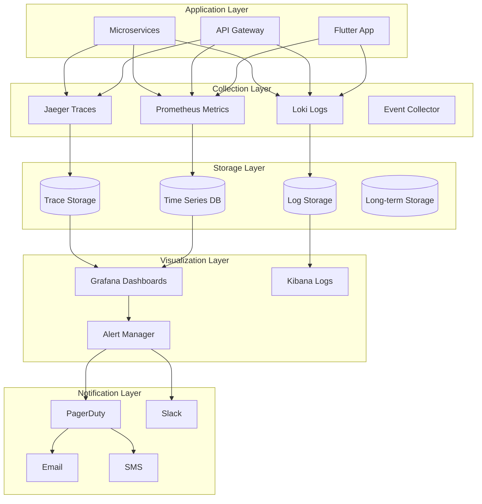

# 🔍 Cosmic Coach Monitoring & Observability Setup
## Complete Guide for Production Monitoring

---

## Executive Summary

This document provides comprehensive instructions for setting up monitoring, alerting, and observability for the Cosmic Coach platform, ensuring 99.9% uptime and rapid incident response.

**Key Metrics:**
- **Target Uptime**: 99.9% (43 minutes downtime/month)
- **Alert Response Time**: <5 minutes
- **MTTR**: <30 minutes
- **Data Retention**: 90 days hot, 1 year cold

---

## 1. Monitoring Architecture

### Overview Diagram



### Core Components

```yaml
# monitoring-stack.yaml
version: '3.8'

services:
  prometheus:
    image: prom/prometheus:latest
    volumes:
      - ./prometheus.yml:/etc/prometheus/prometheus.yml
      - prometheus-data:/prometheus
    ports:
      - "9090:9090"
    command:
      - '--config.file=/etc/prometheus/prometheus.yml'
      - '--storage.tsdb.retention.time=30d'

  grafana:
    image: grafana/grafana:latest
    volumes:
      - grafana-data:/var/lib/grafana
      - ./grafana/dashboards:/etc/grafana/provisioning/dashboards
    ports:
      - "3000:3000"
    environment:
      - GF_SECURITY_ADMIN_PASSWORD=secure_password

  loki:
    image: grafana/loki:latest
    ports:
      - "3100:3100"
    volumes:
      - ./loki-config.yaml:/etc/loki/local-config.yaml
      - loki-data:/loki

  promtail:
    image: grafana/promtail:latest
    volumes:
      - /var/log:/var/log:ro
      - ./promtail-config.yaml:/etc/promtail/config.yml

  alertmanager:
    image: prom/alertmanager:latest
    volumes:
      - ./alertmanager.yml:/etc/alertmanager/alertmanager.yml
    ports:
      - "9093:9093"

  jaeger:
    image: jaegertracing/all-in-one:latest
    ports:
      - "16686:16686"
      - "14268:14268"
    environment:
      - COLLECTOR_ZIPKIN_HOST_PORT=:9411

volumes:
  prometheus-data:
  grafana-data:
  loki-data:
```

---

## 2. Metrics Collection

### 2.1 Application Metrics

```javascript
// metrics-collector.js
const prometheus = require('prom-client');

class MetricsCollector {
  constructor() {
    // Enable default metrics (CPU, memory, etc.)
    prometheus.collectDefaultMetrics({ timeout: 5000 });

    // Custom metrics
    this.metrics = {
      // Counters
      httpRequests: new prometheus.Counter({
        name: 'http_requests_total',
        help: 'Total HTTP requests',
        labelNames: ['method', 'route', 'status']
      }),

      predictions: new prometheus.Counter({
        name: 'predictions_generated_total',
        help: 'Total predictions generated',
        labelNames: ['type', 'tier']
      }),

      revenue: new prometheus.Counter({
        name: 'revenue_total',
        help: 'Total revenue in cents',
        labelNames: ['type', 'currency']
      }),

      errors: new prometheus.Counter({
        name: 'errors_total',
        help: 'Total errors',
        labelNames: ['service', 'type', 'severity']
      }),

      // Gauges
      activeUsers: new prometheus.Gauge({
        name: 'active_users',
        help: 'Currently active users',
        labelNames: ['tier']
      }),

      queueSize: new prometheus.Gauge({
        name: 'queue_size',
        help: 'Current queue size',
        labelNames: ['queue']
      }),

      cacheHitRate: new prometheus.Gauge({
        name: 'cache_hit_rate',
        help: 'Cache hit rate percentage',
        labelNames: ['cache']
      }),

      // Histograms
      httpDuration: new prometheus.Histogram({
        name: 'http_request_duration_seconds',
        help: 'HTTP request latency',
        labelNames: ['method', 'route', 'status'],
        buckets: [0.1, 0.5, 1, 2, 5]
      }),

      dbQueryDuration: new prometheus.Histogram({
        name: 'db_query_duration_seconds',
        help: 'Database query duration',
        labelNames: ['query', 'table'],
        buckets: [0.01, 0.05, 0.1, 0.5, 1]
      }),

      aiResponseTime: new prometheus.Histogram({
        name: 'ai_response_time_seconds',
        help: 'AI service response time',
        labelNames: ['service', 'model'],
        buckets: [0.5, 1, 2, 5, 10]
      })
    };
  }

  // Track HTTP request
  trackHttpRequest(method, route, status, duration) {
    this.metrics.httpRequests.inc({ method, route, status });
    this.metrics.httpDuration.observe({ method, route, status }, duration);
  }

  // Track prediction
  trackPrediction(type, tier) {
    this.metrics.predictions.inc({ type, tier });
  }

  // Track revenue
  trackRevenue(amount, type, currency = 'USD') {
    this.metrics.revenue.inc({ type, currency }, amount * 100); // Convert to cents
  }

  // Track error
  trackError(service, type, severity) {
    this.metrics.errors.inc({ service, type, severity });
  }

  // Update active users
  updateActiveUsers(count, tier = 'all') {
    this.metrics.activeUsers.set({ tier }, count);
  }

  // Express middleware
  middleware() {
    return (req, res, next) => {
      const start = Date.now();

      res.on('finish', () => {
        const duration = (Date.now() - start) / 1000;
        this.trackHttpRequest(req.method, req.route?.path || req.path, res.statusCode, duration);
      });

      next();
    };
  }

  // Expose metrics endpoint
  getMetrics() {
    return prometheus.register.metrics();
  }
}

module.exports = MetricsCollector;
```

### 2.2 Infrastructure Metrics

```yaml
# prometheus.yml
global:
  scrape_interval: 15s
  evaluation_interval: 15s

alerting:
  alertmanagers:
    - static_configs:
        - targets: ['alertmanager:9093']

rule_files:
  - '/etc/prometheus/alerts/*.yml'

scrape_configs:
  # Node Exporter - System metrics
  - job_name: 'node'
    static_configs:
      - targets: ['node-exporter:9100']

  # Kubernetes metrics
  - job_name: 'kubernetes'
    kubernetes_sd_configs:
      - role: pod
    relabel_configs:
      - source_labels: [__meta_kubernetes_pod_annotation_prometheus_io_scrape]
        action: keep
        regex: true

  # Application metrics
  - job_name: 'app'
    static_configs:
      - targets:
          - 'api-gateway:8080'
          - 'prediction-service:3001'
          - 'compatibility-service:3002'
          - 'voice-service:3003'

  # Database metrics
  - job_name: 'postgres'
    static_configs:
      - targets: ['postgres-exporter:9187']

  - job_name: 'mongodb'
    static_configs:
      - targets: ['mongodb-exporter:9216']

  - job_name: 'redis'
    static_configs:
      - targets: ['redis-exporter:9121']

  # External service monitoring
  - job_name: 'blackbox'
    metrics_path: /probe
    params:
      module: [http_2xx]
    static_configs:
      - targets:
          - https://api.openai.com
          - https://api.elevenlabs.io
          - https://api.stripe.com
    relabel_configs:
      - source_labels: [__address__]
        target_label: __param_target
      - target_label: __address__
        replacement: blackbox-exporter:9115
```

### 2.3 Business Metrics

```python
# business_metrics.py
import time
from prometheus_client import Counter, Gauge, Histogram, Summary

class BusinessMetrics:
    def __init__(self):
        # Revenue metrics
        self.revenue_counter = Counter(
            'business_revenue_total',
            'Total revenue in cents',
            ['source', 'tier', 'currency']
        )

        self.mrr_gauge = Gauge(
            'business_mrr',
            'Monthly Recurring Revenue',
            ['currency']
        )

        self.arpu_gauge = Gauge(
            'business_arpu',
            'Average Revenue Per User',
            ['segment']
        )

        # User metrics
        self.user_signups = Counter(
            'business_user_signups_total',
            'Total user signups',
            ['source', 'platform']
        )

        self.user_conversions = Counter(
            'business_user_conversions_total',
            'User conversions to paid',
            ['from_tier', 'to_tier']
        )

        self.churn_rate = Gauge(
            'business_churn_rate',
            'Monthly churn rate',
            ['tier']
        )

        # Engagement metrics
        self.dau_gauge = Gauge(
            'business_dau',
            'Daily Active Users'
        )

        self.mau_gauge = Gauge(
            'business_mau',
            'Monthly Active Users'
        )

        self.session_duration = Histogram(
            'business_session_duration_seconds',
            'User session duration',
            ['platform'],
            buckets=(60, 300, 600, 1800, 3600, 7200)
        )

        # Feature usage
        self.feature_usage = Counter(
            'business_feature_usage_total',
            'Feature usage count',
            ['feature', 'tier']
        )

        # Support metrics
        self.support_tickets = Counter(
            'business_support_tickets_total',
            'Support tickets created',
            ['priority', 'category']
        )

        self.support_resolution_time = Histogram(
            'business_support_resolution_hours',
            'Time to resolve support tickets',
            ['priority'],
            buckets=(1, 4, 8, 24, 48, 168)
        )

    def track_revenue(self, amount, source, tier='basic', currency='USD'):
        """Track revenue event"""
        self.revenue_counter.labels(
            source=source,
            tier=tier,
            currency=currency
        ).inc(amount * 100)  # Convert to cents

    def update_mrr(self, amount, currency='USD'):
        """Update MRR gauge"""
        self.mrr_gauge.labels(currency=currency).set(amount)

    def track_signup(self, source='organic', platform='web'):
        """Track new user signup"""
        self.user_signups.labels(source=source, platform=platform).inc()

    def track_conversion(self, from_tier='free', to_tier='basic'):
        """Track user conversion"""
        self.user_conversions.labels(
            from_tier=from_tier,
            to_tier=to_tier
        ).inc()

    def update_engagement_metrics(self, dau, mau):
        """Update engagement metrics"""
        self.dau_gauge.set(dau)
        self.mau_gauge.set(mau)

    def track_feature_usage(self, feature, tier='free'):
        """Track feature usage"""
        self.feature_usage.labels(feature=feature, tier=tier).inc()

    def calculate_metrics(self):
        """Calculate derived metrics"""
        # This would be called periodically to update calculated metrics
        pass
```

---

## 3. Logging Setup

### 3.1 Structured Logging

```javascript
// logger.js
const winston = require('winston');
const { ElasticsearchTransport } = require('winston-elasticsearch');

class Logger {
  constructor(service) {
    this.service = service;

    // Create logger instance
    this.logger = winston.createLogger({
      level: process.env.LOG_LEVEL || 'info',
      format: winston.format.combine(
        winston.format.timestamp(),
        winston.format.errors({ stack: true }),
        winston.format.json()
      ),
      defaultMeta: {
        service: service,
        environment: process.env.NODE_ENV,
        version: process.env.APP_VERSION
      },
      transports: this.getTransports()
    });
  }

  getTransports() {
    const transports = [
      // Console output for development
      new winston.transports.Console({
        format: winston.format.combine(
          winston.format.colorize(),
          winston.format.simple()
        )
      })
    ];

    if (process.env.NODE_ENV === 'production') {
      // File transport for persistent logs
      transports.push(
        new winston.transports.File({
          filename: 'logs/error.log',
          level: 'error',
          maxsize: 10485760, // 10MB
          maxFiles: 10
        }),
        new winston.transports.File({
          filename: 'logs/combined.log',
          maxsize: 10485760,
          maxFiles: 10
        })
      );

      // Elasticsearch for centralized logging
      if (process.env.ELASTICSEARCH_URL) {
        transports.push(
          new ElasticsearchTransport({
            level: 'info',
            clientOpts: {
              node: process.env.ELASTICSEARCH_URL
            },
            index: 'cosmic-coach-logs'
          })
        );
      }
    }

    return transports;
  }

  // Logging methods with context
  info(message, meta = {}) {
    this.logger.info(message, this.enrichMetadata(meta));
  }

  error(message, error, meta = {}) {
    this.logger.error(message, {
      ...this.enrichMetadata(meta),
      error: {
        message: error.message,
        stack: error.stack,
        code: error.code
      }
    });
  }

  warn(message, meta = {}) {
    this.logger.warn(message, this.enrichMetadata(meta));
  }

  debug(message, meta = {}) {
    this.logger.debug(message, this.enrichMetadata(meta));
  }

  // Audit logging for compliance
  audit(action, userId, details = {}) {
    this.logger.info('AUDIT', {
      ...this.enrichMetadata(details),
      audit: true,
      action,
      userId,
      timestamp: new Date().toISOString()
    });
  }

  // Performance logging
  perf(operation, duration, meta = {}) {
    this.logger.info('PERFORMANCE', {
      ...this.enrichMetadata(meta),
      performance: true,
      operation,
      duration,
      timestamp: new Date().toISOString()
    });
  }

  enrichMetadata(meta) {
    return {
      ...meta,
      correlationId: meta.correlationId || this.generateCorrelationId(),
      timestamp: new Date().toISOString()
    };
  }

  generateCorrelationId() {
    return `${Date.now()}-${Math.random().toString(36).substr(2, 9)}`;
  }

  // Express middleware for request logging
  requestLogger() {
    return (req, res, next) => {
      const start = Date.now();
      const correlationId = req.headers['x-correlation-id'] || this.generateCorrelationId();

      req.correlationId = correlationId;

      // Log request
      this.info('Request received', {
        correlationId,
        method: req.method,
        path: req.path,
        ip: req.ip,
        userAgent: req.headers['user-agent']
      });

      // Log response
      res.on('finish', () => {
        const duration = Date.now() - start;

        this.info('Request completed', {
          correlationId,
          method: req.method,
          path: req.path,
          status: res.statusCode,
          duration
        });

        if (duration > 2000) {
          this.warn('Slow request', {
            correlationId,
            method: req.method,
            path: req.path,
            duration
          });
        }
      });

      next();
    };
  }
}

module.exports = Logger;
```

### 3.2 Log Aggregation

```yaml
# loki-config.yaml
auth_enabled: false

server:
  http_listen_port: 3100

ingester:
  lifecycler:
    address: 127.0.0.1
    ring:
      kvstore:
        store: inmemory
      replication_factor: 1
    final_sleep: 0s

schema_config:
  configs:
    - from: 2020-10-24
      store: boltdb-shipper
      object_store: filesystem
      schema: v11
      index:
        prefix: index_
        period: 24h

storage_config:
  boltdb_shipper:
    active_index_directory: /loki/boltdb-shipper-active
    cache_location: /loki/boltdb-shipper-cache
    shared_store: filesystem
  filesystem:
    directory: /loki/chunks

limits_config:
  enforce_metric_name: false
  reject_old_samples: true
  reject_old_samples_max_age: 168h
  retention_period: 720h

chunk_store_config:
  max_look_back_period: 720h

table_manager:
  retention_deletes_enabled: true
  retention_period: 720h
```

---

## 4. Tracing Setup

### 4.1 Distributed Tracing

```javascript
// tracing.js
const { NodeTracerProvider } = require('@opentelemetry/sdk-trace-node');
const { Resource } = require('@opentelemetry/resources');
const { SemanticResourceAttributes } = require('@opentelemetry/semantic-conventions');
const { JaegerExporter } = require('@opentelemetry/exporter-jaeger');
const { BatchSpanProcessor } = require('@opentelemetry/sdk-trace-base');
const { registerInstrumentations } = require('@opentelemetry/instrumentation');
const { HttpInstrumentation } = require('@opentelemetry/instrumentation-http');
const { ExpressInstrumentation } = require('@opentelemetry/instrumentation-express');
const { MongoDBInstrumentation } = require('@opentelemetry/instrumentation-mongodb');

class TracingService {
  constructor(serviceName) {
    this.serviceName = serviceName;
    this.provider = null;
  }

  initialize() {
    // Create resource
    const resource = Resource.default().merge(
      new Resource({
        [SemanticResourceAttributes.SERVICE_NAME]: this.serviceName,
        [SemanticResourceAttributes.SERVICE_VERSION]: process.env.APP_VERSION || '1.0.0',
        environment: process.env.NODE_ENV || 'development'
      })
    );

    // Create provider
    this.provider = new NodeTracerProvider({
      resource: resource
    });

    // Configure Jaeger exporter
    const jaegerExporter = new JaegerExporter({
      endpoint: process.env.JAEGER_ENDPOINT || 'http://localhost:14268/api/traces',
      serviceName: this.serviceName
    });

    // Add span processor
    this.provider.addSpanProcessor(
      new BatchSpanProcessor(jaegerExporter, {
        maxQueueSize: 100,
        maxExportBatchSize: 10,
        scheduledDelayMillis: 500,
        exportTimeoutMillis: 30000
      })
    );

    // Register provider
    this.provider.register();

    // Register auto-instrumentations
    registerInstrumentations({
      instrumentations: [
        new HttpInstrumentation({
          requestHook: (span, request) => {
            span.setAttributes({
              'http.request.body': JSON.stringify(request.body),
              'http.request.headers': JSON.stringify(request.headers)
            });
          }
        }),
        new ExpressInstrumentation(),
        new MongoDBInstrumentation()
      ]
    });

    console.log(`Tracing initialized for service: ${this.serviceName}`);
  }

  // Manual span creation for custom operations
  createSpan(name, fn) {
    const tracer = this.provider.getTracer(this.serviceName);
    return tracer.startActiveSpan(name, async (span) => {
      try {
        const result = await fn(span);
        span.setStatus({ code: 1, message: 'Success' });
        return result;
      } catch (error) {
        span.setStatus({ code: 2, message: error.message });
        span.recordException(error);
        throw error;
      } finally {
        span.end();
      }
    });
  }

  // Add trace context to logs
  getTraceContext() {
    const span = trace.getActiveSpan();
    if (span) {
      const spanContext = span.spanContext();
      return {
        traceId: spanContext.traceId,
        spanId: spanContext.spanId,
        traceFlags: spanContext.traceFlags
      };
    }
    return {};
  }
}

// Usage
const tracing = new TracingService('cosmic-coach-api');
tracing.initialize();

// In your application code
app.get('/api/prediction', async (req, res) => {
  await tracing.createSpan('generate_prediction', async (span) => {
    span.setAttributes({
      'user.id': req.user.id,
      'prediction.type': req.query.type
    });

    const prediction = await generatePrediction(req.user.id);

    span.addEvent('prediction_generated', {
      predictionId: prediction.id
    });

    res.json(prediction);
  });
});
```

---

## 5. Alert Configuration

### 5.1 Alert Rules

```yaml
# alerts.yml
groups:
  - name: availability
    rules:
      - alert: ServiceDown
        expr: up == 0
        for: 1m
        labels:
          severity: critical
          team: platform
        annotations:
          summary: "Service {{ $labels.job }} is down"
          description: "{{ $labels.instance }} has been down for more than 1 minute"

      - alert: HighErrorRate
        expr: rate(errors_total[5m]) > 0.05
        for: 5m
        labels:
          severity: critical
          team: platform
        annotations:
          summary: "High error rate detected"
          description: "Error rate is {{ $value }} errors per second (threshold: 0.05)"

  - name: performance
    rules:
      - alert: HighLatency
        expr: histogram_quantile(0.95, rate(http_request_duration_seconds_bucket[5m])) > 2
        for: 10m
        labels:
          severity: warning
          team: platform
        annotations:
          summary: "High API latency"
          description: "95th percentile latency is {{ $value }}s (threshold: 2s)"

      - alert: SlowDatabaseQueries
        expr: histogram_quantile(0.95, rate(db_query_duration_seconds_bucket[5m])) > 1
        for: 5m
        labels:
          severity: warning
          team: database
        annotations:
          summary: "Slow database queries"
          description: "95th percentile query time is {{ $value }}s"

  - name: resource_utilization
    rules:
      - alert: HighMemoryUsage
        expr: (node_memory_MemTotal_bytes - node_memory_MemAvailable_bytes) / node_memory_MemTotal_bytes > 0.90
        for: 5m
        labels:
          severity: warning
          team: infrastructure
        annotations:
          summary: "High memory usage"
          description: "Memory usage is {{ $value | humanizePercentage }}"

      - alert: HighCPUUsage
        expr: rate(node_cpu_seconds_total[5m]) > 0.80
        for: 10m
        labels:
          severity: warning
          team: infrastructure
        annotations:
          summary: "High CPU usage"
          description: "CPU usage is {{ $value | humanizePercentage }}"

      - alert: DiskSpaceLow
        expr: node_filesystem_avail_bytes / node_filesystem_size_bytes < 0.10
        for: 5m
        labels:
          severity: critical
          team: infrastructure
        annotations:
          summary: "Low disk space"
          description: "Only {{ $value | humanizePercentage }} disk space remaining"

  - name: business_metrics
    rules:
      - alert: LowConversionRate
        expr: rate(business_user_conversions_total[1h]) / rate(business_user_signups_total[1h]) < 0.02
        for: 2h
        labels:
          severity: warning
          team: product
        annotations:
          summary: "Low conversion rate"
          description: "Conversion rate is {{ $value | humanizePercentage }} (target: 2%)"

      - alert: HighChurnRate
        expr: business_churn_rate > 0.10
        for: 1h
        labels:
          severity: warning
          team: product
        annotations:
          summary: "High churn rate"
          description: "Churn rate is {{ $value | humanizePercentage }} (threshold: 10%)"

      - alert: RevenueDropCritical
        expr: rate(business_revenue_total[1h]) < 100
        for: 2h
        labels:
          severity: critical
          team: business
        annotations:
          summary: "Significant revenue drop"
          description: "Hourly revenue is ${{ $value }} (expected: $100+)"

  - name: external_dependencies
    rules:
      - alert: OpenAIDown
        expr: probe_success{job="blackbox", instance="https://api.openai.com"} == 0
        for: 5m
        labels:
          severity: critical
          team: platform
        annotations:
          summary: "OpenAI API is down"
          description: "OpenAI API has been unreachable for 5 minutes"

      - alert: StripeDown
        expr: probe_success{job="blackbox", instance="https://api.stripe.com"} == 0
        for: 5m
        labels:
          severity: critical
          team: payments
        annotations:
          summary: "Stripe API is down"
          description: "Stripe payment processing is unavailable"
```

### 5.2 Alert Routing

```yaml
# alertmanager.yml
global:
  resolve_timeout: 5m
  smtp_from: 'alerts@cosmiccoach.app'
  smtp_smarthost: 'smtp.sendgrid.net:587'
  smtp_auth_username: 'apikey'
  smtp_auth_password: '${SENDGRID_API_KEY}'

route:
  group_by: ['alertname', 'cluster', 'service']
  group_wait: 10s
  group_interval: 10s
  repeat_interval: 12h
  receiver: 'default'

  routes:
    # Critical alerts - immediate paging
    - match:
        severity: critical
      receiver: 'pagerduty-critical'
      repeat_interval: 5m

    # Warning alerts - Slack only
    - match:
        severity: warning
      receiver: 'slack-warnings'
      repeat_interval: 4h

    # Business alerts
    - match:
        team: business
      receiver: 'business-team'

    # Database alerts
    - match:
        team: database
      receiver: 'database-team'

receivers:
  - name: 'default'
    slack_configs:
      - api_url: '${SLACK_WEBHOOK_URL}'
        channel: '#alerts'
        title: 'Alert: {{ .GroupLabels.alertname }}'
        text: '{{ range .Alerts }}{{ .Annotations.description }}{{ end }}'

  - name: 'pagerduty-critical'
    pagerduty_configs:
      - service_key: '${PAGERDUTY_SERVICE_KEY}'
        description: '{{ .GroupLabels.alertname }}'
        details:
          firing: '{{ .Alerts.Firing | len }}'
          resolved: '{{ .Alerts.Resolved | len }}'

  - name: 'slack-warnings'
    slack_configs:
      - api_url: '${SLACK_WEBHOOK_URL}'
        channel: '#warnings'
        send_resolved: true

  - name: 'business-team'
    email_configs:
      - to: 'business-team@cosmiccoach.app'
        headers:
          Subject: 'Business Alert: {{ .GroupLabels.alertname }}'

  - name: 'database-team'
    slack_configs:
      - api_url: '${SLACK_DBA_WEBHOOK_URL}'
        channel: '#database-alerts'

inhibit_rules:
  - source_match:
      severity: 'critical'
    target_match:
      severity: 'warning'
    equal: ['alertname', 'cluster', 'service']
```

---

## 6. Dashboards

### 6.1 Main Dashboard

```json
{
  "dashboard": {
    "title": "Cosmic Coach - Main Dashboard",
    "panels": [
      {
        "title": "System Health",
        "type": "stat",
        "targets": [
          {
            "expr": "sum(up)",
            "legendFormat": "Services Up"
          }
        ]
      },
      {
        "title": "Request Rate",
        "type": "graph",
        "targets": [
          {
            "expr": "sum(rate(http_requests_total[5m])) by (service)",
            "legendFormat": "{{ service }}"
          }
        ]
      },
      {
        "title": "Error Rate",
        "type": "graph",
        "targets": [
          {
            "expr": "sum(rate(errors_total[5m])) by (service)",
            "legendFormat": "{{ service }}"
          }
        ]
      },
      {
        "title": "Response Time (p95)",
        "type": "graph",
        "targets": [
          {
            "expr": "histogram_quantile(0.95, rate(http_request_duration_seconds_bucket[5m]))",
            "legendFormat": "p95"
          }
        ]
      },
      {
        "title": "Active Users",
        "type": "stat",
        "targets": [
          {
            "expr": "active_users",
            "legendFormat": "Active Users"
          }
        ]
      },
      {
        "title": "Revenue Today",
        "type": "stat",
        "targets": [
          {
            "expr": "increase(business_revenue_total[24h]) / 100",
            "legendFormat": "Revenue ($)"
          }
        ]
      },
      {
        "title": "CPU Usage",
        "type": "graph",
        "targets": [
          {
            "expr": "100 - (avg(irate(node_cpu_seconds_total{mode=\"idle\"}[5m])) * 100)",
            "legendFormat": "CPU %"
          }
        ]
      },
      {
        "title": "Memory Usage",
        "type": "graph",
        "targets": [
          {
            "expr": "(1 - (node_memory_MemAvailable_bytes / node_memory_MemTotal_bytes)) * 100",
            "legendFormat": "Memory %"
          }
        ]
      }
    ]
  }
}
```

### 6.2 Business Dashboard

```javascript
// business-dashboard.js
const businessDashboard = {
  title: "Business Metrics Dashboard",
  refresh: "30s",
  panels: [
    {
      id: 1,
      title: "Monthly Recurring Revenue",
      type: "stat",
      query: "business_mrr",
      format: "currency"
    },
    {
      id: 2,
      title: "Daily Active Users",
      type: "graph",
      query: "business_dau",
      timeRange: "7d"
    },
    {
      id: 3,
      title: "Conversion Funnel",
      type: "funnel",
      queries: [
        "sum(increase(business_user_signups_total[24h]))",
        "sum(increase(business_user_trials_total[24h]))",
        "sum(increase(business_user_conversions_total[24h]))"
      ]
    },
    {
      id: 4,
      title: "Revenue by Source",
      type: "pie",
      query: "sum(increase(business_revenue_total[24h])) by (source)"
    },
    {
      id: 5,
      title: "Churn Rate by Tier",
      type: "bar",
      query: "business_churn_rate",
      groupBy: "tier"
    },
    {
      id: 6,
      title: "Feature Usage",
      type: "heatmap",
      query: "rate(business_feature_usage_total[1h])",
      groupBy: ["feature", "tier"]
    },
    {
      id: 7,
      title: "Support Ticket Resolution",
      type: "histogram",
      query: "business_support_resolution_hours",
      buckets: [1, 4, 8, 24, 48]
    },
    {
      id: 8,
      title: "ARPU Trend",
      type: "graph",
      query: "business_arpu",
      timeRange: "30d"
    }
  ]
};
```

---

## 7. SLO/SLA Monitoring

### 7.1 SLO Definitions

```yaml
# slos.yaml
slos:
  - name: api_availability
    description: "API availability SLO"
    target: 99.9  # Three 9s
    window: 30d
    query: |
      sum(rate(http_requests_total{status!~"5.."}[5m]))
      /
      sum(rate(http_requests_total[5m]))

  - name: api_latency
    description: "API latency SLO"
    target: 95  # 95% of requests under 2s
    window: 30d
    query: |
      histogram_quantile(0.95,
        rate(http_request_duration_seconds_bucket[5m])
      ) < 2

  - name: prediction_success_rate
    description: "Prediction generation success rate"
    target: 99.5
    window: 7d
    query: |
      sum(rate(predictions_generated_total[5m]))
      /
      sum(rate(prediction_requests_total[5m]))

  - name: payment_success_rate
    description: "Payment processing success rate"
    target: 99.95
    window: 30d
    query: |
      sum(rate(payments_successful_total[5m]))
      /
      sum(rate(payments_attempted_total[5m]))

error_budgets:
  - slo: api_availability
    budget: 43.2  # minutes per month
    alert_at: 50  # Alert when 50% of budget consumed

  - slo: api_latency
    budget: 36000  # slow requests per month
    alert_at: 75
```

### 7.2 SLA Monitoring

```javascript
// sla-monitor.js
class SLAMonitor {
  constructor() {
    this.slas = {
      uptime: {
        target: 0.999,  // 99.9%
        measurement: 'availability',
        period: '30d'
      },
      responseTime: {
        target: 2000,  // 2 seconds
        percentile: 95,
        period: '24h'
      },
      errorRate: {
        target: 0.01,  // 1%
        measurement: 'errors/requests',
        period: '1h'
      }
    };
  }

  async checkSLAs() {
    const results = {};

    for (const [name, sla] of Object.entries(this.slas)) {
      const current = await this.measureSLA(name);
      const status = this.evaluateSLA(current, sla);

      results[name] = {
        target: sla.target,
        current: current,
        status: status,
        compliance: (current / sla.target) * 100
      };

      if (!status) {
        await this.handleSLABreach(name, current, sla);
      }
    }

    return results;
  }

  async measureSLA(name) {
    // Query Prometheus for SLA metrics
    const queries = {
      uptime: 'avg_over_time(up[30d])',
      responseTime: 'histogram_quantile(0.95, rate(http_request_duration_seconds_bucket[24h]))',
      errorRate: 'rate(errors_total[1h]) / rate(http_requests_total[1h])'
    };

    const response = await fetch(`${PROMETHEUS_URL}/api/v1/query`, {
      method: 'POST',
      body: `query=${queries[name]}`
    });

    const data = await response.json();
    return parseFloat(data.result[0].value[1]);
  }

  evaluateSLA(current, sla) {
    if (sla.measurement === 'availability') {
      return current >= sla.target;
    } else if (sla.percentile) {
      return current <= sla.target;
    } else {
      return current <= sla.target;
    }
  }

  async handleSLABreach(name, current, target) {
    // Send critical alert
    await this.sendAlert({
      severity: 'critical',
      title: `SLA Breach: ${name}`,
      message: `Current: ${current}, Target: ${target}`,
      runbook: `https://runbook.cosmiccoach.app/sla/${name}`
    });

    // Log for compliance
    await this.logSLABreach(name, current, target);

    // Trigger auto-remediation if available
    await this.attemptAutoRemediation(name);
  }
}
```

---

## 8. Incident Response

### 8.1 Runbook Template

```markdown
# Runbook: High Error Rate

## Alert Details
- **Alert Name**: HighErrorRate
- **Severity**: Critical
- **Team**: Platform

## Symptoms
- Error rate > 5% for 5+ minutes
- Users experiencing failures
- Possible revenue impact

## Diagnostic Steps

1. **Check Dashboard**
   ```
   https://grafana.cosmiccoach.app/d/main
   ```

2. **Identify Failing Service**
   ```bash
   kubectl get pods -n production | grep -v Running
   ```

3. **Check Logs**
   ```bash
   kubectl logs -n production <pod-name> --tail=100
   ```

4. **Check Recent Deployments**
   ```bash
   kubectl rollout history deployment -n production
   ```

## Resolution Steps

### Quick Fix (< 5 minutes)
1. **Rollback Recent Deployment**
   ```bash
   kubectl rollout undo deployment/<service> -n production
   ```

2. **Scale Up If Load Issue**
   ```bash
   kubectl scale deployment/<service> --replicas=10 -n production
   ```

3. **Clear Cache If Data Issue**
   ```bash
   redis-cli FLUSHALL
   ```

### Root Cause Analysis
1. Collect error logs
2. Identify pattern
3. Create fix
4. Test in staging
5. Deploy fix

## Escalation
- L1: On-call engineer (5 min)
- L2: Team lead (15 min)
- L3: CTO (30 min)

## Post-Incident
1. Create incident report
2. Update runbook
3. Add monitoring
4. Schedule postmortem
```

### 8.2 On-Call Schedule

```javascript
// oncall-manager.js
class OnCallManager {
  constructor() {
    this.schedule = {
      primary: [
        { name: 'Alice', phone: '+1-xxx-xxx-xxxx', start: 'Monday 00:00', end: 'Wednesday 23:59' },
        { name: 'Bob', phone: '+1-xxx-xxx-xxxx', start: 'Thursday 00:00', end: 'Sunday 23:59' }
      ],
      secondary: [
        { name: 'Charlie', phone: '+1-xxx-xxx-xxxx', available: 'always' }
      ],
      escalation: [
        { level: 1, timeout: 5, contact: 'primary' },
        { level: 2, timeout: 15, contact: 'secondary' },
        { level: 3, timeout: 30, contact: 'management' }
      ]
    };
  }

  getCurrentOncall() {
    const now = new Date();
    const day = now.getDay();
    const hour = now.getHours();

    // Find primary on-call
    // Implementation here

    return this.schedule.primary[0];
  }

  async pageOncall(alert) {
    const oncall = this.getCurrentOncall();

    // Try each escalation level
    for (const level of this.schedule.escalation) {
      const acked = await this.sendPage(oncall, alert, level);

      if (acked) {
        return { success: true, responder: oncall.name };
      }

      // Wait for timeout before escalating
      await this.wait(level.timeout * 60 * 1000);
    }

    // All escalation failed
    return { success: false, error: 'No acknowledgment received' };
  }

  async sendPage(oncall, alert, level) {
    // Send via PagerDuty
    const incident = await this.pagerduty.createIncident({
      title: alert.title,
      urgency: alert.severity === 'critical' ? 'high' : 'low',
      details: alert,
      assignments: [oncall]
    });

    // Also send SMS for critical alerts
    if (alert.severity === 'critical') {
      await this.twilio.messages.create({
        body: `CRITICAL: ${alert.title}. Respond: ${incident.url}`,
        to: oncall.phone,
        from: process.env.TWILIO_PHONE
      });
    }

    // Wait for acknowledgment
    return await this.waitForAck(incident.id, level.timeout);
  }
}
```

---

## 9. Performance Monitoring

### 9.1 APM Setup

```javascript
// apm.js
const apm = require('elastic-apm-node');

// Initialize APM
const apmAgent = apm.start({
  serviceName: 'cosmic-coach-api',
  secretToken: process.env.ELASTIC_APM_SECRET_TOKEN,
  serverUrl: process.env.ELASTIC_APM_SERVER_URL,
  environment: process.env.NODE_ENV,

  // Performance tuning
  transactionSampleRate: 0.1,  // Sample 10% of transactions
  captureBody: 'all',
  captureHeaders: true,

  // Custom context
  globalLabels: {
    region: process.env.AWS_REGION,
    version: process.env.APP_VERSION
  }
});

// Custom transactions
function trackTransaction(name, type, fn) {
  const transaction = apmAgent.startTransaction(name, type);

  try {
    const result = fn();
    transaction.result = 'success';
    return result;
  } catch (error) {
    apmAgent.captureError(error);
    transaction.result = 'error';
    throw error;
  } finally {
    transaction.end();
  }
}

// Database query monitoring
function monitorQuery(query) {
  const span = apmAgent.startSpan('db.query', 'db');

  span.setLabel('db.statement', query);

  return {
    end: (error) => {
      if (error) {
        span.setOutcome('failure');
        apmAgent.captureError(error);
      } else {
        span.setOutcome('success');
      }
      span.end();
    }
  };
}

module.exports = { apmAgent, trackTransaction, monitorQuery };
```

---

## 10. Maintenance & Operations

### 10.1 Health Checks

```javascript
// health.js
class HealthChecker {
  async checkHealth() {
    const checks = {
      database: await this.checkDatabase(),
      redis: await this.checkRedis(),
      external: await this.checkExternalServices(),
      disk: await this.checkDiskSpace(),
      memory: await this.checkMemory()
    };

    const overall = Object.values(checks).every(c => c.status === 'healthy');

    return {
      status: overall ? 'healthy' : 'unhealthy',
      timestamp: new Date().toISOString(),
      checks
    };
  }

  async checkDatabase() {
    try {
      await db.query('SELECT 1');
      return { status: 'healthy', latency: 5 };
    } catch (error) {
      return { status: 'unhealthy', error: error.message };
    }
  }

  async checkRedis() {
    try {
      await redis.ping();
      return { status: 'healthy' };
    } catch (error) {
      return { status: 'unhealthy', error: error.message };
    }
  }

  async checkExternalServices() {
    const services = [
      { name: 'openai', url: 'https://api.openai.com' },
      { name: 'stripe', url: 'https://api.stripe.com' }
    ];

    const results = {};

    for (const service of services) {
      try {
        const response = await fetch(service.url);
        results[service.name] = {
          status: response.ok ? 'healthy' : 'degraded',
          statusCode: response.status
        };
      } catch (error) {
        results[service.name] = {
          status: 'unhealthy',
          error: error.message
        };
      }
    }

    return results;
  }
}

// Express endpoint
app.get('/health', async (req, res) => {
  const health = await healthChecker.checkHealth();
  const statusCode = health.status === 'healthy' ? 200 : 503;
  res.status(statusCode).json(health);
});
```

### 10.2 Backup Monitoring

```bash
#!/bin/bash
# backup-monitor.sh

# Check if backup ran successfully
LAST_BACKUP=$(gsutil ls -l gs://cosmic-coach-backups/daily/ | tail -n 2 | head -n 1)
BACKUP_TIME=$(echo $LAST_BACKUP | awk '{print $2}')
CURRENT_TIME=$(date +%s)
BACKUP_EPOCH=$(date -d "$BACKUP_TIME" +%s)
DIFF=$((CURRENT_TIME - BACKUP_EPOCH))

# Alert if backup is older than 25 hours
if [ $DIFF -gt 90000 ]; then
    curl -X POST $SLACK_WEBHOOK_URL \
        -H 'Content-Type: application/json' \
        -d '{"text":"⚠️ Database backup is overdue! Last backup: '$BACKUP_TIME'"}'
fi

# Verify backup integrity
BACKUP_FILE=$(echo $LAST_BACKUP | awk '{print $3}')
gsutil cp $BACKUP_FILE /tmp/test-backup.sql

if pg_restore --list /tmp/test-backup.sql > /dev/null 2>&1; then
    echo "✅ Backup integrity verified"
else
    echo "❌ Backup integrity check failed"
    curl -X POST $SLACK_WEBHOOK_URL \
        -H 'Content-Type: application/json' \
        -d '{"text":"🚨 CRITICAL: Database backup integrity check failed!"}'
fi

rm /tmp/test-backup.sql
```

---

## Conclusion

This comprehensive monitoring setup ensures:

1. **Complete Observability**: Metrics, logs, and traces for full visibility
2. **Proactive Alerting**: Issues detected before users notice
3. **Fast Resolution**: Clear runbooks and automated remediation
4. **Business Insight**: Revenue and user behavior tracking
5. **Compliance**: Audit logging and SLA monitoring

Remember: **You can't fix what you can't see. Monitor everything, alert on what matters.**