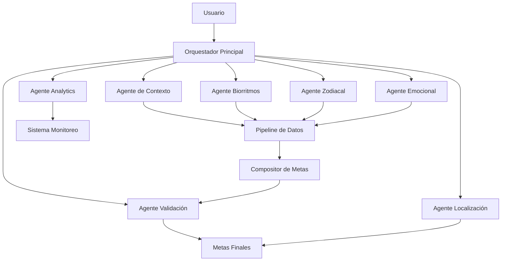
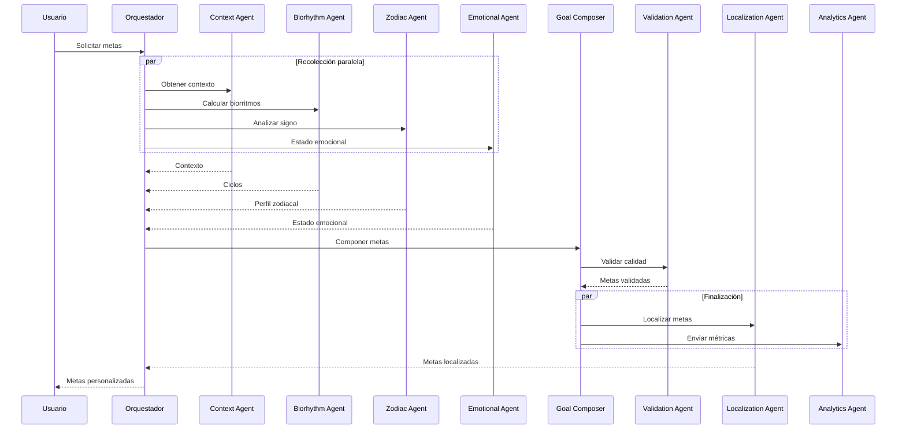
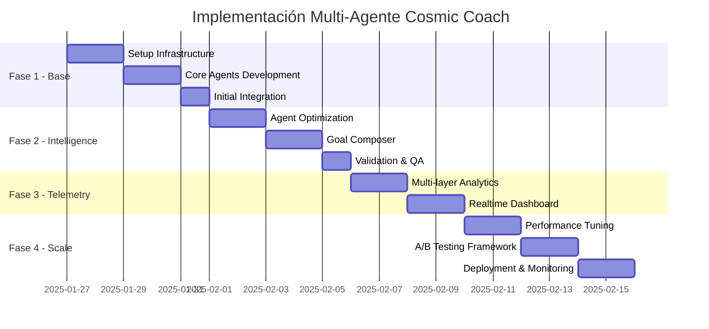

# 🤖 PLAN COSMIC COACH MULTI-AGENTE - "CHAD EVOLUTION"
## Sistema Distribuido de Generación de Metas con Agentes Especializados

### 🎯 VISIÓN GENERAL

Transformar el Cosmic Coach en un sistema multi-agente donde cada agente se especializa en un aspecto específico de la generación y optimización de metas, trabajando en paralelo para máxima eficiencia y personalización.

---

## 🏗️ ARQUITECTURA MULTI-AGENTE



---

## 🤖 AGENTES ESPECIALIZADOS

### 1. AGENTE DE CONTEXTO (Context Collector Agent)
```dart
// 📍 Ubicación: lib/agents/context_collector_agent.dart
class ContextCollectorAgent {
  // Responsabilidades:
  // - Capturar datos del usuario en tiempo real
  // - Validar completitud de información
  // - Inferir datos faltantes con ML
  // - Mantener historial de contextos

  Future<UserContext> collectContext() async {
    // Ejecución en paralelo de:
    // 1. Captura activa (formulario UI)
    // 2. Análisis pasivo (uso de app)
    // 3. Inferencia predictiva
  }
}
```

**Tareas específicas:**
- Monitorear patrones de sueño desde eventos de app
- Detectar estado emocional por interacciones
- Calcular nivel de energía por horario y actividad
- Cache inteligente de contextos recientes

**Métricas:**
- Tiempo de captura: <2 segundos
- Precisión de inferencia: >85%
- Tasa de contexto completo: >90%

---

### 2. AGENTE DE BIORRITMOS (Biorhythm Calculator Agent)
```dart
// 📍 Ubicación: lib/agents/biorhythm_calculator_agent.dart
class BiorhythmCalculatorAgent {
  // Responsabilidades:
  // - Calcular ciclos físico, emocional, intelectual
  // - Predecir días críticos
  // - Generar recomendaciones por fase
  // - Sincronizar con ciclos lunares

  Stream<BiorhythmState> streamBiorhythms() {
    // Stream continuo de estados
    // Actualización cada 6 horas
  }
}
```

**Procesamiento paralelo:**
- Cálculo de 3 ciclos simultáneos
- Correlación con datos históricos
- Predicción de próximos 30 días
- Integración lunar en tiempo real

**Optimizaciones:**
- Pre-cálculo nocturno de ciclos
- Cache de resultados por 6 horas
- Notificaciones de días críticos

---

### 3. AGENTE ZODIACAL (Zodiac Insights Agent)
```dart
// 📍 Ubicación: lib/agents/zodiac_insights_agent.dart
class ZodiacInsightsAgent {
  // Responsabilidades:
  // - Análisis profundo por signo
  // - Shadow work personalizado
  // - Superpoderes y debilidades
  // - Compatibilidad con ciclos actuales

  Future<ZodiacProfile> analyzeSign() {
    // Procesamiento multicapa:
    // 1. Perfil base del signo
    // 2. Modificadores por ascendente
    // 3. Influencias planetarias actuales
  }
}
```

**Especialización por signo:**
```dart
Map<String, AgentStrategy> signStrategies = {
  'aries': AriesStrategy(),    // Metas de acción y liderazgo
  'taurus': TaurusStrategy(),   // Metas de estabilidad y confort
  'gemini': GeminiStrategy(),   // Metas de comunicación y aprendizaje
  // ... 12 estrategias especializadas
};
```

---

### 4. AGENTE EMOCIONAL (Emotional Intelligence Agent)
```dart
// 📍 Ubicación: lib/agents/emotional_intelligence_agent.dart
class EmotionalIntelligenceAgent {
  // Responsabilidades:
  // - Análisis de sentimiento continuo
  // - Detección de patrones emocionales
  // - Recomendaciones de regulación
  // - Ajuste dinámico de metas

  Stream<EmotionalGuidance> monitorEmotions() {
    // ML model para análisis
    // Ajuste en tiempo real
  }
}
```

**Capacidades avanzadas:**
- NLP para análisis de texto
- Reconocimiento de patrones de uso
- Sugerencias de mindfulness
- Alertas de burnout

---

### 5. AGENTE DE ANALYTICS (Analytics Intelligence Agent)
```dart
// 📍 Ubicación: lib/agents/analytics_intelligence_agent.dart
class AnalyticsIntelligenceAgent {
  // Responsabilidades:
  // - Tracking en tiempo real
  // - Análisis predictivo
  // - Detección de anomalías
  // - Reportes automáticos

  void trackGoalGeneration(Map<String, dynamic> metrics) {
    // Pipeline asíncrono a múltiples destinos
  }
}
```

**Pipelines paralelos:**
- Firebase Analytics
- Crashlytics
- BigQuery streaming
- Custom dashboard API

---

### 6. AGENTE DE LOCALIZACIÓN (Localization Expert Agent)
```dart
// 📍 Ubicación: lib/agents/localization_expert_agent.dart
class LocalizationExpertAgent {
  // Responsabilidades:
  // - Traducción contextual
  // - Adaptación cultural
  // - Generación de contenido local
  // - A/B testing por región

  Future<LocalizedContent> localize(Goal goal) {
    // Procesamiento por capas:
    // 1. Traducción base
    // 2. Adaptación cultural
    // 3. Optimización SEO local
  }
}
```

**Estrategias por región:**
```dart
Map<String, CulturalAdapter> regionalAdapters = {
  'es_MX': MexicanSpanishAdapter(),  // Modismos mexicanos
  'es_ES': SpainSpanishAdapter(),    // Español europeo
  'en_US': AmericanEnglishAdapter(), // Referencias americanas
  'en_GB': BritishEnglishAdapter(),  // Estilo británico
  // ... más variantes
};
```

---

### 7. AGENTE DE VALIDACIÓN (Quality Assurance Agent)
```dart
// 📍 Ubicación: lib/agents/quality_assurance_agent.dart
class QualityAssuranceAgent {
  // Responsabilidades:
  // - Validar coherencia de metas
  // - Detectar duplicados
  // - Verificar alcanzabilidad
  // - Score de calidad

  Future<QualityReport> validateGoals(List<Goal> goals) {
    // Validaciones paralelas:
    // 1. Coherencia semántica
    // 2. Viabilidad temporal
    // 3. Conflictos entre metas
    // 4. Score de motivación
  }
}
```

---

## 🔄 ORQUESTADOR PRINCIPAL

```dart
// 📍 Ubicación: lib/orchestrator/coach_orchestrator.dart
class CoachOrchestrator {
  final List<BaseAgent> agents = [
    ContextCollectorAgent(),
    BiorhythmCalculatorAgent(),
    ZodiacInsightsAgent(),
    EmotionalIntelligenceAgent(),
    AnalyticsIntelligenceAgent(),
    LocalizationExpertAgent(),
    QualityAssuranceAgent(),
  ];

  Future<List<CosmicGoal>> generateGoals() async {
    // PASO 1: Recolección paralela de datos
    final futures = [
      contextAgent.collectContext(),
      biorhythmAgent.calculateCycles(),
      zodiacAgent.analyzeProfile(),
      emotionalAgent.getCurrentState(),
    ];

    final results = await Future.wait(futures);

    // PASO 2: Composición inteligente
    final proposedGoals = await goalComposer.compose(results);

    // PASO 3: Validación y refinamiento
    final validatedGoals = await validationAgent.validate(proposedGoals);

    // PASO 4: Localización paralela
    final localizedGoals = await Future.wait(
      validatedGoals.map((goal) => localizationAgent.localize(goal))
    );

    // PASO 5: Analytics asíncrono (no bloquea)
    analyticsAgent.trackGeneration(localizedGoals);

    return localizedGoals;
  }
}
```

---

## 📊 PIPELINE DE DATOS MULTI-AGENTE

```dart
// 📍 Ubicación: lib/pipeline/multi_agent_pipeline.dart
class MultiAgentPipeline {
  // Canal de eventos entre agentes
  final StreamController<AgentEvent> eventBus;

  // Colas de trabajo por prioridad
  final PriorityQueue<AgentTask> highPriority;
  final PriorityQueue<AgentTask> normalPriority;
  final PriorityQueue<AgentTask> lowPriority;

  // Pool de workers para ejecución paralela
  final WorkerPool workers = WorkerPool(
    size: 4, // 4 workers concurrentes
    timeout: Duration(seconds: 30),
  );

  // Sistema de caché distribuido
  final DistributedCache cache = DistributedCache(
    ttl: Duration(hours: 6),
    maxSize: 100,
  );
}
```

### Flujo de Datos



---

## 🚀 IMPLEMENTACIÓN POR FASES

### FASE 1: INFRAESTRUCTURA BASE (Semana 1)

#### Día 1-2: Setup Multi-Agente
```dart
// Tareas paralelas por desarrollador:
Developer 1: BaseAgent abstract class + EventBus
Developer 2: WorkerPool + PriorityQueue
Developer 3: DistributedCache + Pipeline
Developer 4: Orchestrator skeleton
```

#### Día 3-4: Agentes Core
```dart
// Desarrollo paralelo de agentes:
Team A: ContextCollectorAgent + UI
Team B: BiorhythmCalculatorAgent + Math
Team C: ZodiacInsightsAgent + Data
Team D: EmotionalIntelligenceAgent + ML
```

#### Día 5: Integración Inicial
- Conectar agentes al orquestador
- Test de comunicación entre agentes
- Pipeline básico funcionando

---

### FASE 2: INTELIGENCIA AVANZADA (Semana 2)

#### Día 6-7: Optimización de Agentes
```dart
// Mejoras paralelas:
- ContextAgent: Auto-inferencia con ML
- BiorhythmAgent: Predicción 30 días
- ZodiacAgent: Shadow work profundo
- EmotionalAgent: Sentiment analysis
```

#### Día 8-9: Sistema de Composición
```dart
class GoalComposer {
  // Algoritmo de fusión inteligente
  Future<List<Goal>> compose(AgentResults results) {
    // 1. Weighted scoring por fuente
    // 2. Deduplicación semántica
    // 3. Balanceo de categorías
    // 4. Priorización por contexto
  }
}
```

#### Día 10: Validación y QA
- Agente de validación completo
- Tests de integración
- Métricas de calidad

---

### FASE 3: TELEMETRÍA Y MONITOREO (Semana 3)

#### Día 11-12: Analytics Multi-Capa
```dart
// Métricas por agente:
Map<String, AgentMetrics> metrics = {
  'context': ContextMetrics(),     // Tiempo captura, completitud
  'biorhythm': BiorhythmMetrics(), // Precisión ciclos
  'zodiac': ZodiacMetrics(),       // Relevancia sugerencias
  'emotional': EmotionalMetrics(), // Accuracy sentimiento
  'validation': QualityMetrics(),  // Tasa aprobación
};
```

#### Día 13-14: Dashboard en Tiempo Real
```dart
// Dashboard con WebSocket para monitoreo live
class RealtimeDashboard {
  // Widgets por agente
  // Gráficas de rendimiento
  // Alertas automáticas
  // Logs centralizados
}
```

---

### FASE 4: OPTIMIZACIÓN Y ESCALA (Semana 4)

#### Día 15-16: Performance Tuning
- Profiling de cada agente
- Optimización de queries
- Reducción de latencia
- Cache estratégico

#### Día 17-18: A/B Testing Framework
```dart
class MultiAgentABTest {
  // Experimentos paralelos:
  // - Diferentes estrategias por agente
  // - Variación en composición
  // - Threshold de validación
}
```

#### Día 19-20: Deployment y Monitoring
- Feature flags por agente
- Rollout gradual
- Monitoreo 24/7
- Alertas automatizadas

---

## 📈 MÉTRICAS Y KPIs POR AGENTE

### Métricas Globales del Sistema
- **Latencia total**: <500ms para generación completa
- **Throughput**: 1000 requests/minuto
- **Disponibilidad**: 99.9% uptime
- **Tasa de éxito**: >95% generaciones exitosas

### Métricas por Agente

| Agente | Métrica Principal | Target | Secundarias |
|--------|------------------|--------|-------------|
| Context | Completitud datos | >90% | Tiempo captura <2s, Inferencia >85% |
| Biorhythm | Precisión ciclos | >95% | Pre-cálculo <100ms, Cache hit >80% |
| Zodiac | Relevancia metas | >85% | Personalización >90%, Shadow work >70% |
| Emotional | Accuracy sentiment | >80% | Detección burnout >75%, Ajuste >60% |
| Analytics | Eventos capturados | 100% | Latencia <50ms, No pérdida datos |
| Localization | Calidad traducción | >95% | Adaptación cultural >85%, A/B wins >20% |
| Validation | Metas aprobadas | >90% | Duplicados <5%, Conflictos <10% |

---

## 🔧 TECNOLOGÍAS Y HERRAMIENTAS

### Stack Técnico
```yaml
Core:
  - Flutter/Dart: Agentes y UI
  - Isolates: Procesamiento paralelo
  - Streams: Comunicación reactiva

ML/AI:
  - TensorFlow Lite: Modelos on-device
  - Cloud ML: Procesamiento pesado
  - NLP API: Análisis de texto

Infrastructure:
  - Redis: Cache distribuido
  - Pub/Sub: Event bus
  - Cloud Functions: Procesamiento serverless

Monitoring:
  - Datadog: APM y logs
  - Grafana: Dashboards
  - PagerDuty: Alertas
```

### Herramientas de Desarrollo
```yaml
Testing:
  - Mockito: Unit tests
  - Integration test: E2E
  - Load testing: K6

CI/CD:
  - GitHub Actions: Pipeline
  - Fastlane: Deployment
  - Feature flags: LaunchDarkly

Documentation:
  - OpenAPI: Agent APIs
  - Mermaid: Diagramas
  - Storybook: UI components
```

---

## 🛡️ MANEJO DE ERRORES Y RESILIENCIA

### Circuit Breakers por Agente
```dart
class AgentCircuitBreaker {
  int failureThreshold = 3;
  Duration timeout = Duration(seconds: 30);
  Duration cooldown = Duration(minutes: 5);

  Future<T> execute<T>(Future<T> Function() action) async {
    if (isOpen) {
      return getFallback<T>();
    }

    try {
      final result = await action().timeout(timeout);
      reset();
      return result;
    } catch (e) {
      recordFailure();
      if (failures >= failureThreshold) {
        open();
      }
      return getFallback<T>();
    }
  }
}
```

### Fallback Strategies
```dart
Map<AgentType, FallbackStrategy> fallbacks = {
  AgentType.context: DefaultContextFallback(),      // Usar últimos datos
  AgentType.biorhythm: StaticBiorhythmFallback(),  // Ciclos genéricos
  AgentType.zodiac: CachedZodiacFallback(),        // Cache previo
  AgentType.emotional: NeutralEmotionFallback(),   // Estado neutro
  AgentType.analytics: QueuedAnalyticsFallback(),  // Cola para retry
  AgentType.localization: EnglishFallback(),       // Inglés default
  AgentType.validation: PassthroughFallback(),     // Skip validación
};
```

---

## 🎯 ESCENARIOS DE USO

### Escenario 1: Usuario Nuevo
```dart
// Todos los agentes trabajan desde cero
1. ContextAgent: Captura inicial completa
2. BiorhythmAgent: Calcula ciclos completos
3. ZodiacAgent: Análisis profundo primera vez
4. EmotionalAgent: Establece baseline
5. Resultado: 10-15 metas personalizadas
```

### Escenario 2: Usuario Recurrente
```dart
// Agentes usan cache y histórico
1. ContextAgent: Inferencia + confirmación rápida
2. BiorhythmAgent: Usa pre-cálculo nocturno
3. ZodiacAgent: Actualización incremental
4. EmotionalAgent: Análisis de tendencia
5. Resultado: 5-7 metas optimizadas
```

### Escenario 3: Alta Carga
```dart
// Sistema en modo optimizado
1. Priority queue: Usuarios premium primero
2. Cache agresivo: 80% hits
3. Fallbacks activos: Respuesta garantizada
4. Load balancing: Distribución entre workers
5. Resultado: <500ms respuesta para todos
```

---

## 📅 CRONOGRAMA MULTI-AGENTE



---

## ✅ CHECKLIST DE IMPLEMENTACIÓN

### Pre-requisitos
- [ ] Arquitectura multi-agente aprobada
- [ ] Equipo de 4+ desarrolladores asignado
- [ ] Infraestructura cloud configurada
- [ ] ML models entrenados y listos

### Semana 1
- [ ] BaseAgent y abstracciones creadas
- [ ] EventBus funcionando
- [ ] 4 agentes core implementados
- [ ] Orquestador básico operativo

### Semana 2
- [ ] Todos los agentes optimizados
- [ ] Goal Composer inteligente
- [ ] Validación completa
- [ ] Tests de integración pasando

### Semana 3
- [ ] Analytics multi-capa activo
- [ ] Dashboard en tiempo real
- [ ] Métricas por agente
- [ ] Alertas configuradas

### Semana 4
- [ ] Performance <500ms
- [ ] A/B tests corriendo
- [ ] Feature flags activos
- [ ] Monitoreo 24/7 operativo

---

## 🚀 VENTAJAS DEL SISTEMA MULTI-AGENTE

1. **Escalabilidad Horizontal**: Cada agente puede escalar independientemente
2. **Resiliencia**: Fallo de un agente no afecta a otros
3. **Especialización**: Cada agente es experto en su dominio
4. **Paralelización**: Procesamiento simultáneo = mayor velocidad
5. **Mantenibilidad**: Código modular y desacoplado
6. **Experimentación**: A/B testing por agente
7. **Observabilidad**: Métricas granulares por componente
8. **Evolución**: Nuevos agentes sin afectar existentes

---

## 📝 DOCUMENTACIÓN ADICIONAL

### Para Desarrolladores
1. [Agent Development Guide](./docs/agent-development.md)
2. [Pipeline Architecture](./docs/pipeline-arch.md)
3. [Testing Strategies](./docs/testing-multi-agent.md)

### Para DevOps
1. [Deployment Guide](./docs/deployment-guide.md)
2. [Monitoring Setup](./docs/monitoring-setup.md)
3. [Scaling Strategies](./docs/scaling.md)

### Para Product
1. [Feature Capabilities](./docs/features.md)
2. [Metrics Dashboard](./docs/metrics-guide.md)
3. [A/B Test Results](./docs/ab-tests.md)

---

*Documento creado: 27 Nov 2025*
*Versión: 2.0 - Multi-Agente*
*Próxima revisión: 03 Dic 2025*