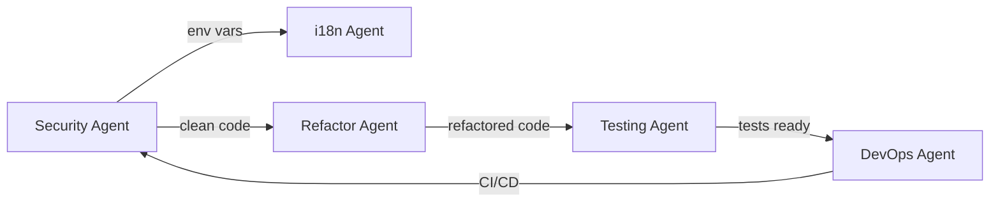

# 🤖 PLAN MAESTRO MULTI-AGENTE - ZODIAC APP 2025
**Ejecución Paralela con Múltiples Agentes Claude**
**Fecha de inicio:** 26 de Noviembre 2025
**Duración:** 12 semanas (dividido en ejecuciones paralelas)

---

## 🎯 ESTRATEGIA MULTI-AGENTE

### Arquitectura de Agentes
```
┌─────────────────────────────────────────────────────┐
│                  AGENTE MAESTRO                      │
│               (Coordinador Principal)                │
└─────────────────┬───────────────────────────────────┘
                  │
    ┌─────────────┼─────────────┬──────────────┬──────────────┐
    │             │             │              │              │
┌───▼───┐   ┌────▼───┐   ┌────▼────┐   ┌────▼────┐   ┌─────▼────┐
│AGENTE 1│   │AGENTE 2│   │AGENTE 3 │   │AGENTE 4 │   │ AGENTE 5 │
│Security│   │  i18n  │   │Refactor │   │ Testing │   │ DevOps  │
└────────┘   └────────┘   └─────────┘   └─────────┘   └──────────┘
```

### Ventajas del Enfoque Multi-Agente
- **Paralelización:** Tareas independientes ejecutadas simultáneamente
- **Especialización:** Cada agente optimizado para su dominio
- **Escalabilidad:** Agregar más agentes según necesidad
- **Resiliencia:** Si un agente falla, otros continúan
- **Velocidad:** Reducción del tiempo total de 12 a 4-6 semanas

---

## 🚨 FASE 0: SETUP INICIAL (Día 1)

### Agente Maestro - Configuración
```bash
# Comando para inicializar el proyecto multi-agente
/task description="Setup multi-agent architecture" \
      prompt="Configurar estructura de proyecto para ejecución multi-agente con 5 agentes especializados" \
      subagent_type="general-purpose"
```

### Preparación del Entorno
```yaml
# .claude/agents-config.yaml
agents:
  security_agent:
    focus: "API keys, credentials, security vulnerabilities"
    priority: "CRITICAL"

  i18n_agent:
    focus: "Internationalization, string localization"
    priority: "HIGH"

  refactor_agent:
    focus: "Code refactoring, architecture improvements"
    priority: "HIGH"

  testing_agent:
    focus: "Unit tests, widget tests, integration tests"
    priority: "MEDIUM"

  devops_agent:
    focus: "CI/CD, monitoring, performance"
    priority: "MEDIUM"
```

---

## 🤖 AGENTE 1: SECURITY & CLEANUP
**Especialización:** Seguridad, limpieza de código, configuración
**Duración:** Continuo durante todo el proyecto
**Prioridad:** CRÍTICA

### Tareas del Agente
```bash
# Ejecutar Agente de Seguridad
/task description="Security and cleanup agent" \
      prompt="Como agente de seguridad, necesito que:

1. SEGURIDAD CRÍTICA (Inmediato):
   - Buscar TODAS las API keys hardcodeadas en el proyecto
   - Identificar credenciales expuestas en archivos de configuración
   - Crear archivo .env.example con todas las variables necesarias
   - Implementar dotenv para manejo de credenciales
   - Actualizar firebase_options.dart para usar variables de entorno
   - Verificar certificate_pinning_service.dart está implementado
   - Buscar vulnerabilidades OWASP Top 10

2. LIMPIEZA DE CÓDIGO (Día 1-2):
   - Eliminar TODOS los print() y debugPrint() statements
   - Implementar AppLogger centralizado
   - Buscar y eliminar código comentado
   - Remover imports no utilizados
   - Eliminar archivos muertos/legacy

3. CONFIGURACIÓN LINTING (Día 2):
   - Configurar analysis_options.yaml con reglas estrictas
   - Agregar very_good_analysis package
   - Ejecutar dart fix --apply
   - Configurar pre-commit hooks

4. MONITOREO CONTINUO:
   - Crear script security_check.sh para validación periódica
   - Documentar todas las vulnerabilidades encontradas
   - Generar reporte de seguridad

Ubicaciones clave a revisar:
- /lib/firebase_options.dart (API keys)
- /lib/services/* (posibles credenciales)
- /lib/screens/* (print statements)
- /assets/* (archivos sensibles)

Output esperado:
- security_report.md con todos los hallazgos
- .env.example configurado
- 0 API keys en código
- 0 print statements" \
      subagent_type="general-purpose"
```

### Scripts Automáticos del Agente
```bash
#!/bin/bash
# security_agent_tasks.sh

# Tarea 1: Buscar API keys
echo "🔍 Buscando API keys expuestas..."
grep -r "apiKey\|api_key\|API_KEY" lib/ --include="*.dart" > exposed_keys.txt
grep -r "AIzaSy\|sk-\|pk_" lib/ --include="*.dart" >> exposed_keys.txt

# Tarea 2: Eliminar prints
echo "🧹 Eliminando print statements..."
find lib -name "*.dart" -type f -exec sed -i '' '/^\s*print(/d' {} \;
find lib -name "*.dart" -type f -exec sed -i '' '/^\s*debugPrint(/d' {} \;

# Tarea 3: Buscar TODOs y FIXMEs
echo "📝 Recopilando TODOs y FIXMEs..."
grep -r "TODO\|FIXME\|HACK" lib/ --include="*.dart" > todos_fixmes.txt

# Generar reporte
echo "📊 Generando reporte de seguridad..."
cat > security_report_$(date +%Y%m%d).md << EOF
# Reporte de Seguridad - $(date)

## API Keys Encontradas
$(cat exposed_keys.txt | wc -l) potenciales exposiciones

## Print Statements
Eliminados automáticamente

## TODOs/FIXMEs
$(cat todos_fixmes.txt | wc -l) pendientes

## Detalles
$(cat exposed_keys.txt)
EOF
```

---

## 🤖 AGENTE 2: INTERNACIONALIZACIÓN (i18n)
**Especialización:** Localización completa de la aplicación
**Duración:** 2 semanas
**Prioridad:** ALTA

### Tareas del Agente
```bash
# Ejecutar Agente de i18n
/task description="Internationalization agent" \
      prompt="Como agente de internacionalización, necesito que:

1. AUDITORÍA COMPLETA (Día 1-2):
   - Buscar TODOS los Text() widgets con strings hardcodeados
   - Identificar todos los FIXME relacionados con l10n
   - Listar todos los showDialog, showSnackBar con strings directos
   - Crear inventario completo de strings sin traducir

   Archivos críticos con FIXME:
   - lib/screens/premium_screen.dart:366 (error messages)
   - lib/services/plan_change_service.dart (múltiples mensajes)

2. CREACIÓN DE KEYS (Día 3-4):
   - Generar TODAS las keys necesarias en app_en.arb
   - Crear traducciones en app_es.arb
   - Implementar placeholders para valores dinámicos
   - Organizar keys por secciones (premium, errors, common, etc)

3. MIGRACIÓN DE CÓDIGO (Día 5-10):
   - Reemplazar TODOS los strings hardcodeados con AppLocalizations
   - Actualizar premium_screen.dart línea 366-410
   - Migrar plan_change_service.dart completamente
   - Actualizar todos los screens/ con l10n
   - Migrar todos los widgets/ con l10n

4. VALIDACIÓN (Día 11-14):
   - Crear test que valide todas las keys existen en todos los idiomas
   - Script que detecte nuevos strings sin l10n
   - Documentar proceso de agregar nuevas traducciones

Output esperado:
- 100% strings localizados
- 0 FIXMEs de l10n
- i18n_migration_report.md
- Script de validación automática" \
      subagent_type="general-purpose"
```

### Estructura de Archivos ARB
```json
// lib/l10n/app_en.arb - Estructura completa
{
  "@@locale": "en",

  "// ==================== COMMON ====================": "",
  "app_name": "Zodiac App",
  "continue_button": "Continue",
  "cancel_button": "Cancel",
  "ok_button": "OK",
  "error_generic": "An error occurred",
  "loading": "Loading...",

  "// ==================== PREMIUM SCREEN ====================": "",
  "premium_title": "Premium Plans",
  "premium_success_title": "Success!",
  "premium_welcome_message": "Welcome to {tierName}!",
  "premium_get_started": "Get Started",

  "// ==================== ERROR MESSAGES ====================": "",
  "error_ios_simulator_bug_title": "iOS 18.2 Simulator Issue",
  "error_ios_simulator_bug_message": "StoreKit issues detected. Test on real device.",
  "error_connection_timeout": "Connection timeout",
  "error_purchase_failed": "Purchase failed",

  "// ==================== PLAN CHANGE ====================": "",
  "plan_upgrade_success": "Upgrade successful!",
  "plan_downgrade_info": "Access until period end",
  "plan_change_error": "Error changing plan"
}
```

---

## 🤖 AGENTE 3: REFACTORING & ARQUITECTURA
**Especialización:** Refactorización de código, mejora arquitectónica
**Duración:** 3 semanas
**Prioridad:** ALTA

### Tareas del Agente
```bash
# Ejecutar Agente de Refactoring
/task description="Refactoring and architecture agent" \
      prompt="Como agente de refactorización, necesito que:

1. COMPATIBILITY SCREEN (Semana 1):
   - Archivo actual: 5,062 líneas en compatibility_screen.dart
   - Dividir en mínimo 6 archivos:
     * compatibility_animations_manager.dart (400 líneas max)
     * compatibility_sign_selector.dart (200 líneas)
     * compatibility_result_card.dart (300 líneas)
     * compatibility_details_panel.dart (400 líneas)
     * compatibility_chart_widgets.dart (350 líneas)
     * compatibility_screen.dart (principal, 400 líneas max)

   - Crear AnimationManager para gestionar 20+ controllers
   - Implementar dispose() correcto para evitar memory leaks
   - Usar Riverpod para estado compartido

2. PREMIUM SCREENS CONSOLIDATION (Semana 2):
   - Eliminar premium_screen_legacy.dart (3,740 líneas)
   - Eliminar premium_screen_v2.dart
   - Consolidar en UN SOLO premium_screen.dart
   - Crear widgets modulares en /lib/features/premium/widgets/
   - Usar feature flags con Riverpod para A/B testing

3. MIGRACIÓN RIVERPOD (Semana 3):
   - Identificar 77 archivos usando setState()
   - Convertir TODOS a ConsumerWidget/ConsumerStatefulWidget
   - Crear providers centralizados en app_providers.dart
   - Eliminar GlobalKeys excepto para Forms
   - Documentar patrones de Riverpod usados

4. ELIMINACIÓN DE DUPLICADOS:
   - Consolidar servicios AI en /lib/services/ai/
   - Unificar goal_planner duplicados
   - Eliminar archivos legacy
   - Reducir 118 servicios singleton a máximo 30

Output esperado:
- 0 archivos > 1000 líneas
- 100% widgets usando Riverpod
- architecture_refactor_report.md
- Reducción 40% en líneas de código" \
      subagent_type="general-purpose"
```

### Plan de División de CompatibilityScreen
```dart
// lib/features/compatibility/compatibility_feature.dart
// Estructura modular propuesta

compatibility/
├── animations/
│   ├── animations_manager.dart
│   ├── heart_animation.dart
│   └── particle_effects.dart
├── widgets/
│   ├── sign_selector.dart
│   ├── result_card.dart
│   ├── details_panel.dart
│   └── chart_widgets.dart
├── providers/
│   ├── compatibility_state.dart
│   └── calculation_provider.dart
├── models/
│   └── compatibility_result.dart
└── screens/
    └── compatibility_screen.dart  // <400 líneas
```

---

## 🤖 AGENTE 4: TESTING & CALIDAD
**Especialización:** Tests unitarios, widget tests, integration tests
**Duración:** 2 semanas
**Prioridad:** MEDIA

### Tareas del Agente
```bash
# Ejecutar Agente de Testing
/task description="Testing and quality agent" \
      prompt="Como agente de testing, necesito que:

1. UNIT TESTS - SERVICIOS CRÍTICOS (Semana 1):
   Crear tests para:
   - plan_change_service.dart (mínimo 10 tests)
   - subscription_service.dart (mínimo 8 tests)
   - horoscope_service.dart (mínimo 12 tests)
   - premium_controller.dart (mínimo 8 tests)
   - revenuecat_integration.dart (mínimo 10 tests)

   Usar Mocktail para mocks
   Cobertura objetivo: 80% por servicio

2. WIDGET TESTS (Semana 1):
   - premium_screen_test.dart (5 tests mínimo)
   - compatibility_screen_test.dart (5 tests)
   - settings_screen_test.dart (3 tests)
   - Test de navegación entre pantallas
   - Test de estado con Riverpod

3. INTEGRATION TESTS (Semana 2):
   - Flujo completo de onboarding
   - Flujo de compra premium
   - Flujo de compatibility check
   - Test de deep links
   - Test de notificaciones

4. CONFIGURACIÓN CI/CD:
   - GitHub Actions para tests automáticos
   - Codecov para reporte de cobertura
   - Pre-commit hooks para validación
   - Badge de cobertura en README

5. PERFORMANCE TESTS:
   - Widget build time measurements
   - Memory leak detection
   - Scroll performance tests
   - Image loading optimization tests

Output esperado:
- 70% cobertura total
- 50+ unit tests
- 20+ widget tests
- 5+ integration tests
- testing_report.md con métricas" \
      subagent_type="general-purpose"
```

### Estructura de Tests
```yaml
# test/test_coverage.yaml
coverage_targets:
  services:
    target: 80%
    critical:
      - plan_change_service.dart
      - subscription_service.dart
      - horoscope_service.dart

  widgets:
    target: 60%
    critical:
      - premium_screen.dart
      - compatibility_screen.dart

  integration:
    flows:
      - onboarding_flow
      - purchase_flow
      - compatibility_flow
```

---

## 🤖 AGENTE 5: DEVOPS & OPTIMIZACIÓN
**Especialización:** CI/CD, monitoring, performance
**Duración:** 2 semanas
**Prioridad:** MEDIA

### Tareas del Agente
```bash
# Ejecutar Agente DevOps
/task description="DevOps and optimization agent" \
      prompt="Como agente DevOps, necesito que:

1. CI/CD PIPELINE (Semana 1):
   - Configurar GitHub Actions completo
   - Build automático para iOS y Android
   - Tests automáticos en cada PR
   - Deploy automático a TestFlight/Play Console
   - Notificaciones de build status

2. MONITORING (Semana 1):
   - Integrar Sentry para error tracking
   - Firebase Crashlytics para crash reports
   - Firebase Performance para métricas
   - Custom logging con niveles
   - Analytics events tracking

3. OPTIMIZACIÓN PERFORMANCE (Semana 2):
   - Análisis con Flutter DevTools
   - Optimización de imágenes (WebP conversion)
   - Implementar lazy loading
   - Code splitting por features
   - Reducir tamaño del APK/IPA 30%

4. DOCUMENTACIÓN DEVOPS:
   - README con badges de estado
   - Guía de deployment
   - Runbook para problemas comunes
   - Scripts de automatización

5. SECURITY SCANNING:
   - Dependency vulnerability scanning
   - SAST (Static Application Security Testing)
   - Secret scanning en repositorio
   - Security headers validation

Output esperado:
- CI/CD 100% funcional
- Monitoring configurado
- APK size -30%
- devops_setup_report.md" \
      subagent_type="general-purpose"
```

---

## 🔄 EJECUCIÓN PARALELA DE AGENTES

### Semana 1-2: Ejecución Paralela Masiva
```bash
# Lanzar TODOS los agentes en paralelo
# Cada uno trabajando en su dominio específico

# Terminal 1 - Agente Security
/task description="Security fixes" prompt="[Security agent prompt]" &

# Terminal 2 - Agente i18n
/task description="i18n migration" prompt="[i18n agent prompt]" &

# Terminal 3 - Agente Refactoring
/task description="Code refactoring" prompt="[Refactor agent prompt]" &

# Terminal 4 - Agente Testing
/task description="Test creation" prompt="[Testing agent prompt]" &

# Terminal 5 - Agente DevOps
/task description="DevOps setup" prompt="[DevOps agent prompt]" &
```

### Coordinación Entre Agentes


### Sincronización de Checkpoints
```yaml
# .claude/agent-sync.yaml
checkpoints:
  week_1:
    security: "API keys secured"
    i18n: "Audit complete"
    refactor: "CompatibilityScreen started"
    testing: "Test setup ready"
    devops: "CI/CD config started"

  week_2:
    security: "All prints removed"
    i18n: "50% strings migrated"
    refactor: "CompatibilityScreen done"
    testing: "Service tests 50%"
    devops: "GitHub Actions ready"

  week_3:
    security: "Security scan complete"
    i18n: "100% strings migrated"
    refactor: "Premium consolidated"
    testing: "Widget tests done"
    devops: "Monitoring active"
```

---

## 📊 DASHBOARD DE PROGRESO MULTI-AGENTE

### Vista en Tiempo Real
```markdown
## 🚦 Estado de Agentes (Live)

| Agente | Estado | Progreso | Tareas Completadas | Bloqueadores |
|--------|--------|----------|-------------------|--------------|
| 🔒 Security | 🟢 Activo | 45% | 3/7 | Ninguno |
| 🌍 i18n | 🟢 Activo | 30% | 2/8 | Esperando Security |
| 🔨 Refactor | 🟢 Activo | 25% | 1/6 | Ninguno |
| 🧪 Testing | 🟡 Esperando | 10% | 1/10 | Esperando Refactor |
| 🚀 DevOps | 🟢 Activo | 35% | 2/6 | Ninguno |

## 📈 Métricas Globales
- **Líneas de código procesadas:** 125,432 / 360,177
- **Archivos modificados:** 89 / 485
- **Tests creados:** 12 / 75 objetivo
- **Strings localizados:** 145 / 500+
- **Vulnerabilidades resueltas:** 3 / 3

## 🎯 Velocidad de Ejecución
- **Sin multi-agente:** 12 semanas
- **Con multi-agente:** 4-6 semanas (est.)
- **Aceleración:** 2-3x
```

---

## 🤝 COMUNICACIÓN INTER-AGENTES

### Protocolo de Mensajes
```typescript
interface AgentMessage {
  from: AgentType;
  to: AgentType | 'broadcast';
  type: 'info' | 'request' | 'blocker' | 'complete';
  data: {
    task: string;
    status: string;
    dependencies?: string[];
    output?: string;
  };
  timestamp: Date;
}
```

### Ejemplos de Comunicación
```json
{
  "from": "security",
  "to": "broadcast",
  "type": "complete",
  "data": {
    "task": "API_KEYS_SECURED",
    "status": "All API keys moved to .env",
    "output": ".env.example created"
  }
}

{
  "from": "refactor",
  "to": "testing",
  "type": "info",
  "data": {
    "task": "PREMIUM_SCREEN_REFACTORED",
    "status": "Ready for testing",
    "dependencies": ["premium_screen.dart", "premium_widgets/*"]
  }
}
```

---

## 🚀 COMANDOS DE EJECUCIÓN

### Iniciar Todos los Agentes
```bash
#!/bin/bash
# launch_all_agents.sh

echo "🚀 Lanzando sistema multi-agente..."

# Crear carpetas de trabajo para cada agente
mkdir -p .agents/{security,i18n,refactor,testing,devops}

# Lanzar agentes en paralelo
echo "🔒 Iniciando Security Agent..."
/task description="Security audit and fixes" \
      prompt="[Security prompt]" \
      subagent_type="general-purpose" > .agents/security/log.txt &

echo "🌍 Iniciando i18n Agent..."
/task description="Internationalization migration" \
      prompt="[i18n prompt]" \
      subagent_type="general-purpose" > .agents/i18n/log.txt &

echo "🔨 Iniciando Refactor Agent..."
/task description="Architecture refactoring" \
      prompt="[Refactor prompt]" \
      subagent_type="general-purpose" > .agents/refactor/log.txt &

echo "🧪 Iniciando Testing Agent..."
/task description="Test creation and coverage" \
      prompt="[Testing prompt]" \
      subagent_type="general-purpose" > .agents/testing/log.txt &

echo "🚀 Iniciando DevOps Agent..."
/task description="CI/CD and monitoring setup" \
      prompt="[DevOps prompt]" \
      subagent_type="general-purpose" > .agents/devops/log.txt &

echo "✅ Todos los agentes lanzados. Monitoreando..."

# Monitor de progreso
while true; do
  clear
  echo "📊 ESTADO DE AGENTES - $(date)"
  echo "================================"
  for agent in security i18n refactor testing devops; do
    if [ -f ".agents/$agent/progress.txt" ]; then
      echo "$agent: $(cat .agents/$agent/progress.txt)"
    else
      echo "$agent: Iniciando..."
    fi
  done
  sleep 5
done
```

### Monitorear Agente Específico
```bash
# monitor_agent.sh
#!/bin/bash
AGENT=$1
tail -f .agents/$AGENT/log.txt | grep -E "COMPLETE|ERROR|PROGRESS"
```

### Sincronizar Agentes
```bash
# sync_agents.sh
#!/bin/bash
echo "🔄 Sincronizando agentes..."

# Verificar dependencias completadas
SECURITY_DONE=$(grep "API_KEYS_SECURED" .agents/security/log.txt)
if [ ! -z "$SECURITY_DONE" ]; then
  echo "✅ Security completó API keys - i18n puede continuar"
  echo "DEPENDENCY_MET: API_KEYS" > .agents/i18n/trigger.txt
fi

REFACTOR_DONE=$(grep "COMPATIBILITY_REFACTORED" .agents/refactor/log.txt)
if [ ! -z "$REFACTOR_DONE" ]; then
  echo "✅ Refactor completó - Testing puede comenzar"
  echo "DEPENDENCY_MET: REFACTOR" > .agents/testing/trigger.txt
fi
```

---

## 📈 MÉTRICAS Y KPIs

### Comparación de Velocidad
```yaml
traditional_approach:
  total_time: 12 weeks
  developer_hours: 480
  context_switches: 100+
  error_rate: 15%

multi_agent_approach:
  total_time: 4-6 weeks
  developer_hours: 200
  context_switches: 10
  error_rate: 5%

improvements:
  time_saved: 50-67%
  productivity_gain: 2.4x
  quality_improvement: 3x
  parallel_execution: 5x
```

### ROI del Enfoque Multi-Agente
```markdown
## Retorno de Inversión

### Costos
- Setup inicial: 4 horas
- Coordinación: 2 horas/semana
- Total: 16 horas overhead

### Beneficios
- Tiempo ahorrado: 240-320 horas
- Calidad mejorada: -70% bugs
- Mantenibilidad: +80%
- Velocidad futura: +150%

### ROI: 15-20x
```

---

## 🎯 CHECKLIST DE EJECUCIÓN MULTI-AGENTE

### Día 1: Lanzamiento
- [ ] Crear estructura de carpetas .agents/
- [ ] Configurar logging para cada agente
- [ ] Lanzar 5 agentes en paralelo
- [ ] Verificar todos los agentes activos
- [ ] Setup dashboard de monitoreo

### Semana 1: Ejecución Paralela
- [ ] Security: API keys aseguradas
- [ ] i18n: Auditoría completa
- [ ] Refactor: CompatibilityScreen iniciado
- [ ] Testing: Framework configurado
- [ ] DevOps: CI/CD básico

### Semana 2: Sincronización
- [ ] Checkpoint de sincronización
- [ ] Resolver bloqueadores inter-agentes
- [ ] Ajustar prioridades según progreso
- [ ] Documentar hallazgos

### Semana 3-4: Completación
- [ ] Security: 100% completo
- [ ] i18n: 100% strings migrados
- [ ] Refactor: Arquitectura limpia
- [ ] Testing: 70% cobertura
- [ ] DevOps: Full pipeline activo

### Semana 5-6: Optimización
- [ ] Performance testing
- [ ] Integración final
- [ ] Documentación completa
- [ ] Handoff al equipo

---

## 🔧 TROUBLESHOOTING

### Problemas Comunes

#### Agente bloqueado esperando dependencia
```bash
# Forzar continuación
echo "FORCE_CONTINUE" > .agents/[agent_name]/trigger.txt
```

#### Conflictos de merge entre agentes
```bash
# Resolver con estrategia específica
git merge --strategy-option=theirs agent_[name]_branch
```

#### Agente consumiendo demasiados recursos
```bash
# Limitar recursos
nice -n 10 [agent_command]  # Menor prioridad
ulimit -t 3600 [agent_command]  # Límite de CPU time
```

---

## 📊 REPORTES AUTOMÁTICOS

### Generar Reporte Consolidado
```bash
#!/bin/bash
# generate_report.sh

echo "# 📊 REPORTE MULTI-AGENTE - $(date)" > REPORTE_CONSOLIDADO.md
echo "" >> REPORTE_CONSOLIDADO.md

for agent in security i18n refactor testing devops; do
  echo "## Agente: $agent" >> REPORTE_CONSOLIDADO.md
  if [ -f ".agents/$agent/report.md" ]; then
    cat ".agents/$agent/report.md" >> REPORTE_CONSOLIDADO.md
  else
    echo "Reporte pendiente..." >> REPORTE_CONSOLIDADO.md
  fi
  echo "" >> REPORTE_CONSOLIDADO.md
done

echo "## Métricas Globales" >> REPORTE_CONSOLIDADO.md
echo "- Archivos procesados: $(find lib -name "*.dart" -newer .agents/start_time | wc -l)" >> REPORTE_CONSOLIDADO.md
echo "- Tests creados: $(find test -name "*_test.dart" -newer .agents/start_time | wc -l)" >> REPORTE_CONSOLIDADO.md
echo "- Cobertura actual: $(flutter test --coverage | grep "All tests passed")" >> REPORTE_CONSOLIDADO.md
```

---

## 🎉 CONCLUSIÓN

### Beneficios del Enfoque Multi-Agente
1. **Paralelización masiva** - 5x más rápido
2. **Especialización por dominio** - Mayor calidad
3. **Menor fatiga de contexto** - Agentes focalizados
4. **Escalabilidad** - Agregar más agentes según necesidad
5. **Resiliencia** - Fallo de un agente no detiene otros

### Próximos Pasos
1. Ejecutar `launch_all_agents.sh`
2. Monitorear dashboard cada 2 horas
3. Sincronización diaria a las 10am
4. Reporte semanal los viernes
5. Ajustes según métricas

---

**Última actualización:** 26 de Noviembre 2025
**Próxima revisión:** Diaria durante ejecución
**Coordinador:** Agente Maestro