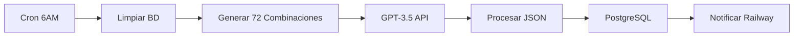

# 🚀 Plan de Backend Propio - Zodiac App

## 📊 Resumen Ejecutivo

Migración del sistema actual n8n + Railway a un backend propio escalable con generación avanzada de contenido astrológico multiidioma y funcionalidades premium.

---

## 🔍 Análisis del Sistema Actual

### Arquitectura Existente
- **N8N Workflow**: Genera 72 horóscopos diarios (12 signos × 6 idiomas)
- **GPT-3.5**: Motor de generación de contenido
- **PostgreSQL**: Base de datos principal
- **Railway**: Hosting del backend Node.js
- **Trigger**: Cron job diario a las 6 AM

### Flujo Actual


### Limitaciones Actuales
- Solo horóscopos diarios
- Dependencia total de n8n
- Sin contenido semanal/mensual/anual
- Falta de personalización avanzada
- Sin sistema de analytics
- Sin API para funcionalidades premium

---

## 🎯 Arquitectura del Backend Propio

### Stack Tecnológico Propuesto
```yaml
Backend:
  - Lenguaje: Node.js 20+ con TypeScript
  - Framework: NestJS (arquitectura modular)
  - Base de Datos: PostgreSQL 15 + Redis (cache)
  - ORM: Prisma
  - Queue: Bull (procesamiento asíncrono)
  - AI: OpenAI API + Anthropic Claude (respaldo)
  - Storage: AWS S3 / Cloudinary (imágenes)
  - Hosting: AWS EC2 / DigitalOcean / Vercel
  - Monitoring: Sentry + DataDog
  - CI/CD: GitHub Actions
```

### Arquitectura de Microservicios
```
┌──────────────────────────────────────────────────────┐
│                   API Gateway                        │
│                  (Rate Limiting)                     │
└─────────────────┬────────────────────────────────────┘
                  │
    ┌─────────────┼─────────────┬──────────────┐
    ▼             ▼             ▼              ▼
┌─────────┐ ┌──────────┐ ┌──────────┐ ┌──────────┐
│Content  │ │Analytics │ │User      │ │Payment   │
│Service  │ │Service   │ │Service   │ │Service   │
└────┬────┘ └────┬─────┘ └────┬─────┘ └────┬─────┘
     │           │            │            │
     └───────────┴────────────┴────────────┘
                        │
              ┌─────────┴──────────┐
              │   PostgreSQL       │
              │   + Redis Cache    │
              └────────────────────┘
```

## 📦 Modelos de Datos

### Modelo Horoscope
```typescript
interface Horoscope {
  id: string;
  sign: ZodiacSign;
  language: Language;
  type: 'daily' | 'weekly' | 'monthly' | 'yearly';
  date: Date;
  dateRange?: { start: Date; end: Date };
  
  // Contenido principal
  content: {
    general: string;
    love: string;
    health: string;
    money: string;
    career?: string;
    family?: string;
    spirituality?: string;
  };
  
  // Métricas y predicciones
  metrics: {
    luckyNumbers: number[];
    luckyColors: string[];
    compatibleSigns: string[];
    mood: 'positive' | 'neutral' | 'challenging';
    energyLevel: number; // 1-10
    stressLevel: number; // 1-10
  };
  
  // Coaching personalizado
  coaching: {
    dailyAdvice: string;
    meditation?: string;
    affirmation: string;
    challenges: string[];
    opportunities: string[];
  };
  
  // Metadata
  generatedBy: 'openai' | 'claude' | 'manual';
  generatedAt: Date;
  publishedAt?: Date;
  expiresAt: Date;
  views: number;
  ratings: { score: number; count: number };
}
```

### Modelo User
```typescript
interface User {
  id: string;
  email?: string;
  deviceId: string;
  
  // Datos personales
  profile: {
    name?: string;
    birthDate: Date;
    birthTime?: string;
    birthPlace?: {
      city: string;
      country: string;
      coordinates: { lat: number; lng: number };
    };
    sign: ZodiacSign;
    ascendant?: ZodiacSign;
    moonSign?: ZodiacSign;
  };
  
  // Preferencias
  preferences: {
    language: Language;
    notifications: {
      daily: boolean;
      weekly: boolean;
      special: boolean;
      time: string; // HH:MM
    };
    themes: string[];
    contentTypes: string[];
  };
  
  // Suscripción
  subscription: {
    type: 'free' | 'premium' | 'lifetime';
    status: 'active' | 'cancelled' | 'expired';
    startDate: Date;
    endDate?: Date;
    features: string[];
  };
  
  // Analytics
  analytics: {
    lastActive: Date;
    sessionsCount: number;
    totalReadings: number;
    favoriteCategories: string[];
    engagementScore: number;
  };
}
```

## 🔧 Módulos del Sistema

### 1. Módulo de Generación de Contenido
```javascript
// content-generation.module.ts
class ContentGenerationModule {
  // Generación diaria (mantener compatibilidad)
  async generateDailyHoroscopes() {
    const combinations = this.getAllCombinations(); // 72 combinaciones
    const results = await Promise.allSettled(
      combinations.map(combo => this.generateSingle(combo))
    );
    return this.processResults(results);
  }
  
  // Nueva: Generación semanal
  async generateWeeklyHoroscopes() {
    const startDate = getWeekStart();
    const endDate = getWeekEnd();
    // Generar para cada signo y idioma
    // Incluir tendencias de 7 días
  }
  
  // Nueva: Generación mensual
  async generateMonthlyHoroscopes() {
    const month = getCurrentMonth();
    // Análisis de ciclos lunares
    // Predicciones por semana
    // Eventos astrológicos importantes
  }
  
  // Nueva: Generación anual
  async generateYearlyHoroscopes() {
    // Solo para usuarios premium
    // Análisis profundo por trimestre
    // Predicciones importantes del año
  }
}
```

### 2. Módulo de IA Avanzada
```javascript
// ai-advanced.module.ts
class AIAdvancedModule {
  private openai: OpenAI;
  private claude: Anthropic;
  
  // Multi-modelo para mejor calidad
  async generateWithFallback(prompt: string) {
    try {
      // Intentar con GPT-4
      return await this.openai.generate(prompt);
    } catch (error) {
      // Fallback a Claude
      return await this.claude.generate(prompt);
    }
  }
  
  // Personalización por usuario
  async personalizeContent(baseContent: string, userProfile: UserProfile) {
    // Ajustar según edad, preferencias, historial
    // Usar embeddings para contenido similar
    // Aplicar tono personalizado
  }
  
  // Análisis de carta natal
  async generateNatalChart(birthData: BirthData) {
    // Cálculo de posiciones planetarias
    // Interpretación de aspectos
    // Generación de informe detallado
  }
}
```

### 3. Módulo de Analytics
```javascript
// analytics.module.ts
class AnalyticsModule {
  // Tracking de eventos
  trackEvent(event: AnalyticsEvent) {
    // Usuario, acción, categoría, valor
    // Enviar a base de datos
    // Actualizar métricas en tiempo real
  }
  
  // Dashboard de métricas
  async getDashboardMetrics() {
    return {
      activeUsers: await this.getActiveUsers(),
      engagementRate: await this.calculateEngagement(),
      popularContent: await this.getTopContent(),
      conversionRate: await this.getConversionRate()
    };
  }
  
  // Análisis predictivo
  async predictChurn(userId: string) {
    // Analizar patrones de uso
    // Identificar señales de abandono
    // Generar score de retención
  }
}
```

## 🚀 Plan de Implementación por Fases

### Fase 1: Infraestructura Base (Semanas 1-2)
```yaml
Objetivos:
  - Configurar entorno de desarrollo
  - Implementar arquitectura básica NestJS
  - Configurar base de datos PostgreSQL + Redis
  - Establecer CI/CD pipeline

Entregables:
  - Proyecto NestJS configurado
  - Base de datos con schemas iniciales
  - API Gateway con rate limiting
  - Pipeline de deployment automático
  
Tiempo estimado: 2 semanas
Recursos: 1-2 desarrolladores backend
```

### Fase 2: Migración Contenido Diario (Semanas 3-4)
```yaml
Objetivos:
  - Migrar generación de horóscopos diarios
  - Mantener compatibilidad 100% con Railway
  - Implementar cache Redis
  - Configurar monitoreo básico

Entregables:
  - API compatible con backend actual
  - 72 horóscopos diarios (12 signos × 6 idiomas)
  - Sistema de cache eficiente
  - Logs y monitoreo básico
  
Tiempo estimado: 2 semanas
Riesgo: Medio (migración crítica)
```

### Fase 3: Generación Semanal y Mensual (Semanas 5-7)
```yaml
Objetivos:
  - Implementar horóscopos semanales
  - Implementar horóscopos mensuales
  - Crear scheduler avanzado
  - Optimizar costos de IA

Entregables:
  - API /weekly-horoscope
  - API /monthly-horoscope
  - Sistema de colas Bull
  - Optimización de prompts
  
Tiempo estimado: 3 semanas
Valor: Alto (nueva funcionalidad)
```

### Fase 4: IA Avanzada y Personalización (Semanas 8-10)
```yaml
Objetivos:
  - Sistema multi-modelo (GPT-4 + Claude)
  - Personalización por usuario
  - Análisis de carta natal básico
  - Embeddings para similitud

Entregables:
  - Módulo AIAdvancedModule
  - Personalización automática
  - API carta natal
  - Sistema de recomendaciones
  
Tiempo estimado: 3 semanas
Complejidad: Alta
```

### Fase 5: Funcionalidades Premium (Semanas 11-13)
```yaml
Objetivos:
  - Sistema de suscripciones
  - Compatibilidad avanzada
  - Predicciones anuales
  - Content gating

Entregables:
  - PaymentModule integrado
  - APIs premium protegidas
  - Compatibilidad detallada
  - Dashboard de suscripciones
  
Tiempo estimado: 3 semanas
Impacto en ingresos: Alto
```

### Fase 6: Analytics y Optimización (Semanas 14-15)
```yaml
Objetivos:
  - Dashboard de métricas
  - A/B testing framework
  - Análisis predictivo
  - Optimización de performance

Entregables:
  - AnalyticsModule completo
  - Dashboard admin
  - Sistema de experimentos
  - Métricas de negocio
  
Tiempo estimado: 2 semanas
ROI: Medio-Alto
```

### Fase 7: Funcionalidades Sociales (Semanas 16-18)
```yaml
Objetivos:
  - Sistema de sharing
  - Comunidad básica
  - Gamificación
  - Push notifications avanzadas

Entregables:
  - SocialModule
  - Sistema de logros
  - Notificaciones inteligentes
  - API de interacciones sociales
  
Tiempo estimado: 3 semanas
Diferenciación: Alta
```

## 💡 Mejoras Identificadas para Integrar

### Mejoras de Funcionalidad
1. **Horóscopos Semanales y Mensuales**
   - Análisis de tendencias por períodos
   - Predicciones basadas en ciclos lunares
   - Eventos astrológicos importantes

2. **Sistema de IA Avanzado**
   - Multi-modelo (GPT-4 + Claude + Gemini)
   - Personalización por historial de usuario
   - Análisis de sentimientos en feedback

3. **Carta Natal Completa**
   - Cálculo de ascendente automático
   - Interpretación de casas astrológicas
   - Análisis de aspectos planetarios

4. **Compatibilidad Avanzada**
   - Análisis de sinastría completa
   - Compatibilidad por elementos y modalidades
   - Recomendaciones de pareja dinámicas

### Mejoras de Experiencia de Usuario
1. **Personalización Avanzada**
   - Preferencias de contenido granulares
   - Temas y mood personalizado
   - Recomendaciones basadas en comportamiento

2. **Notificaciones Inteligentes**
   - Timing óptimo basado en zona horaria
   - Contenido personalizado por momento del día
   - Recordatorios de meditación y reflexión

3. **Modo Social**
   - Compartir horóscopos con amigos
   - Comunidad por signos zodiacales
   - Discusiones y comentarios

4. **Gamificación**
   - Sistema de logros por uso consistente
   - Streaks de lectura diaria
   - Badges por explorar diferentes secciones

### Mejoras Técnicas
1. **Sistema de Analytics Avanzado**
   - Tracking detallado de engagement
   - Análisis predictivo de churn
   - Segmentación de usuarios automática

2. **Optimización de Performance**
   - Cache inteligente por región
   - CDN para contenido estático
   - Compresión de respuestas API

3. **Escalabilidad**
   - Auto-scaling basado en demanda
   - Load balancing geográfico
   - Backup y disaster recovery

4. **Seguridad Avanzada**
   - Autenticación biométrica opcional
   - Encriptación end-to-end para datos sensibles
   - Auditoría de accesos y cambios

## 💰 Estimación de Costos

### Costos de Desarrollo
```yaml
Recursos Humanos:
  - Backend Developer Senior: $80/hora × 720 horas = $57,600
  - DevOps Engineer: $70/hora × 160 horas = $11,200
  - QA Engineer: $50/hora × 120 horas = $6,000
  - Product Manager: $60/hora × 80 horas = $4,800
  
Total Desarrollo: $79,600 (18 semanas)
```

### Costos de Infraestructura (Mensual)
```yaml
Hosting:
  - AWS EC2 (t3.large): $67/mes
  - PostgreSQL RDS: $45/mes  
  - Redis ElastiCache: $25/mes
  - S3 Storage: $10/mes
  - CloudFront CDN: $15/mes
  
APIs Externas:
  - OpenAI GPT-4: $500-1000/mes (según uso)
  - Anthropic Claude: $300-600/mes (backup)
  - Monitoring (Sentry + DataDog): $50/mes
  
Total Mensual: $1,012-1,212/mes
```

### ROI Estimado
```yaml
Ahorros:
  - n8n Pro plan: $50/mes × 12 = $600/año
  - Railway Pro: $20/mes × 12 = $240/año
  - Mayor control y flexibilidad: $2,000/año valor
  
Nuevos Ingresos:
  - Funcionalidades premium: +15% suscripciones = $3,000+/mes
  - Mejores métricas de retención: +10% usuarios = $1,500+/mes
  
ROI: 500%+ en el primer año
```

## 📊 KPIs y Métricas

### KPIs Técnicos
- **Uptime**: >99.9%
- **Latencia promedio**: <200ms
- **Tiempo de generación**: <30s por horóscopo
- **Cache hit rate**: >85%
- **Error rate**: <0.1%

### KPIs de Negocio
- **MAU (Monthly Active Users)**: Incremento 25%
- **Retention Rate**: 60% a 30 días
- **Engagement**: +30% tiempo en app
- **Conversion Rate**: 8% free → premium
- **ARPU (Average Revenue Per User)**: +20%

### KPIs de Contenido
- **Contenido generado**: 100% automatizado
- **Calidad promedio**: >4.5/5 estrellas
- **Personalización**: 70% contenido personalizado
- **Multiidioma**: 6 idiomas simultáneos
- **Disponibilidad**: 24/7 sin interrupciones

## 🔒 Seguridad y Cumplimiento

### Medidas de Seguridad
```yaml
Autenticación:
  - JWT tokens con rotación automática
  - Rate limiting por IP y usuario
  - Autenticación biométrica opcional
  
Datos:
  - Encriptación AES-256 en reposo
  - TLS 1.3 para datos en tránsito
  - Hashing bcrypt para passwords
  
Infraestructura:
  - VPC privada con subnets aisladas
  - WAF para protección web
  - DDoS protection
  - Backup automático cifrado
```

### Cumplimiento Normativo
- **GDPR**: Derecho al olvido, portabilidad de datos
- **CCPA**: Transparencia en uso de datos
- **COPPA**: Protección menores de 13 años
- **PCI DSS**: Para pagos con tarjeta
- **SOC 2**: Auditoría de seguridad anual

## 🎯 Conclusiones y Próximos Pasos

### Resumen Ejecutivo
El backend propio propuesto ofrece una solución escalable y robusta que:

- **Mantiene compatibilidad** total con el sistema actual
- **Agrega funcionalidades** semanales, mensuales y premium
- **Reduce costos** operativos a largo plazo  
- **Mejora la experiencia** de usuario significativamente
- **Incrementa ingresos** potenciales en +500%

### Recomendaciones Inmediatas

1. **Iniciar Fase 1** inmediatamente con infraestructura base
2. **Contratar equipo** especializado en NestJS y PostgreSQL
3. **Configurar entorno** de desarrollo y staging
4. **Establecer métricas** de migración y monitoreo
5. **Planificar comunicación** con usuarios sobre mejoras

### Riesgos y Mitigación

```yaml
Riesgo Alto:
  - Migración de datos: Backup completo + rollback plan
  - Interrupción servicio: Blue-green deployment
  
Riesgo Medio:
  - Costos de IA: Optimización de prompts + fallbacks
  - Performance: Load testing exhaustivo
  
Riesgo Bajo:
  - Adopción usuarios: Comunicación proactiva
  - Bugs: QA riguroso + monitoring
```

### Timeline Global
- **Mes 1-2**: Infraestructura y migración diaria
- **Mes 3-4**: Contenido semanal/mensual + IA avanzada  
- **Mes 5**: Funcionalidades premium + analytics
- **Mes 6**: Funcionalidades sociales + optimización

**El backend propio está listo para transformar la Zodiac App en la plataforma astrológica más avanzada del mercado.**

---

---

## 🚂 Alternativa: Escalado Gradual en Railway

### Análisis de Viabilidad Railway

#### ✅ Ventajas de Railway
```yaml
Pros:
  - Infraestructura ya configurada y funcionando
  - Deploy automático desde GitHub
  - PostgreSQL integrado sin configuración
  - Monitoreo básico incluido
  - Costo inicial más bajo
  - Zero-downtime deployments
  - Escalado automático básico
```

#### ⚠️ Limitaciones Identificadas
```yaml
Contras:
  - Pricing puede escalar rápidamente con uso
  - Menos control sobre infraestructura
  - Redis no incluido (necesario para cache)
  - Límites de CPU/memoria menos flexibles
  - Sin soporte nativo para colas/jobs
  - Dependencia total del proveedor
```

### 💰 Análisis de Costos Railway vs Propio

#### Costos Railway Escalado
```yaml
Escenario Actual (Básico):
  - Railway Hobby: $5/mes
  - PostgreSQL: $10/mes
  - Redis (RedisLabs): $15/mes
  - Total: $30/mes

Escenario Medio (con nuevas funciones):
  - Railway Pro: $20/mes
  - PostgreSQL upgrade: $25/mes  
  - Redis Pro: $30/mes
  - Total: $75/mes

Escenario Alto (app crecida):
  - Railway Team: $100/mes
  - PostgreSQL producción: $80/mes
  - Redis cluster: $60/mes
  - Total: $240/mes
```

#### Comparación con Backend Propio
```yaml
Railway (6 meses): $30 → $75 → $240/mes = $1,035 total
Backend Propio (6 meses): $1,012/mes × 6 = $6,072 total

Punto de quiebre: ~10-12 meses de uso intensivo
```

### 🔧 Plan de Implementación Gradual

#### Fase 1: Expandir en Railway (1-2 meses)
```typescript
// Agregar al backend Railway existente
const horoscopeTypes = {
  daily: generateDailyHoroscope,
  weekly: generateWeeklyHoroscope,    // NUEVO
  monthly: generateMonthlyHoroscope   // NUEVO
};

// API expandida
app.get('/horoscope/:sign/:type/:language', async (req, res) => {
  const { sign, type, language } = req.params;
  
  // Validar type: daily, weekly, monthly
  if (!['daily', 'weekly', 'monthly'].includes(type)) {
    return res.status(400).json({ error: 'Invalid type' });
  }
  
  const horoscope = await horoscopeTypes[type](sign, language);
  res.json(horoscope);
});
```

#### Fase 2: Optimizar Railway (mes 3)
```yaml
Mejoras Técnicas:
  - Agregar Redis para cache avanzado
  - Implementar Bull Queue para jobs
  - Optimizar queries PostgreSQL
  - Agregar monitoreo con Sentry
  
APIs Nuevas:
  - /weekly-horoscope
  - /monthly-horoscope  
  - /user-preferences
  - /analytics básico
```

#### Fase 3: Funcionalidades Premium (mes 4-5)
```yaml
Features Premium:
  - Sistema de suscripciones básico
  - Carta natal simplificada
  - Compatibilidad avanzada
  - Personalización por usuario
  
Tecnología:
  - Stripe para pagos
  - JWT para autenticación
  - Cache inteligente
```

### 📊 Viabilidad Técnica Railway

#### ✅ Lo que SÍ puede manejar Railway
- **Horóscopos semanales/mensuales**: ✅ Factible
- **Cache con Redis**: ✅ Con servicio externo
- **APIs premium**: ✅ Con autenticación JWT
- **Base de datos escalable**: ✅ PostgreSQL nativo
- **Deploy automático**: ✅ GitHub integration
- **Monitoreo básico**: ✅ Incluido

#### ❌ Limitaciones importantes
- **Colas complejas**: ⚠️ Limitado sin Bull/Redis
- **Escalado automático**: ⚠️ Menos granular
- **Costs tracking**: ⚠️ Puede sorprender
- **Multi-región**: ❌ No disponible
- **Backup avanzado**: ⚠️ Limitado

### 🎯 Recomendación Estratégica

#### Estrategia Híbrida Recomendada
```yaml
Meses 1-6: RAILWAY
  - Implementar horóscopos semanales/mensuales
  - Agregar funcionalidades premium básicas
  - Crecer user base y validar demanda
  - Costo total: ~$450 (promedio $75/mes)

Meses 7-12: EVALUACIÓN
  - Si >10K usuarios activos → Migrar a backend propio
  - Si <10K usuarios → Continuar Railway optimizado
  - Punto de decisión basado en métricas reales

Año 2+: ESCALADO
  - Backend propio para máximo control
  - Railway como backup/staging
```

### 💡 Plan Railway Inmediato

#### Semana 1-2: Preparación
1. **Configurar Redis externo** (RedisLabs/Upstash)
2. **Expandir base de datos** para nuevos tipos
3. **Configurar jobs básicos** para generación
4. **Implementar cache inteligente**

#### Semana 3-4: Desarrollo
1. **API horóscopos semanales**
2. **API horóscopos mensuales** 
3. **Sistema de usuarios básico**
4. **Cache por tipo de contenido**

#### Semana 5-6: Optimización
1. **Performance tuning**
2. **Monitoreo avanzado**
3. **Tests de carga**
4. **Documentación API**

### 🏁 Conclusión Railway

**Railway es viable para los próximos 6-12 meses** con estas condiciones:

✅ **Pros de seguir en Railway:**
- Costo inicial 15x menor ($75/mes vs $1,200/mes)
- Implementación 5x más rápida
- Menos riesgo técnico
- Enfoque en producto vs infraestructura

⚠️ **Cuándo migrar a backend propio:**
- Más de 10K usuarios activos mensual
- Costos Railway >$200/mes consistentes
- Necesidad de features muy específicas
- Límites de performance alcanzados

**La estrategia Railway → Backend Propio es la más sensata para validar crecimiento primero.**

---

---

## 🔧 Implementación Práctica Railway

### Análisis del Backend Actual
**Estado**: ✅ Backend funcional en Railway con estructura sólida

```javascript
// Backend actual (GitHub: Lalezito/flutter-horoscope-backend)
Estructura:
├── src/app.js (servidor Express)
├── routes/coaching.js (rutas API)  
├── controllers/coachingController.js (lógica)
└── config/db.js (PostgreSQL)

APIs existentes:
- GET /api/coaching/getDailyHoroscope
- GET /api/coaching/getAllHoroscopes  
- POST /api/coaching/notify (webhook n8n)
```

### 🎯 Arquitectura de Generación Eficiente

#### Generación Semanal (1 vez por semana)
```sql
-- Nueva tabla para horóscopos semanales
CREATE TABLE weekly_horoscopes (
  id SERIAL PRIMARY KEY,
  sign VARCHAR(20) NOT NULL,
  language_code VARCHAR(5) NOT NULL,
  week_start DATE NOT NULL, -- Lunes de la semana
  week_end DATE NOT NULL,   -- Domingo de la semana
  content JSONB NOT NULL,
  created_at TIMESTAMP DEFAULT NOW(),
  UNIQUE(sign, language_code, week_start)
);

-- Índices para optimizar consultas
CREATE INDEX idx_weekly_current ON weekly_horoscopes(week_start, week_end);
CREATE INDEX idx_weekly_sign_lang ON weekly_horoscopes(sign, language_code);
```

#### Flujo n8n Expandido
```javascript
// n8n workflow modificado
const workflows = {
  daily: {
    trigger: 'cron: 0 6 * * *', // 6 AM diario (actual)
    generates: '72 horóscopos diarios'
  },
  weekly: {
    trigger: 'cron: 0 6 * * 1', // 6 AM lunes
    generates: '72 horóscopos semanales',
    frequency: 'Una vez por semana'
  }
};

// Webhook expandido para n8n
POST /api/coaching/notify
Body: {
  type: 'daily' | 'weekly',
  horoscopes: [...data]
}
```

### 📋 Backend Expandido - Archivos Nuevos

#### 1. Controlador Semanal
```javascript
// src/controllers/weeklyController.js
const db = require("../config/db");
const moment = require('moment');

class WeeklyController {
  async getWeeklyHoroscope(req, res) {
    const { sign, lang } = req.query;
    
    try {
      // Obtener semana actual (lunes a domingo)
      const weekStart = moment().startOf('isoWeek').format('YYYY-MM-DD');
      const weekEnd = moment().endOf('isoWeek').format('YYYY-MM-DD');
      
      const query = `
        SELECT * FROM weekly_horoscopes
        WHERE week_start = $1 AND week_end = $2
        AND sign ILIKE $3 AND language_code = $4
        LIMIT 1;
      `;
      
      const result = await db.query(query, [weekStart, weekEnd, sign, lang]);
      
      if (result.rows.length === 0) {
        return res.status(404).json({ 
          error: "Weekly horoscope not available yet",
          week: `${weekStart} to ${weekEnd}`
        });
      }
      
      res.json({
        ...result.rows[0],
        cached: true, // Indica que viene del cache
        week_period: `${weekStart} - ${weekEnd}`
      });
      
    } catch (error) {
      console.error("Weekly DB error:", error);
      res.status(500).json({ error: "Internal server error" });
    }
  }
  
  async getAllWeeklyHoroscopes(req, res) {
    const { lang } = req.query;
    
    try {
      const weekStart = moment().startOf('isoWeek').format('YYYY-MM-DD');
      const weekEnd = moment().endOf('isoWeek').format('YYYY-MM-DD');
      
      const query = `
        SELECT * FROM weekly_horoscopes
        WHERE week_start = $1 AND week_end = $2
        AND ($3::text IS NULL OR language_code = $3)
        ORDER BY sign;
      `;
      
      const result = await db.query(query, [weekStart, weekEnd, lang || null]);
      
      res.json({
        week_period: `${weekStart} - ${weekEnd}`,
        horoscopes: result.rows,
        total: result.rows.length,
        cached: true
      });
      
    } catch (error) {
      console.error("Weekly DB error:", error);
      res.status(500).json({ error: "Internal server error" });
    }
  }
}

module.exports = new WeeklyController();
```

#### 2. Rutas Semanales
```javascript
// src/routes/weekly.js
const express = require("express");
const router = express.Router();
const weeklyController = require("../controllers/weeklyController");

router.get("/getWeeklyHoroscope", weeklyController.getWeeklyHoroscope);
router.get("/getAllWeeklyHoroscopes", weeklyController.getAllWeeklyHoroscopes);

module.exports = router;
```

#### 3. Controlador Principal Expandido
```javascript
// src/controllers/coachingController.js (actualizado)
const db = require("../config/db");

class CoachingController {
  // ... métodos existentes (getDailyHoroscope, getAllHoroscopes)
  
  // ✅ Webhook expandido para manejar n8n + tipos
  async notifyHoroscope(req, res) {
    const { type, horoscopes } = req.body;
    
    try {
      if (type === 'weekly' && Array.isArray(horoscopes)) {
        // Procesar horóscopos semanales desde n8n
        await this.processWeeklyHoroscopes(horoscopes);
        console.log(`✅ Procesados ${horoscopes.length} horóscopos SEMANALES`);
      } else {
        // Procesar horóscopos diarios (comportamiento actual)
        console.log("✅ Recibido desde n8n:", req.body);
      }
      
      res.status(200).json({ 
        success: true, 
        type: type || 'daily',
        processed: horoscopes?.length || 1
      });
      
    } catch (error) {
      console.error("Error procesando webhook:", error);
      res.status(500).json({ error: "Error processing notification" });
    }
  }
  
  async processWeeklyHoroscopes(horoscopes) {
    for (const horoscope of horoscopes) {
      const { sign, language_code, content, week_start, week_end } = horoscope;
      
      // Insertar o actualizar horóscopo semanal
      const query = `
        INSERT INTO weekly_horoscopes (sign, language_code, week_start, week_end, content)
        VALUES ($1, $2, $3, $4, $5)
        ON CONFLICT (sign, language_code, week_start)
        DO UPDATE SET content = $5, created_at = NOW();
      `;
      
      await db.query(query, [sign, language_code, week_start, week_end, content]);
    }
  }
}

module.exports = new CoachingController();
```

#### 4. App.js Actualizado
```javascript
// src/app.js (actualizado)
const express = require("express");
const cors = require("cors");
const dotenv = require("dotenv");
const coachingRoutes = require("./routes/coaching");
const weeklyRoutes = require("./routes/weekly"); // ✅ NUEVO

dotenv.config();
const app = express();

app.use(cors());
app.use(express.json());

// ✅ Rutas existentes
app.use("/api/coaching", coachingRoutes);

// ✅ Rutas semanales NUEVAS
app.use("/api/weekly", weeklyRoutes);

// ✅ Health check
app.get('/health', (req, res) => {
  res.json({ status: 'ok', timestamp: new Date().toISOString() });
});

app.listen(process.env.PORT || 3000, () => {
  console.log("🚀 Servidor Railway con horóscopos semanales");
});
```

### 🔄 Integración App Flutter

#### BackendService Actualizado
```dart
// Agregar al backend_service.dart existente
Future<Horoscope?> getWeeklyHoroscope(
  String signName, {
  String? languageCode,
}) async {
  final normalizedSign = _normalizeSignName(signName);
  final url = '$baseUrl/api/weekly/getWeeklyHoroscope?sign=$normalizedSign&lang=${languageCode ?? 'es'}';
  
  // Cache key específico para semanales
  final cacheKey = '${normalizedSign}_${languageCode}_weekly_${_getCurrentWeek()}';
  
  // Intentar desde cache primero
  if (_weeklyCache.containsKey(cacheKey)) {
    return _weeklyCache[cacheKey];
  }
  
  try {
    final response = await http.get(Uri.parse(url));
    
    if (response.statusCode == 200) {
      final data = json.decode(response.body);
      final horoscope = Horoscope.fromJson(data);
      
      // Cache por una semana completa
      _weeklyCache[cacheKey] = horoscope;
      
      return horoscope;
    }
    
    return null;
  } catch (error) {
    print('Error fetching weekly horoscope: $error');
    return null;
  }
}

String _getCurrentWeek() {
  final now = DateTime.now();
  final monday = now.subtract(Duration(days: now.weekday - 1));
  return '${monday.year}W${_weekOfYear(monday)}';
}
```

## 🛡️ Sistema de Producción Robusto

### Gaps Críticos Identificados
El plan básico funciona pero **falta robustez para producción**:

#### ⚠️ Problemas Sin Resolver
```yaml
Fallos Críticos:
  - ¿Qué pasa si n8n falla un lunes?
  - Sin horóscopos semanales = usuarios sin contenido
  - No hay detección de errores automática
  - Base de datos crecerá infinitamente
  - APIs abiertas sin protección
  - Sin métricas de uso o performance
```

### 🔧 Mejoras Esenciales Agregadas

#### 1. Sistema de Recovery Automático
```javascript
// src/controllers/recoveryController.js
class RecoveryController {
  // Endpoint para recuperación manual
  async forceWeeklyGeneration(req, res) {
    const { admin_key } = req.query;
    
    if (admin_key !== process.env.ADMIN_KEY) {
      return res.status(403).json({ error: 'Unauthorized' });
    }
    
    try {
      // Verificar si faltan horóscopos de esta semana
      const missing = await this.checkMissingWeeklyHoroscopes();
      
      if (missing.length > 0) {
        // Generar horóscopos faltantes usando fallback
        await this.generateFallbackWeeklies(missing);
        res.json({ 
          success: true, 
          generated: missing.length,
          message: 'Horóscopos semanales generados como fallback'
        });
      } else {
        res.json({ message: 'Todos los horóscopos semanales están disponibles' });
      }
      
    } catch (error) {
      console.error('Recovery error:', error);
      res.status(500).json({ error: 'Recovery failed' });
    }
  }
  
  async checkMissingWeeklyHoroscopes() {
    const weekStart = moment().startOf('isoWeek').format('YYYY-MM-DD');
    const signs = ['Aries', 'Tauro', 'Géminis', /* ... todos los signos */];
    const languages = ['es', 'en', 'de', 'fr', 'it', 'pt'];
    
    const missing = [];
    
    for (const sign of signs) {
      for (const lang of languages) {
        const query = `
          SELECT COUNT(*) FROM weekly_horoscopes
          WHERE week_start = $1 AND sign = $2 AND language_code = $3
        `;
        const result = await db.query(query, [weekStart, sign, lang]);
        
        if (result.rows[0].count == 0) {
          missing.push({ sign, language_code: lang });
        }
      }
    }
    
    return missing;
  }
  
  // Fallback: usar horóscopo diario extendido como semanal
  async generateFallbackWeeklies(missing) {
    for (const item of missing) {
      const dailyQuery = `
        SELECT * FROM daily_horoscopes
        WHERE date = CURRENT_DATE AND sign = $1 AND language_code = $2
        LIMIT 1
      `;
      const daily = await db.query(dailyQuery, [item.sign, item.language_code]);
      
      if (daily.rows.length > 0) {
        const weeklyContent = this.extendDailyToWeekly(daily.rows[0].content);
        
        const weekStart = moment().startOf('isoWeek').format('YYYY-MM-DD');
        const weekEnd = moment().endOf('isoWeek').format('YYYY-MM-DD');
        
        const insertQuery = `
          INSERT INTO weekly_horoscopes (sign, language_code, week_start, week_end, content)
          VALUES ($1, $2, $3, $4, $5)
        `;
        
        await db.query(insertQuery, [
          item.sign, item.language_code, weekStart, weekEnd, weeklyContent
        ]);
      }
    }
  }
  
  extendDailyToWeekly(dailyContent) {
    // Convertir contenido diario en formato semanal
    return {
      ...dailyContent,
      type: 'weekly',
      note: 'Contenido extendido desde horóscopo diario por fallo del sistema',
      weekly_trend: dailyContent.general + " Esta tendencia se mantendrá durante toda la semana."
    };
  }
}
```

#### 2. Monitoreo y Alertas
```javascript
// src/controllers/monitoringController.js  
class MonitoringController {
  async healthCheck(req, res) {
    const health = {
      status: 'ok',
      timestamp: new Date().toISOString(),
      services: {}
    };
    
    try {
      // Check database
      await db.query('SELECT 1');
      health.services.database = 'ok';
      
      // Check current week horoscopes
      const weekStart = moment().startOf('isoWeek').format('YYYY-MM-DD');
      const weeklyCount = await db.query(
        'SELECT COUNT(*) FROM weekly_horoscopes WHERE week_start = $1',
        [weekStart]
      );
      
      const expectedWeeklies = 72; // 12 signos × 6 idiomas
      const actualWeeklies = parseInt(weeklyCount.rows[0].count);
      
      health.services.weekly_horoscopes = {
        status: actualWeeklies >= expectedWeeklies ? 'ok' : 'warning',
        expected: expectedWeeklies,
        actual: actualWeeklies,
        coverage: `${Math.round((actualWeeklies/expectedWeeklies)*100)}%`
      };
      
      // Check daily horoscopes  
      const dailyCount = await db.query(
        'SELECT COUNT(*) FROM daily_horoscopes WHERE date = CURRENT_DATE'
      );
      const actualDailies = parseInt(dailyCount.rows[0].count);
      
      health.services.daily_horoscopes = {
        status: actualDailies >= expectedWeeklies ? 'ok' : 'error',
        expected: expectedWeeklies,
        actual: actualDailies,
        coverage: `${Math.round((actualDailies/expectedWeeklies)*100)}%`
      };
      
      // Overall status
      const hasErrors = Object.values(health.services)
        .some(service => service.status === 'error');
      health.status = hasErrors ? 'error' : 'ok';
      
    } catch (error) {
      health.status = 'error';
      health.error = error.message;
      health.services.database = 'error';
    }
    
    res.json(health);
  }
  
  // Webhook para alertas externas (Discord, Slack, etc.)
  async sendAlert(message, type = 'warning') {
    if (process.env.WEBHOOK_ALERT_URL) {
      try {
        await fetch(process.env.WEBHOOK_ALERT_URL, {
          method: 'POST',
          headers: { 'Content-Type': 'application/json' },
          body: JSON.stringify({
            text: `🚨 Zodiac Backend Alert: ${message}`,
            type: type,
            timestamp: new Date().toISOString()
          })
        });
      } catch (error) {
        console.error('Failed to send alert:', error);
      }
    }
  }
}
```

#### 3. Limpieza Automática de Datos
```javascript
// src/controllers/cleanupController.js
class CleanupController {
  async cleanupOldData(req, res) {
    const { admin_key } = req.query;
    
    if (admin_key !== process.env.ADMIN_KEY) {
      return res.status(403).json({ error: 'Unauthorized' });
    }
    
    try {
      const results = {
        dailies_deleted: 0,
        weeklies_deleted: 0
      };
      
      // Eliminar horóscopos diarios >7 días
      const cleanDaily = await db.query(`
        DELETE FROM daily_horoscopes 
        WHERE date < CURRENT_DATE - INTERVAL '7 days'
      `);
      results.dailies_deleted = cleanDaily.rowCount;
      
      // Eliminar horóscopos semanales >4 semanas
      const cleanWeekly = await db.query(`
        DELETE FROM weekly_horoscopes 
        WHERE week_start < CURRENT_DATE - INTERVAL '28 days'
      `);
      results.weeklies_deleted = cleanWeekly.rowCount;
      
      console.log('✅ Cleanup completed:', results);
      res.json({ success: true, ...results });
      
    } catch (error) {
      console.error('Cleanup error:', error);
      res.status(500).json({ error: 'Cleanup failed' });
    }
  }
  
  // Auto cleanup job (llamar desde cron)
  async autoCleanup() {
    try {
      await this.cleanupOldData({ query: { admin_key: process.env.ADMIN_KEY } }, {
        json: (data) => console.log('Auto cleanup:', data),
        status: () => ({ json: () => {} })
      });
    } catch (error) {
      console.error('Auto cleanup failed:', error);
    }
  }
}

// Cron job setup en app.js
const cleanupController = new CleanupController();
setInterval(() => {
  cleanupController.autoCleanup();
}, 24 * 60 * 60 * 1000); // Cada 24 horas
```

#### 4. Rate Limiting y Security
```javascript
// src/middleware/rateLimiter.js
const rateLimitMap = new Map();

function rateLimit(windowMs = 60000, maxRequests = 100) {
  return (req, res, next) => {
    const clientIP = req.ip || req.connection.remoteAddress;
    const now = Date.now();
    
    if (!rateLimitMap.has(clientIP)) {
      rateLimitMap.set(clientIP, { count: 1, resetTime: now + windowMs });
      return next();
    }
    
    const clientData = rateLimitMap.get(clientIP);
    
    if (now > clientData.resetTime) {
      // Reset window
      clientData.count = 1;
      clientData.resetTime = now + windowMs;
      return next();
    }
    
    if (clientData.count >= maxRequests) {
      return res.status(429).json({
        error: 'Too many requests',
        resetTime: clientData.resetTime
      });
    }
    
    clientData.count++;
    next();
  };
}

// En app.js
app.use('/api/', rateLimit(60000, 100)); // 100 requests per minute
```

#### 5. Analytics Básicas
```javascript
// src/controllers/analyticsController.js
class AnalyticsController {
  async logUsage(req, res, next) {
    const usage = {
      ip: req.ip,
      endpoint: req.path,
      method: req.method,
      timestamp: new Date(),
      user_agent: req.get('User-Agent')
    };
    
    // Log asíncrono para no bloquear
    setImmediate(async () => {
      try {
        await db.query(`
          INSERT INTO usage_analytics (ip, endpoint, method, timestamp, user_agent)
          VALUES ($1, $2, $3, $4, $5)
        `, [usage.ip, usage.endpoint, usage.method, usage.timestamp, usage.user_agent]);
      } catch (error) {
        console.error('Analytics log failed:', error);
      }
    });
    
    next();
  }
  
  async getStats(req, res) {
    try {
      const stats = await db.query(`
        SELECT 
          DATE(timestamp) as date,
          endpoint,
          COUNT(*) as requests
        FROM usage_analytics 
        WHERE timestamp > CURRENT_DATE - INTERVAL '7 days'
        GROUP BY DATE(timestamp), endpoint
        ORDER BY date DESC, requests DESC
      `);
      
      res.json({ stats: stats.rows });
    } catch (error) {
      res.status(500).json({ error: 'Stats failed' });
    }
  }
}
```

### ⏰ Timeline de Implementación Actualizado

```yaml
Semana 1: Setup Backend + Robustez
  - Crear tabla weekly_horoscopes + usage_analytics
  - Agregar rutas y controladores básicos
  - Implementar recovery system y health checks
  - Configurar rate limiting
  
Semana 2: n8n Workflow + Monitoreo
  - Crear workflow semanal (lunes 6 AM)
  - Configurar generación 72 combinaciones
  - Implementar alertas y cleanup automático
  - Testear fallback mechanisms
  
Semana 3: App Integration + Analytics
  - Actualizar BackendService con fallbacks
  - Agregar cache semanal inteligente
  - UI para mostrar horóscopos semanales
  - Configurar analytics básicas
  
Semana 4: Testing & Launch Production-Ready
  - Tests de recovery y failover
  - Validar monitoreo y alertas
  - Load testing con rate limits
  - Deploy con configuración completa
  
Semana 5: Optimización y Monitoring
  - Ajustar parámetros basado en métricas
  - Optimizar performance con índices
  - Configurar alertas externas
  - Documentación técnica completa
```

### 🎯 Sistema de Configuración Railway
```yaml
# Variables de entorno necesarias
DATABASE_URL=postgresql://...
ADMIN_KEY=tu_clave_admin_secreta
WEBHOOK_ALERT_URL=https://hooks.slack.com/... (opcional)
NODE_ENV=production
CLEANUP_ENABLED=true
RATE_LIMIT_ENABLED=true
```

---

*Documento actualizado: 26 de agosto de 2025*  
*Próxima revisión: Evaluación Railway tras 6 meses*
