# Architecture Documentation

**Version**: 1.0.0
**Last Updated**: 2025-10-05
**Status**: ✅ Production Ready

---

## Table of Contents

1. [System Architecture](#system-architecture)
2. [Data Flow Diagrams](#data-flow-diagrams)
3. [Service Dependency Graph](#service-dependency-graph)
4. [Module Structure](#module-structure)
5. [External Integrations](#external-integrations)

---

## System Architecture

### High-Level Architecture

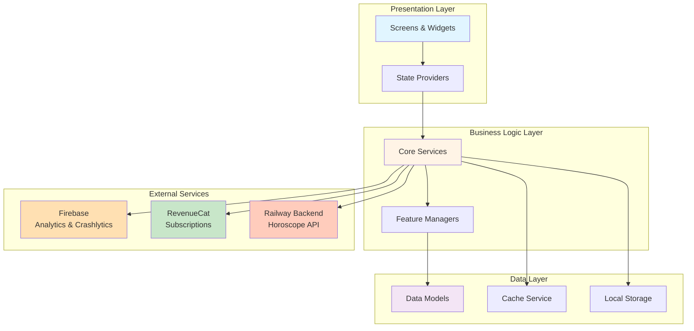

---

### Three-Layer Architecture

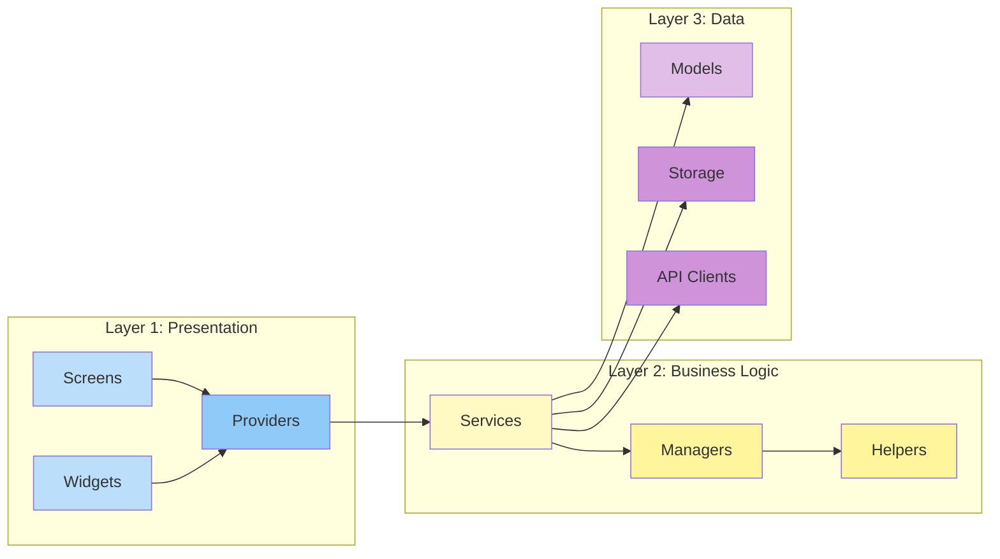

---

## Data Flow Diagrams

### 1. User Authentication Flow

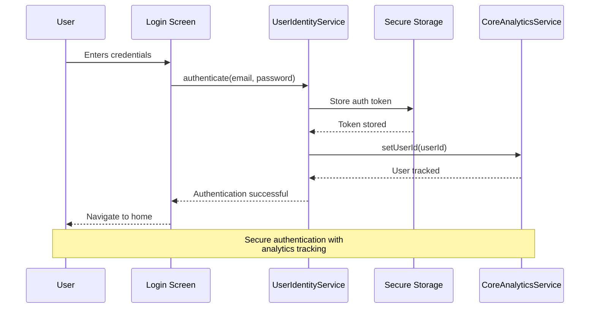

---

### 2. Premium Purchase Flow

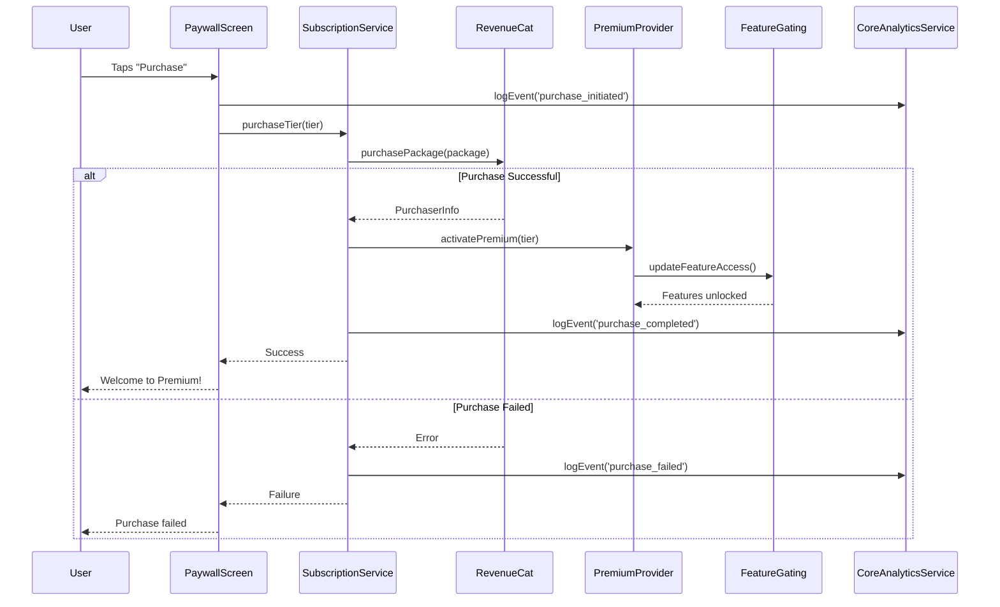

---

### 3. Offline Sync Flow

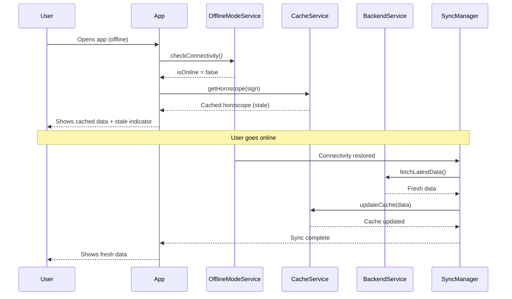

---

### 4. Notification Scheduling Flow

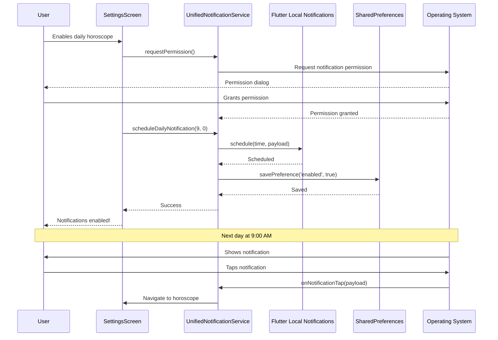

---

### 5. Horoscope Fetch with Cache Flow

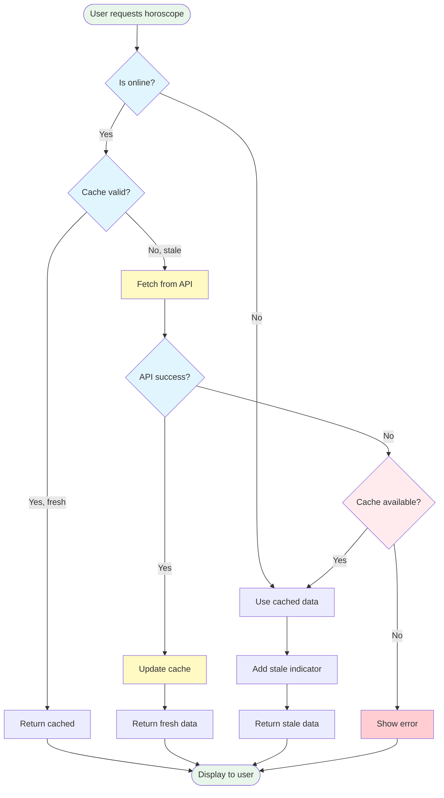

---

## Service Dependency Graph

### Core Services Dependencies

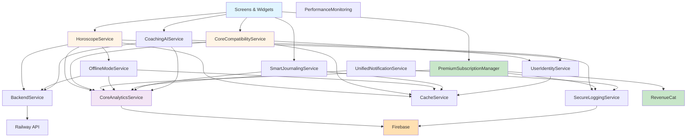

---

### Circular Dependencies Check

**Status**: ✅ No circular dependencies detected

**Key Design Decisions**:
1. Services never depend on UI components
2. Core services use dependency injection
3. Shared services (Analytics, Logging) are leaf nodes
4. External integrations are isolated

---

## Module Structure

### Directory Organization

```
lib/
├── main.dart                          # App entry point
├── screens/                           # UI Layer
│   ├── home_screen.dart
│   ├── horoscope_screen.dart
│   ├── compatibility_screen.dart
│   ├── premium_screen.dart
│   └── settings_screen.dart
├── services/                          # Business Logic Layer
│   ├── consolidated_ai/               # AI Services
│   │   ├── coaching_ai_service.dart
│   │   └── conversation_ai_service.dart
│   ├── consolidated_compatibility/    # Compatibility Services
│   │   ├── core_compatibility_service.dart
│   │   └── compatibility_provider.dart
│   ├── consolidated_payments/         # Payment Services
│   │   ├── quantum_payment_engine.dart
│   │   └── payment_provider.dart
│   ├── core_analytics_service.dart    # Analytics
│   ├── secure_logging_service.dart    # Logging
│   ├── performance_monitoring_service.dart  # Performance
│   ├── offline_mode_service.dart      # Offline Support
│   ├── unified_notification_service.dart    # Notifications
│   ├── user_identity_service.dart     # User Identity
│   ├── subscription_service.dart      # Subscriptions
│   └── backend_service.dart           # API Client
├── models/                            # Data Models
│   ├── horoscope.dart
│   ├── compatibility_result.dart
│   ├── subscription_tier.dart
│   └── user_profile.dart
├── providers/                         # State Management
│   ├── premium_provider.dart
│   ├── theme_provider.dart
│   └── user_provider.dart
├── utils/                             # Utilities
│   ├── constants.dart
│   ├── helpers.dart
│   └── app_logger.dart
└── widgets/                           # Reusable Widgets
    ├── cosmic_button.dart
    ├── zodiac_card.dart
    └── premium_badge.dart
```

---

### Service Categories

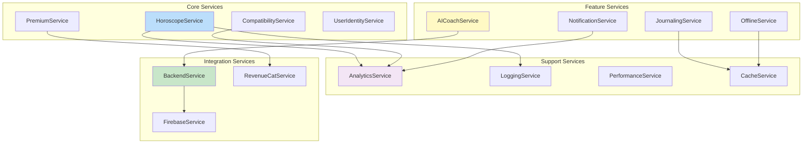

---

## External Integrations

### Integration Points

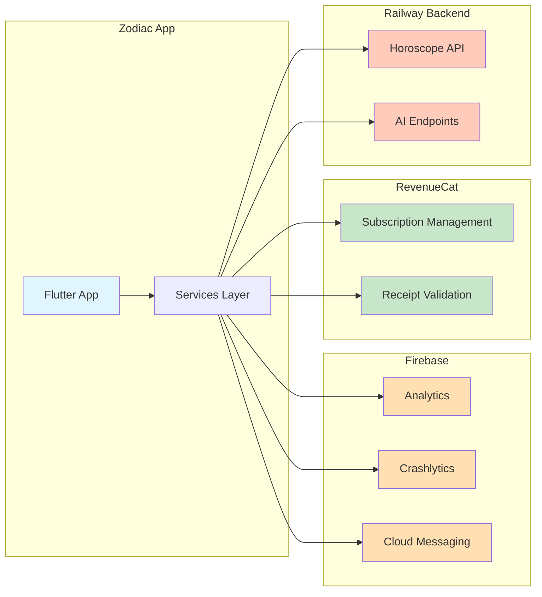

---

### API Communication

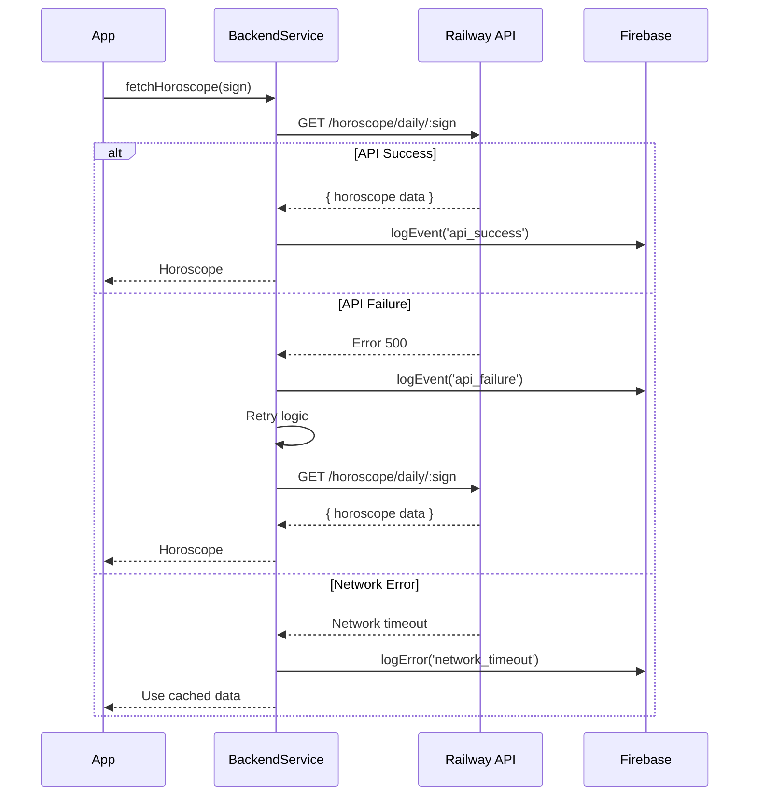

---

## Design Patterns

### 1. Singleton Pattern
**Used in**: All services
```dart
class CoreAnalyticsService {
  static final CoreAnalyticsService _instance = CoreAnalyticsService._internal();
  factory CoreAnalyticsService() => _instance;
  CoreAnalyticsService._internal();
}
```

### 2. Provider Pattern
**Used in**: State management
```dart
ChangeNotifierProvider(
  create: (_) => PremiumProvider(),
  child: MyApp(),
);
```

### 3. Repository Pattern
**Used in**: Data access
```dart
class HoroscopeRepository {
  Future<Horoscope> getHoroscope(String sign) async {
    // Try cache first
    final cached = await cache.get(sign);
    if (cached != null) return cached;

    // Fetch from API
    final fresh = await api.fetchHoroscope(sign);
    await cache.set(sign, fresh);
    return fresh;
  }
}
```

### 4. Observer Pattern
**Used in**: Analytics, logging
```dart
class AnalyticsObserver extends RouteObserver<PageRoute> {
  @override
  void didPush(Route route, Route? previousRoute) {
    analytics.logEvent('screen_view', {'screen': route.settings.name});
  }
}
```

---

## Scalability Considerations

### Horizontal Scaling
- **Backend**: Railway auto-scaling
- **Cache**: Distributed caching ready
- **Analytics**: Firebase auto-scales

### Performance Optimization
- **Lazy loading**: Services initialized on demand
- **Code splitting**: Feature modules isolated
- **Cache strategy**: Multi-layer caching
- **Offline first**: Reduce API calls

### Monitoring
- **Performance**: Real-time metrics
- **Errors**: Crashlytics integration
- **Revenue**: RevenueCat dashboard
- **Usage**: Firebase Analytics

---

## Future Enhancements

### Planned Improvements
1. **GraphQL API**: Replace REST with GraphQL
2. **WebSocket**: Real-time cosmic updates
3. **CDN**: Static content delivery
4. **Push Notifications**: Backend-triggered notifications
5. **Multi-language**: i18n support expansion

### Architecture Evolution
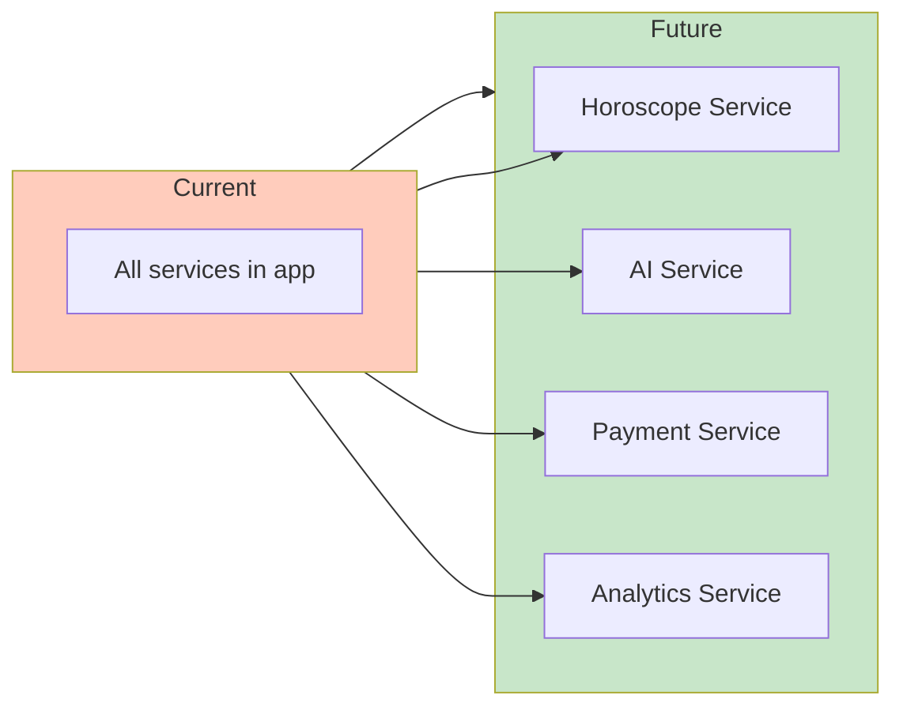

---

**For questions**: Contact architecture team
**For updates**: See CHANGELOG.md
**For implementation**: See service documentation
